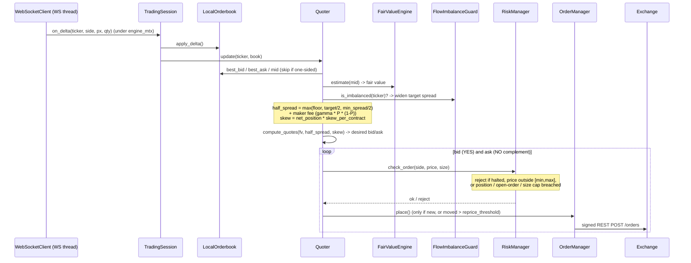
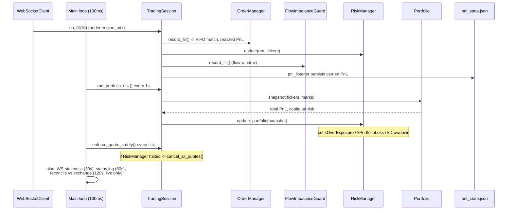

# Kalshi Market Maker — Build Plan

## Things to Fix — Prioritized

> Highest priority at the top. Ordering: bugs that corrupt the book or risk
> money first, then market-making quality, then operational robustness, then
> structural refactors. Detailed write-ups for several items live in the
> sections further down (referenced by name).

### P0 — Correctness & safety (do these first)

- [ ] **1. Orderbook deltas are applied wrong — the book corrupts on every
  update.** `orderbook_delta.delta_fp` is an *increment* to the resting size at
  a price level, but `LocalOrderbook::apply_delta` treats it as the *absolute*
  new quantity (`existing->quantity = new_quantity`, not `+=`). Confirmed from
  captured frames: deltas are signed (`-0.16`, `-1.47`, `680.27`). Two failure
  modes today: a shrink like `-1.47` rounds to `-1` and *sets* the level
  negative; a small shrink like `-0.16` rounds to `0` and our zero-branch
  **erases the whole level**. Also the exchange uses *fractional* contract
  counts and `parse_fp_count` rounds to `int`, so sub-unit changes vanish.
  Fix: apply as `quantity += delta`, remove a level only when it reaches ≤ 0,
  and carry fractional size (ties to the quantity-type work, R3). Tests:
  snapshot + a stream of incremental deltas, assert the book matches the
  exchange. **Top priority — every quote is computed against this book, so it
  silently re-corrupts within seconds even after the snapshot-sort fix.**

- [ ] **2. `ensure()` fail-fast invariant primitive.** Flatten all orders, then
  crash, on a broken invariant. Safety-critical and explicitly requested. Full
  design in *Safety: `ensure()` Fail-Fast Invariant Checks* below.

### P1 — Market-making quality

- [ ] **3. D1 — non-crossing quote clamp.** Clamp quotes to stay strictly
  passive vs. the observed BBO (≥1c behind) so latency on fast books can't turn
  a quote into a `post only cross`. The *systematic* crossing was the orderbook
  sort bug (now fixed); this is the residual. Detail in *Demo Run Findings*.

- [ ] **4. D2 — align scanner price band with the risk price gate.** The scanner
  admits `[min_price, max_price]` but the quoter only trades `[10,90]`, so the
  scanner's top picks are un-quotable longshots. Derive one band from the other.

### P2 — Operational robustness

- [ ] **5. D3 — staleness flapping on quiet markets.** Thin markets send no WS
  traffic for >30s and trip `kStaleBook` repeatedly → flatten/re-quote churn.
  Count heartbeats toward freshness, or lengthen the threshold for low-activity
  markets (don't loosen blindly — it weakens staleness protection on active
  markets).

### P3 — Structural refactors (PR #1 review — detail in *Code Review Follow-ups*)

- [ ] **6. R3 — `Cents` / strong quantity type.** Bumped up: the P0 #1 precision
  fix wants a non-`int`, fractional size type.
- [ ] **7. R2 — break up `main.cpp`** (also flagged by clang-tidy:
  cognitive complexity 27 > 25).
- [ ] **8. R1 — split `source/`** into `Calculations/ Quoter/
  PortfolioManagement/ Networking/ Common/`.
- [ ] **9. R4 — Constraints-vs-Guards framework.**
- [ ] **10. R5 — `KalshiSession` + a `Session` concept** (multi-exchange).
- [ ] **11. R6 — comment convention** (prose only at the top of each `.hpp`).
- [ ] **12. R7 — `docs/kalshi-messages.md` + rate-limiting review.**

**Recently fixed this session (committed):** orderbook ascending-sort → correct
BBO/mid (was the reason we weren't making markets); quoter resync on flatten
(re-quotes after halt/disconnect); seed order-error containment (one bad market
can't crash startup). See *Demo Run Findings*.

---

## Architecture

The binary is one executable with four modes selected by CLI flag. **Scanning
and trading are separate runs**: `--scan` writes a config file, and you re-run
the bot pointed at it to actually make markets. There is no loop that "sets up
and trades each market in turn" — after a one-time per-ticker setup loop the bot
is entirely **event-driven** (WebSocket callbacks) with a periodic safety timer.

### 1. Startup, mode dispatch, and the per-ticker setup loop


So the answer to "I have a list of markets, then what?": each ticker is **seeded
and subscribed once** (`main.cpp` setup loop). Seeding already places the first
pair of quotes. From then on the book moves and fills arrive asynchronously —
the code path below runs once **per inbound message**, not once per market.

### 2. The hot path — one book update becomes a quote



### 3. The two steady-state drivers (fills + periodic safety)



`main.cpp` does process/IO only (config, logger, signals, transports, the WS
thread, and the 100ms poll loop). `TradingSession`
(`source/trading_session.hpp/.cpp`) owns the domain reactions (snapshot/delta/
fill, portfolio kill-switch, status logging) so the same wiring runs in
production, unit tests, and session replay. The WS callback thread and the main
loop both touch the engine, serialized by a single `engine_mtx`. Capture (raw WS
frames + REST responses) is teed by the `CapturingWebSocket` /
`CapturingHttpTransport` decorators (`source/capture.hpp/.cpp`) via `--capture`.

---

## Demo Run Findings (2026-06-29)

First sustained market-making run on the Kalshi **demo** environment
(`config.json` → `demo-api.kalshi.co`, real access key + demo key). The engine
works end-to-end (auth, seed, quote, WS, risk, portfolio, reconcile). Two bugs
were found and fixed, plus several environment/strategy learnings.

**Fixed (committed):**
- **Quoter not resynced on flatten** — a flatten (staleness/disconnect/halt)
  cancelled the resting orders but left the `Quoter`'s `live_quotes_` ids stale,
  so on feed recovery it tried to cancel dead ids and **never re-quoted**.
  `Quoter::reset_quotes()` now called from `TradingSession::cancel_all_quotes`.
- **Order rejection crashed startup** — a single `place` returning HTTP 400
  (e.g. `"post only cross"`) threw out of the unguarded seed loop and killed the
  whole process. `seed_orderbook` now contains quote errors and the `main.cpp`
  seed loop skips a failing ticker. (`on_delta` was already guarded.)
- **Orderbook stored in the wrong order → garbage mid (THE reason we weren't
  making markets).** The exchange sends levels in *ascending* price order (a 1c
  dust level first), but `best_bid`/`best_ask`/`find_level` all assume
  *descending* (best at `front()`). `apply_snapshot` copied the wire order
  verbatim, so `best_bid` was the 1c dust level, `best_ask` its complement
  (99c), and `mid` was pinned near 50 regardless of the real market. Quotes were
  priced *through* the true book → rejected as `post only cross`. Proven on the
  liquid `KXWCADVANCE-…-NED` market: **21 cross-rejections → 0** after sorting
  levels descending on ingest. This was a correctness bug masked because every
  unit test used single-level (already-sorted) books.

**Open follow-ups (tracked):**
- [ ] **D1 — Belt-and-braces non-crossing clamp.** The orderbook fix removed the
  systematic crossing. Residual risk remains on very fast books: a quote priced
  near the touch can cross by the time the ~300ms REST round-trip lands. Clamp
  quotes to stay strictly passive vs. the observed BBO (≥1c behind) so latency
  jitter can't produce a `post only cross`. Lower priority now that mid is
  correct, but still worth doing.
- [ ] **D2 — Scanner price band vs. risk price gate are misaligned.** Scanner
  admits `[min_price, max_price]` (was `[2,98]`) but the risk gate only quotes
  `[10,90]`, so the scanner's top picks (2–5c longshots) are un-quotable and
  also the longshots Bürgi/Deng/Whelan say to avoid. Align the scanner's
  `min/max_price_cents` to the risk gate (or derive one from the other).
- [ ] **D3 — Staleness flapping on quiet markets.** Thin demo markets (e.g. the
  CPI tickers) send no WS traffic for >30s, tripping `kStaleBook` repeatedly →
  flatten/re-quote churn. Consider counting heartbeats/pings toward freshness,
  or a longer threshold for low-activity markets. Don't loosen blindly — it
  weakens staleness protection on active markets.
- Ops note: background launches need `setsid` (a bare `&` under the tooling gets
  killed when the parent shell exits).

---

## Safety: `ensure()` Fail-Fast Invariant Checks

- [ ] **Add a project-wide `ensure()` primitive.** Used liberally to assert
  invariants that must hold for safe trading. On violation: **flatten (cancel
  all resting orders) then crash** with a non-zero exit. An inconsistent process
  must never keep quoting — fail loud and flat, don't limp on.

**Design (the parts that are easy to get wrong):**

- New `source/ensure.{hpp,cpp}` (Common). Signature roughly:
  `void ensure(bool condition, std::string_view what,
  std::source_location loc = std::source_location::current())`. On failure: log
  `critical` with `file:line` + message, invoke the registered panic handler
  (flatten), then terminate.
- **Flatten-before-crash needs a registered hook.** `ensure` can be called from
  anywhere and has no access to the `OrderManager`. At startup `main` registers
  a panic handler — e.g. `set_panic_handler([&] { session.cancel_all_quotes(); })`
  — that `ensure` calls on failure. `cancel_all_quotes` is already
  best-effort / never-throws, so it is safe on this path.
- **RAII will NOT save us here.** `std::abort()` / `std::terminate` do not run
  stack-unwind destructors, so the existing exit-time `ScopeGuard` cancel-all
  will *not* fire on an `ensure` failure. That is exactly why `ensure` must
  flatten explicitly via the hook *before* aborting.
- **Thread-safety / reentrancy.** `ensure` may fire on the WS thread or the main
  loop; the panic handler must take the same `engine_mtx` (or be lock-free
  best-effort) and be idempotent. Guard against an `ensure` failing *inside* the
  handler: set a "panicking" flag on first entry; a second entry skips the
  re-flatten and aborts immediately, so we can never deadlock or recurse.
- **Testability (TDD first).** Make the terminating action injectable — default
  to `std::abort`, overridable in tests to a recording/throwing stub — so tests
  can assert "(a) the panic handler ran (flatten was called) and (b) abort was
  requested" without killing the test process. Same injection pattern as the
  configurable logger.
- **Distinct from a risk halt.** A risk halt is recoverable (`resume()`); an
  `ensure` violation is an unrecoverable invariant break → flatten + exit
  non-zero. Use `ensure` only for "this should be impossible" conditions, never
  for normal control flow or expected error handling (those stay
  exceptions / `check_order` rejections).

**Candidate invariants to seed the rollout:**

- order price ∈ [1,99], quantity > 0, `complement_price` ∈ [1,99]
- `best_bid < best_ask` when both sides present; no negative level sizes
- fair value is finite (not NaN/inf) and ∈ [1,99] before quoting
- net position and open-order counts within the configured hard caps
- config values sane at load (spreads ≥ 0, price band `min < max`)
- realized/unrealized PnL and marks are finite

**Rollout:** land the primitive + its tests first, then introduce `ensure`
calls incrementally — one subsystem per commit — so every new invariant ships
with a test that exercises both the pass and the flatten-then-crash path.

---

## UAT Blockers

**BLOCKER-1 (resolved):** `IxWebSocket` implemented via FetchContent `machinezone/IXWebSocket`. End-to-end connection to live UAT not yet verified.

**BLOCKER-2 (open — narrowed 2026-06-29):** A live `--capture` run against demo
showed network + clock are fine and **public** REST (`GET /orderbook`) returns
200, but every **authenticated** call (`GET /portfolio/positions`, the WS
handshake) returns `401 INVALID_PARAMETER`. Root cause: the `api_key` (access key
ID) in `config-demo.json` is still an unfilled placeholder (`<…>`, not a UUID) —
the private key `.pem` is real, the access key ID is missing. **Action: paste the
real demo access key ID into config, then re-run `--capture`.** Secondary suspect
if 401 persists after that: RSA-PSS salt length in `auth.cpp` uses
`RSA_PSS_SALTLEN_MAX`; Kalshi's SDK uses digest length (32) — verify live once a
real key exists. Field-shape drift (price names, `count` vs `quantity`, status
strings, timestamps) can only be confirmed once authenticated traffic flows.

**Pre-UAT checklist:**
- [x] `IxWebSocket` implemented and library fetched
- [x] Demo RSA private key present (`/home/jfreun1/kalshi-demo-private-key.pem`)
- [ ] Real demo **access key ID** filled into `config-demo.json` (`api_key`) — currently a placeholder
- [x] `config-demo.json` points at demo base/ws URLs
- [~] Raw REST/WS bodies captured via `--capture` (public REST verified 200; authenticated blocked on the key above)
- [x] Paper mode (`--paper`) runs without errors (fixed 2026-06-29 — was silently placing zero orders against the V2 API)

---

## Completed Phases (1–20)

| Phase | Component | Key files |
|---|---|---|
| 1 | Types & Domain Model | `source/types.hpp` |
| 2 | Authentication | `source/auth.hpp/cpp` |
| 3 | REST Client | `source/rest_client.hpp/cpp`, `source/http_transport.hpp` |
| 4 | Local Orderbook | `source/orderbook.hpp/cpp` |
| 5 | WebSocket Client | `source/websocket_client.hpp/cpp` |
| 6 | Order Manager | `source/order_manager.hpp/cpp` |
| 7 | Risk Manager | `source/risk_manager.hpp/cpp` |
| 8 | Fair Value Engine | `source/fair_value.hpp/cpp` |
| 9 | Quoter | `source/quoter.hpp/cpp` |
| 10 | Main Loop | `source/main.cpp` |
| 11 | Pluggable Pricing Model | `source/pricing_model.hpp/cpp` |
| 12 | Theo Grid | (in quoter) |
| 13 | Constraint Bitset & AdverseSelectionGuard | `source/quoter.hpp` |
| 14 | Logging & Observability | spdlog structured logging |
| 15 | Config File & Graceful Shutdown | `source/config.hpp`, `config.example.json` |
| 16 | CI Pipeline & Coverage | `.github/workflows/`, `cmake/coverage.cmake` |
| 17 | Benchmarking | `bench/` |
| 18 | Replay & Fuzz Testing | `test/fuzz/`, `test/fixtures/` |
| 19 | Paper Trading Mode | `--paper` flag |
| 20 | Documentation | `docs/`, `docs/adr/` |

303 tests passing. Build clean.

### Also shipped (post-phase-20, on top of the table above)

| Area | What | Key files |
|---|---|---|
| Ticker Scanner (Phase 31) | ranks markets, writes ready-to-run trade config | `ticker_scanner.*`, `scan_output.*` |
| Portfolio read-model | total realized + unrealized PnL, per-event risk | `portfolio.*` |
| Global kill-switch | `kOverExposure` (capital cap) + `kPortfolioLoss` (realized+unrealized loss floor) + `kDrawdown` (give-back from PnL high-water mark) halt **all** quoting; sampled ~1s | `risk_manager.*`, `RiskManager::update_portfolio` |
| Reconciliation | local vs exchange positions; `kModelDiverge` halt; `--reconcile` | `portfolio.cpp::reconcile` |
| TradingSession engine | domain reactions extracted from `main.cpp` (testable, replayable) | `trading_session.*` |
| Replay integration test | full-stack replay of a session through the real wiring (gated `KALSHI_INTEGRATION_TESTS`, default ON) | `test/integration/replay_session_test.cpp` |
| Session capture | `--capture <dir>` tees raw WS frames + REST responses for replay/UAT | `capture.*` |
| Paper-mode V2 fix | `PaperTransport` now speaks the V2 order schema (was silently broken) | `paper_transport.cpp` |

---

## Code Review Follow-ups (PR #1)

Review of the MOBILE branch (PR #1) surfaced design feedback. Small items were
fixed in the branch; the larger structural items below are tracked here. Most
are cross-cutting refactors that should each land as their own TDD phase.

**Addressed in-branch (PR #1):**
- `flow_imbalance.cpp` — replaced bare `INT64_C(1)` with a named
  `kMinRatioDenominator` constant that documents the divide-by-zero floor.
- `OrderManager::exposure(...)` renamed to `exposure_decomposition(...)` (the
  old name read as a scalar; it returns an `ExposureDecomposition`). Interface,
  impl, fake, and tests updated.

**Tracked refactors (not yet done):**

- [ ] **R1 — Split `source/` into domain subdirectories.** Cluster files into
  `Calculations/` (pricing_model, flow_imbalance, future signals), `Quoter/`
  (quoter, trading_session), `PortfolioManagement/` (portfolio, risk_manager,
  order_manager), `Networking/` (rest_client, websocket_client, transports),
  and `Common/` (types, config, auth). Update CMake target sources + include
  paths; keep `kalshi::` namespace flat. Big mechanical move — do as one commit
  with no behavior change so the diff is reviewable.

- [ ] **R2 — Break up `main.cpp`.** It has grown too large. Extract
  `run_capture_mode` into its own translation unit (`capture_mode.{hpp,cpp}`),
  and pull the live-trading wiring into a small composition-root file so
  `main()` is just argument parsing + dispatch. Avoid unexplained abbreviations
  while moving code (`ws_*` → `websocket_*`, `rest_*` stays — REST is a proper
  noun). Each extraction is independently testable.

- [ ] **R3 — Introduce a `Cents` type.** Replace the `double *_cents` fields
  (e.g. `ExposureDecomposition::e_win_cents`, spread capture, PnL) with a
  dedicated strong type wrapping an integer representation, plus arithmetic
  helpers and explicit dollar conversion. This (a) removes float rounding from
  money math and (b) localizes the representation so a future move to
  sub-cent precision (e.g. micro-cents) is a one-type change. Migrate call
  sites incrementally behind the type's API.

- [ ] **R4 — Constraints vs. Guards abstraction.** `FlowImbalanceGuard` is
  really one of a family of *constraints* the quoter consults (inventory caps,
  flow imbalance, price-range band, spread floor). Define a clear seam — a
  `Constraint` concept/interface that, given market + position context, returns
  a spread/size adjustment or a reject — so new constraints and guards can be
  registered without editing the `Quoter` constructor signature each time.
  Clarify the naming distinction between a "guard" (hard veto) and a
  "constraint" (soft adjustment).

- [ ] **R5 — `TradingSession` → `KalshiSession` + `Session` concept.** The
  engine is Kalshi-specific (WS schema, fill accounting). Rename to
  `KalshiSession` and extract a `Session` concept/interface capturing the
  contract (subscribe, on-fill, quote, halt) so a future `PolymarketSession`
  is a drop-in. Pairs with the ADR-007 multi-exchange direction. More broadly:
  lean on C++20 concepts and strong types across the codebase rather than bare
  interfaces + primitives.

- [ ] **R6 — Comment convention: verbose code, header-top docs only.** The
  preferred style is self-documenting code with explanatory prose confined to a
  block at the top of each `.hpp`. Strip inline/implementation comments that
  restate what readable code already says (offenders flagged:
  `pricing_model.{hpp,cpp}`, `quoter.hpp`, `order_manager.hpp`); promote any
  genuinely useful context to the header preamble. Apply opportunistically as
  files are touched by R1–R5. (Consider codifying this in `CLAUDE.md`.)

- [ ] **R7 — Document Kalshi message types + revisit self-rate-limiting.**
  Add `docs/kalshi-messages.md` enumerating the WS/REST message shapes we
  consume (orderbook snapshot/delta, fills, positions, the `PortfolioSnapshot`
  we synthesize) so terms like "snapshot" are defined in one place. While there,
  re-document our outbound rate-limiting story (see the existing **Rate
  Limiting** section) and confirm the live path honors it.

### Phase 31 — Ticker Scanner

Scans `GET /markets` at startup, scores markets, returns ranked list. Operator picks tickers to add to `config.json`.

```cpp
struct ScannerConfig {
  int min_price_cents{15};
  int max_price_cents{85};
  int min_spread_cents{3};
  int max_spread_cents{10};
  double min_volume_usd{5000.0};
  int min_days_to_close{1};
  int max_days_to_close{10};
};

struct MarketScore {
  std::string ticker;
  std::string title;
  std::string category;
  int mid_price_cents;
  int spread_cents;
  double volume_usd;
  double days_to_close;
  double score;
};

class TickerScanner {
public:
  explicit TickerScanner(RestClient &rest, ScannerConfig config = {});
  [[nodiscard]] std::vector<MarketScore> scan(int top_n = 20) const;
private:
  [[nodiscard]] double score(const MarketScore &m) const;
  RestClient &rest_;
  ScannerConfig config_;
};
```

Scoring (additive, terms normalized to [0,1]):
```
score = 0.35 × log(volume) / log(max_volume)
      + 0.25 × (1 − |mid − 50| / 35)     // peaks at 50c
      + 0.20 × (1 − |spread − 5| / 5)     // peaks at 5c
      + 0.10 × (1 − days_to_close / 10)
      + 0.10 × category_bonus              // Financials=1.0, Econ=0.8, Crypto=0.7, other=0.5
```

**Files:** `source/ticker_scanner.hpp`, `source/ticker_scanner.cpp`, `test/source/ticker_scanner_test.cpp`

---

### Phase 29 — Price-Range Gate — built

Enforced at the single risk chokepoint rather than in the Quoter: `RiskLimits`
gained `min_quote_price_cents` / `max_quote_price_cents` (default `[10, 90]`,
configurable under `risk`), and `RiskManager::check_order` now uses its
previously-unused `price_cents` arg to reject any order whose **own-side**
contract price falls outside the band. Because `check_order` runs before every
`place`, both YES and NO quotes are gated by their own contract price — a YES bid
at 5c and a NO order at 5c (= YES 95c) are both refused. The low bound avoids
cheap longshots (Bürgi: maker returns on <10c are significantly negative); the
high bound caps near-settled extremes. Cancels are unaffected (they don't pass
through `check_order`), so out-of-band resting orders can always be flattened.

**Files:** `source/risk_manager.hpp/cpp`, `source/config.cpp`, `config.example.json`,
tests in `risk_manager_test` + `config_test` (the extreme-inventory `quoter_test`
uses a `[1, 99]` band so it still verifies clamping math).

---

### Phase 27 — Spread Floor & E_win Tracking — built

**Spread floor:** `QuoterConfig.min_spread_cents` (default 3, configurable). In
`Quoter::update`, `half_spread = max({kHalfSpreadMin, target_spread / 2,
min_spread_cents / 2})` so the bot never quotes tighter than the floor (it applies
on top of the imbalance widening from Phase 26). Don't give away the underwriting
premium.

**E_win tracking:** `OrderManager::exposure(ticker)` (added to `IOrderManager`)
returns an `ExposureDecomposition`:
```cpp
struct ExposureDecomposition {
  double spread_capture_cents; // realized profit from matched YES/NO pairs (outcome-independent)
  int    net_inventory;        // signed open contracts (+YES / -NO)
  double e_win_cents;          // payoff if the held side WINS  (qty*100 - cost)
  double e_loss_cents;         // payoff if it LOSES (≤ 0; = -capital at risk)
};
```
Open inventory sits on one side at a time (offsetting fills realize first), so the
split is exact: locked spread capture vs. the directional E_win bet that, per
Palumbo, dominates terminal P&L. `TradingSession::log_status` logs it per ticker.

**Files:** `source/quoter.*`, `source/order_manager.*`, `source/config.cpp`,
`source/trading_session.cpp`, `config.example.json`, tests in `order_manager_test`
/ `quoter_test` / `config_test`.

---

### Phase 26 — Flow Imbalance Signal — built

`FlowImbalanceGuard` (`source/flow_imbalance.hpp/.cpp`) tracks the bot's fill
volume per side, per ticker, over a rolling time window (`FlowImbalanceConfig`:
`window_seconds`, `imbalance_ratio_threshold`, `min_flow_volume`; default
300s/2.0/20). `imbalance_ratio()` = larger-side / smaller-side (1.0 = balanced);
`is_imbalanced()` is true when the window holds ≥ `min_flow_volume` contracts and
the ratio exceeds the threshold. Per Palumbo, side-weighted volume imbalance — the
bot accumulating mostly YES or mostly NO — is the largest predictor of adverse
terminal directional exposure (`E_win`), so a sustained one-sided fill stream is
the signal to back off.

Wired via an **optional guard pointer** (nullptr disables it, so existing call
sites are untouched): `TradingSession::on_fill` feeds the guard; `Quoter::update`
queries `is_imbalanced(ticker)` and adds `quoter.imbalance_spread_cents` (default
2) to the target spread while imbalanced, demanding more compensation for the
adverse flow. Read queries take an injectable `now` for deterministic tests.

**Files:** `source/flow_imbalance.*`, `flow_imbalance_test.cpp`, plus optional-ptr
integration in `quoter.*` / `trading_session.*` / `main.cpp`, `config.*` (`flow`
section + `imbalance_spread_cents`).

---

### Phase 28 — View-Based Pricing (β=0.09 debiasing) — built

`ViewBasedModel : IPricingModel` (`source/pricing_model.*`) prices toward the
bot's probability *view* rather than the raw (biased) market mid. Stateless: the
view is `FairValueInput::external_prob` when supplied, otherwise the **debiased
market mid** via the free function `debias_probability(P, β) = (P − β/2)/(1 − β)`,
clamped to [0.01, 0.99] (β default 0.09 per Bürgi/Deng/Whelan, clamped ≤ 0.95 to
keep 1−β positive). This pulls longshots down (20c → 17c) and favorites up
(80c → 83c) — quoting toward true probability is where systematic maker edge
comes from. Inventory skew / spread stay the Quoter's job (it passes
`net_position=0` to the model), so the model is pure debiasing.

Selected via `QuoterConfig.use_view_based_pricing` (default **false** — Heuristic
remains the safe baseline) + `view_debias_beta`; `main` builds the chosen
`FairValueEngine` and logs which model is active.

**Files:** `source/pricing_model.*`, `view_based_model_test.cpp`, `quoter.hpp`
(config) + `config.cpp` + `main.cpp` (selection), `config.example.json`.

---

### Phase 30 — Maker Fee Integration — built

`QuoterConfig.maker_fee_rate` (γ, default **0.0** — set to your market's actual
rate, e.g. 0.07). In `Quoter::update`, the per-contract fee `γ·P·(1−P)` (P
estimated from fair value, maximal ~1.75c at 50c for γ=0.07) is **added** to the
half-spread so the net-of-fee edge stays positive. (The original PLAN sketch said
"subtract from the half-spread" — that's backwards: covering a fee requires
quoting *wider*, not tighter, so the fee widens the spread.) It stacks on top of
the spread floor and imbalance widening, and is a no-op at the 0.0 default.

**Files:** `source/quoter.hpp/cpp`, `source/config.cpp`, `config.example.json`,
tests in `quoter_test` + `config_test`.

---

## Pre-Live Fixes (before first real-money session)

### Code gaps

| Gap | Status |
|---|---|
| Structured logging (every fill / quote / risk state change) | ✅ done — spdlog throughout `TradingSession` + `main.cpp` |
| WS thread can silently stall (no data, no disconnect) | ✅ done — `check_ws_staleness` sets `kStaleBook` after 30s |
| Cancel-all on WS disconnect | ✅ done — `on_disconnect` → `TradingSession::on_disconnect` → `cancel_all` |
| PnL persists across restarts | ✅ done — `persist_pnl`/`load_pnl` (`pnl_state.json`), wired as the session's fill listener |
| Paper mode placed zero orders against V2 API | ✅ fixed 2026-06-29 — `PaperTransport` parses the V2 request + returns the V2 response |

### Missing tests

| Gap | Status |
|---|---|
| Full-stack integration test | ✅ done — `replay_session_test` drives the real wiring (gated `KALSHI_INTEGRATION_TESTS`, default ON) |
| Capture real sessions for replay / field-shape checks | ✅ tooling done — `--capture`; **blocked on the placeholder `api_key`** (see BLOCKER-2) for a real demo capture |
| Replay fixture is hand-crafted, not from live Kalshi | ⏳ pending a real capture — then drop `session.jsonl` into `test/fixtures/` and give `replay_session_test` capture-specific assertions (current ones are tied to the synthetic fixture) |

### Operational hardening (Phase 32)

Deploy as a `systemd` service with auto-restart, add WS staleness detection, persist PnL across restarts.

**`/etc/systemd/system/kalshi-mm.service`:**
```ini
[Unit]
Description=Kalshi Market Maker
After=network-online.target
Wants=network-online.target

[Service]
ExecStart=/path/to/kalshi-mm /path/to/config.json
Restart=on-failure
RestartSec=10s
StandardOutput=append:/var/log/kalshi-mm/app.log
StandardError=append:/var/log/kalshi-mm/app.log

[Install]
WantedBy=multi-user.target
```

**`/etc/logrotate.d/kalshi-mm`:**
```
/var/log/kalshi-mm/app.log {
    daily
    rotate 14
    compress
    missingok
    notifempty
}
```

**Files:** `main.cpp` (logging + staleness watchdog + disconnect handler), `source/order_manager.cpp` (PnL persistence), `scripts/install-service.sh`

---

## Monitoring (24/7)

### Minimum viable stack

| Layer | Tool | What it catches |
|---|---|---|
| Process watchdog | systemd `Restart=on-failure` | Crash / OOM |
| Log alerting | cron script → Telegram/email | `[critical]` log lines (risk halt, stale WS) |
| Stale WS detection | `kStaleBook` constraint (in-process) | Silent WS hang |
| Position snapshot | Log net position per ticker every 60s | Inventory drift |
| Daily loss persistence | PnL JSON file | Loss limit surviving restarts |

### Alert triggers to implement

1. **Process not running** — external cron, every 5 minutes, checks `systemctl is-active kalshi-mm`
2. **Risk halt** — any `is_halted()` logs at `critical` level; alert on that pattern
3. **WS silent > 30s** — sets `kStaleBook`, logs at `critical`
4. **Position > 80% of limit** — log at `warn` so you can intervene before halt

### Telegram alert script (simplest path to mobile push)

```python
#!/usr/bin/env python3
# scripts/alert.py — called by cron or log monitor
import subprocess, requests, sys
BOT_TOKEN = "..."
CHAT_ID   = "..."
msg = sys.argv[1] if len(sys.argv) > 1 else "kalshi-mm alert"
requests.post(f"https://api.telegram.org/bot{BOT_TOKEN}/sendMessage",
              json={"chat_id": CHAT_ID, "text": msg})
```

Cron entry (checks every 5 minutes):
```cron
*/5 * * * * systemctl is-active --quiet kalshi-mm || python3 /path/scripts/alert.py "kalshi-mm is DOWN"
```

---

## Rate Limiting

Kalshi Basic tier: **200 read tokens/s**, **100 write tokens/s**. Each REST request costs 10 tokens; batch cancels cost **2 tokens** each. Basic tier has no burst (1-second bucket only).

**At ≤5 tickers on slow prediction markets:** safe. A reprice = 1 cancel (2 tokens) + 1 place (10 tokens) × 2 sides = ~24 write tokens. Need >4 reprices/second/ticker to blow the budget — won't happen on event contracts.

**Risk points:**
- Startup: seeding N orderbooks = N GETs simultaneously. Fine at ≤5.
- Fast-moving market (e.g. Fed day): if BBO ticks every second, the `reprice_threshold_cents` config is the main protection — don't reprice unless BBO has moved ≥1c. Already implemented.
- If 429 responses appear: log them, add a per-ticker cooldown timer (skip reprice for 500ms after a 429).

**When scaling beyond Basic:** target the Advanced tier (300/300) or use the `POST /portfolio/orders/batches` endpoint for bulk placement when Phase 21 (async dispatch) is implemented.

---

## Deferred — Scaling (revisit after consistent profit on ≤5 tickers)

Scalability is a goal, but the bottlenecks below only matter once pricing is working and generating edge. Expand to these only after the small-ticker setup is demonstrably profitable. Long-term, the same architecture can extend to **Polymarket and other prediction market exchanges** — the `IHttpTransport` and `IWebSocket` interfaces are designed for exactly this: swap in a Polymarket REST/WS implementation behind the same interfaces, reuse `OrderManager`, `RiskManager`, and `Quoter` unchanged.

### Target architecture: process-per-strategy + an aggregator process (see [ADR-007](docs/adr/007-process-per-strategy-and-aggregator.md))

The end-state for scaling is a **portfolio of strategies** with the quoting layer
separated from the risk-aggregation layer, as distinct OS processes:

- **Each market maker / Quoter is its own process** — one strategy over a market
  set, its own exchange connections, enforcing *local* risk. This is exactly a
  `TradingSession` + its transports.
- **A "portfolio of portfolios" aggregator is its own process** — consumes every
  quoter's `RiskReport`, enforces *global* risk + capital allocation, and emits
  `ControlCommand`s (halt/resume/limit). This is today's in-process global
  kill-switch (`Portfolio` + `RiskManager::update_portfolio`) promoted to a
  process with many inputs.

A second driver is **multiple exchanges**: a quoter process targets one venue via
its own `IHttpTransport`/`IWebSocket` adapter (Kalshi today, **Polymarket** next),
and the aggregator becomes a cross-exchange risk/arbitrage authority — netting
exposure and hedging across venues, and acting on the same event priced
differently on each. Polymarket is on-chain (EVM) with very different auth,
latency, and settlement, so its own process keeps those quirks off the Kalshi hot
path while it reports into the same aggregator via the same `RiskReport`.

Boundary: `IRiskPublisher` (quoter → aggregator, payload ≈ `PortfolioSnapshot` +
`strategy_id` + heartbeat) and `IControlChannel` (aggregator → quoter), in-process
today, IPC at split time — same interface+fake discipline as `IHttpTransport`.
**Already positioned:** `TradingSession` is the quoter core, aggregation already
consumes a `PortfolioSnapshot` DTO (not live objects), and `IPricingModel` is the
strategy seam. **Don't regress:** keep the aggregator snapshot-only (never reach
into a quoter's internals); route remote halts through `RiskManager` +
`enforce_quote_safety` so the cancel-on-halt invariant holds across the wire.
Phase 24 below *is* the aggregator extraction; Phase 25 lives in it.

| Phase | Component | Bottleneck it solves |
|---|---|---|
| 21 | Async HTTP Order Dispatch | REST blocks reprice at ~5 tickers |
| 22 | Per-Series WS + Thread-per-Series | Single WS thread serializes all repricing |
| 23 | Incremental RiskManager Update | O(n) scan on every fill |
| 24 | Aggregator process (PortfolioModel + global risk) | Portfolio of strategies needs one risk/PnL authority across processes |
| 25 | Cross-Ticker Delta Hedging (in the aggregator) | Unhedged directional exposure across series/strategies |
| 26+ | Multi-Exchange Support (Polymarket, etc.) | New exchange adapters behind existing interfaces |

### Portfolio aggregation (read-model) — built

`Portfolio` (`source/portfolio.hpp/.cpp`) is a pure read-model over `IOrderManager`:
given a ticker universe and a mark map (ticker → YES mid cents), `snapshot()`
returns total realized PnL, total **unrealized** (mark-to-market) PnL, total
capital at risk, and a per-**event** breakdown (correlated strikes rolled up via
`event_ticker_of`, sorted by capital at risk). `OrderManager` gained
`unrealized_pnl(ticker, yes_mid)` and `position_cost(ticker)` to source the
mark-to-market and capital-at-risk numbers from its open lots. The main loop logs
the aggregate each status interval. This is the fan-in backbone the per-strategy
quoter processes will report into once aggregation moves to its own process (see
the Target architecture above + [ADR-007](docs/adr/007-process-per-strategy-and-aggregator.md)).

**Portfolio-level safety (built on top):**
- **Global halt (kill-switch)** — `RiskManager::update_portfolio(const PortfolioSnapshot&)`
  consumes the read-model (the single aggregation authority) rather than re-summing
  positions, and trips bits that halt **all** quoters at once (`check_order`
  returns false on any set bit):
  - `kOverExposure` when `snapshot.total_notional_cents` exceeds
    `risk.max_total_exposure_dollars` — per-market limits don't bound aggregate
    exposure at scale.
  - `kPortfolioLoss` when `snapshot.total_pnl_cents()` (realized **+** unrealized
    mark-to-market) falls below `risk.max_total_loss_dollars`. The realized-only
    `daily_loss_limit` / `kPnLLimit` would miss a book bleeding while holding
    inventory; this watches the absolute-loss floor the read-model exists to surface.
  - `kDrawdown` when total PnL has given back more than `risk.max_drawdown_dollars`
    from its **session high-water mark**. Unlike the loss floor (anchored at
    break-even), this protects gains — it can fire while still net profitable. The
    peak starts at 0 and `resume()` re-anchors it so a manual resume doesn't
    instantly re-trip.

  All only set bits; clearing requires `resume()` (don't auto-resume into a
  crashing market). The main loop builds the snapshot once and feeds it to both
  the kill-switch (every ~1s, `run_portfolio_tasks`) and the status log (~60s).
  Truly event-driven (recompute on every WS delta) is deferred to Phase 23
  (Incremental Risk) — full recompute per delta doesn't scale; 1s sampling does.

  ```mermaid
  graph TD
    OM[OrderManager<br/>single source of truth] -->|net pos, lots, realized| PF[Portfolio<br/>read-model]
    OB[Orderbooks] -->|marks| PF
    PF -->|PortfolioSnapshot| RM[RiskManager.update_portfolio]
    RM -->|notional > cap| OE[kOverExposure]
    RM -->|realized+unrealized < loss cap| PL[kPortfolioLoss]
    OE --> HALT[is_halted = any bit set]
    PL --> HALT
    HALT -->|check_order = false| Q[ALL Quoters stop]
    style OM fill:#555
    style OB fill:#555
    style PF fill:#555
  ```
- **Reconciliation** — `reconcile()` (portfolio.cpp) diffs local net positions
  against the exchange's authoritative `GET /portfolio/positions`
  (`RestClient::get_positions`, paginated). Checks the union of tracked tickers and
  any ticker the exchange reports a non-zero position in (catches positions we
  don't know about). On drift it trips `kModelDiverge` and halts. Runs every ~2min
  live; also a standalone `--reconcile` command (exit non-zero on mismatch) for
  pre-trade / CI checks.

**Drawdown kill-switch — deferred refinements (documented, NOT built):**

1. **Persist the high-water mark across restarts.** Today `peak_total_pnl_cents_`
   is in-memory and resets to 0 on restart (session-scoped). A crash/redeploy
   mid-session resets the protection — after a restart you could give back a large
   prior peak without tripping. Fix: persist the peak (alongside `pnl_state.json`)
   and reload it like realized PnL. Needs a decision on scope (daily vs. session
   vs. lifetime) and how it composes with carried inventory.
2. **Reconsider the anchor.** The peak tracks total PnL (realized + unrealized)
   starting at break-even (0), so early-session losses register as drawdown-from-0
   — at the $500 default this is *tighter* than the −$1000 loss floor before any
   profit is banked. Options to weigh: (a) anchor on **realized-only** gains
   (protect locked profit, ignore volatile marks — fewer false trips from thin/
   one-sided books where the unrealized mark is noisy, but slower to react to a
   real bleed); (b) start the peak at the **first observed PnL** instead of 0 so
   it's a pure give-back-from-high (the loss floor already covers absolute early
   losses); (c) make the starting anchor configurable.

Next: optional auto-resync of local state from the exchange snapshot, and wiring
the shared kill-switch into the sharded quoters once Phases 21–22 land.

---

## Research Findings

### Bürgi, Deng, Whelan 2026 — Key Numbers

| Metric | Value |
|---|---|
| Avg return all contracts | −20% pre-fee |
| Maker avg return | −9.64% |
| Taker avg return | −31.46% |
| Maker return on ≥50c | **+2.6%** (stat. sig.) |
| Maker return on <10c | ~−35% |
| Taker fee formula | γP(1−P), γ=0.07 pre-Apr 2025 |
| Belief bias β | 0.09 (range 0.06–0.12) |
| Maker match rate θ | 0.60 |
| Belief dispersion σ | 0.107 |
| Std dev Maker returns ≥50c | 33% |

**Debiasing formula:** `π* = (P − 0.045) / 0.91`

| Market P | Debiased π* |
|---|---|
| 5c | 0.5% |
| 20c | 17% |
| 50c | 50% |
| 80c | 83% |
| 95c | 99.5% |

**Design rules from paper:**
- Quote ≥15c only — Maker losses below 10c are statistically significant negative
- Prefer Financials, Economics, Crypto categories (larger volume, lower ψ bias coefficients)
- `post_only=true` already correctly positions every order as Maker
- Equilibrium spread at θ=0.60 is 3–5c at mid-range → `min_spread_cents=3` floor

### Palumbo 2026 — Key Finding

LPs accumulate net directional exposure (`E_win`) that dominates terminal P&L. This is underwriting, not spread capture. Flow imbalance (winner-to-loser volume ratio) is the single largest predictor (coeff −3.13 for assets, +2.63 for liabilities). Fill rate alone is insufficient — need side-weighted volume imbalance tracking (Phase 26).

---

## Dependency Summary

| Library | Purpose |
|---|---|
| OpenSSL | RSA-SHA256 signing |
| cpp-httplib | HTTPS REST client |
| IxWebSocket | WebSocket (FetchContent) |
| nlohmann/json | JSON parsing |
| spdlog | Structured logging |
| Google Test | Unit tests |
| Google Benchmark | Microbenchmarks |
| libFuzzer | Fuzz testing |
| lcov | Coverage reports |

---

## Phase Checklist

- [x] Phases 1–20 — complete (272 tests passing)
- [x] Phase 31 — Ticker Scanner
- [x] Portfolio read-model + global kill-switch (`kOverExposure` + `kPortfolioLoss` + `kDrawdown`) + reconciliation
- [x] TradingSession engine extracted from `main.cpp`
- [x] Full-stack replay integration test + `--capture` mode (paper-mode V2 bug fixed en route)
- [x] Pre-live fixes — logging, WS staleness, cancel-on-disconnect, PnL persistence

**Immediate (pricing quality, small ticker set):**
- [~] UAT Blocker — `--capture` built & run; **blocked on placeholder `api_key` in `config-demo.json`** (fill real access key ID, then capture + verify field shapes). See UAT Blockers.
- [ ] Real-capture replay — record a demo session, drop into `test/fixtures/`, add capture-specific assertions to `replay_session_test`
- [ ] Phase 32 — Operational hardening (systemd, logrotate, Telegram alert script)
- [x] Phase 29 — Price-Range Gate (band gate in `check_order`, default [10,90]c)
- [x] Phase 27 — Spread Floor & E_win Tracking (min_spread floor + OrderManager::exposure)
- [x] Phase 26 — Flow Imbalance Signal (FlowImbalanceGuard → widen spread under one-sided flow)
- [x] Phase 28 — View-Based Pricing (β=0.09 favorite-longshot debiasing, opt-in)
- [x] Phase 30 — Maker Fee Integration (γ·P·(1−P) widens spread; default off)

**Deferred (scaling — after consistent profit on ≤5 tickers):**
- [ ] Phase 21 — Async HTTP Order Dispatch
- [ ] Phase 22 — Per-Series WS + Thread-per-Series Dispatch
- [ ] Phase 23 — Incremental RiskManager Update
- [ ] Phase 24 — PortfolioModel
- [ ] Phase 25 — Cross-Ticker Delta Hedging
