# Kalshi Market Maker — Build Plan

## Overall Architecture

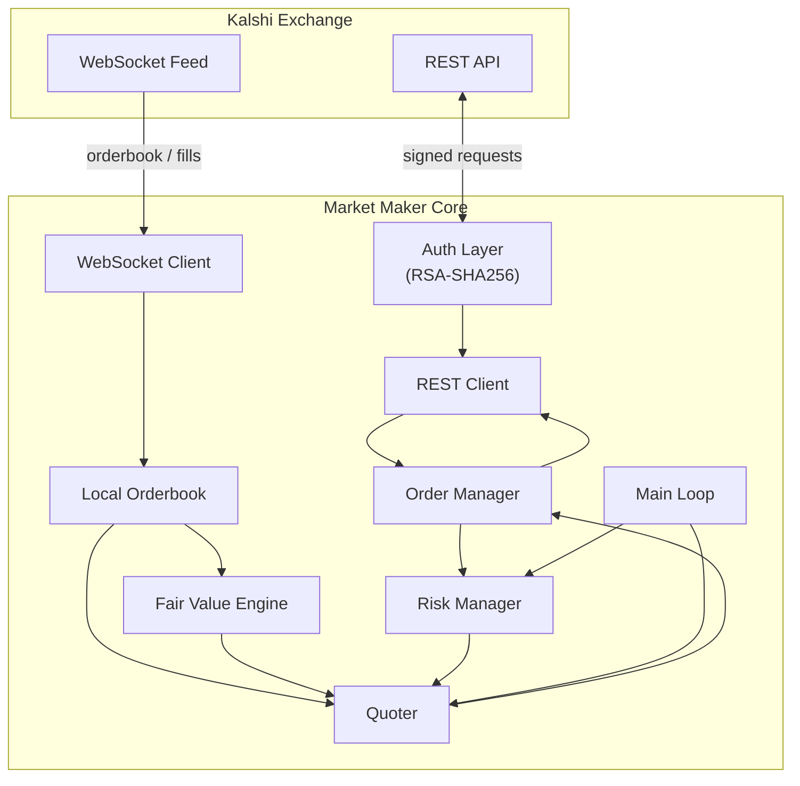
```mermaid
graph TD
    subgraph Exchange ["Kalshi Exchange"]
        REST["REST API"]
        WS["WebSocket Feed"]
    end

    subgraph Core ["Market Maker Core"]
        AUTH["Auth Layer\n(RSA-SHA256)"]
        HTTP["REST Client"]
        WSCONN["WebSocket Client"]
        OB["Local Orderbook"]
        OM["Order Manager"]
        RM["Risk Manager"]
        FV["Fair Value Engine"]
        QE["Quoter"]
        LOOP["Main Loop"]
    end

    REST <-->|signed requests| AUTH
    AUTH --> HTTP
    WS -->|orderbook / fills| WSCONN
    WSCONN --> OB
    HTTP --> OM
    OB --> FV
    OB --> QE
    FV --> QE
    RM --> QE
    QE --> OM
    OM --> HTTP
    OM --> RM
    LOOP --> QE
    LOOP --> RM
```

---

## UAT Blockers

These must be resolved before any live or demo-exchange testing.

### BLOCKER-1: IxWebSocket — RESOLVED

`cmake/ixwebsocket.cmake` fetches `machinezone/IXWebSocket` via FetchContent.
`IxWebSocket` in `source/websocket_client.cpp` delegates every method to an
`ix::WebSocket` stored in a pimpl `Impl`. The library compiles and links.

**Remaining:** connection to the live UAT endpoint has not been tested end-to-end.
That verification happens as part of the UAT dry run (BLOCKER-2 step).

---

### BLOCKER-2: REST API paths and field names unverified against UAT

**File:** `source/rest_client.cpp`

The REST client was written against documented API shapes but has not been
tested against the live UAT environment (`https://demo-api.kalshi.co/trade-api/v2`).
Kalshi has changed field names across API versions. A single wrong field name
silently breaks order placement or parsing without a compile-time error.

Fields most likely to drift: `yes_price`/`no_price` vs `price`, `count` vs
`quantity`, `status` string values (`resting` vs `open`), timestamp format.

**Fix:** Run against UAT with a single ticker, log raw request/response bodies,
and reconcile every field against Kalshi's current API reference before trading.

---

### Pre-UAT Checklist

- [x] BLOCKER-1: Implement `IxWebSocket` using the real `ix::WebSocket` library
- [x] BLOCKER-1: Add `cmake/ixwebsocket.cmake` FetchContent fetch
- [ ] BLOCKER-2: Raw REST request/response bodies verified against UAT
- [ ] Demo account created at kalshi.com, API key + RSA key pair generated
- [ ] `config.json` created from `config.example.json` with demo base URL
- [ ] Paper mode (`--paper`) runs to completion without errors
- [x] Phase 14 (structured logging) in place so UAT output is readable

---

## Phase 1 — Types & Domain Model

Define the shared data structures the entire system depends on. No I/O, no logic — just plain structs and enums. This is the foundation everything else builds on.

**TDD approach:** Write tests that construct, copy, compare, and serialize each type. Implementation is trivial; the point is locking the interface.

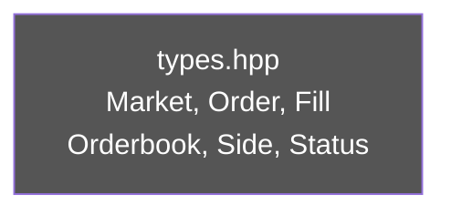
```mermaid
graph TD
    T["types.hpp\nMarket, Order, Fill\nOrderbook, Side, Status"]

    style T fill:#555,color:#fff
```

**Files:**
- `source/types.hpp`
- `test/source/types_test.cpp`

**Testing:**
- **Unit:** struct construction, field access, equality, `remaining_quantity()`, `is_active()`, `is_valid_price()`, `complement_price()` symmetry. All done — 19 tests passing.
- **Contract/Integration/ASAN:** N/A — pure value types, no I/O.

**Key types:**

```cpp
enum class Side { Yes, No };
enum class OrderStatus { Open, PartiallyFilled, Filled, Cancelled };
enum class OrderType { Limit, Market };

struct Order {
    std::string id;
    std::string market_ticker;
    Side side;
    int price_cents;      // 1–99
    int quantity;         // number of contracts
    int filled_quantity;
    OrderStatus status;
    std::chrono::system_clock::time_point created_at;
};

struct Level {
    int price_cents;
    int quantity;
};

struct Orderbook {
    std::string market_ticker;
    std::vector<Level> yes;  // sorted descending
    std::vector<Level> no;   // sorted descending
};

struct Fill {
    std::string order_id;
    std::string market_ticker;
    Side side;
    int price_cents;
    int quantity;
    std::chrono::system_clock::time_point timestamp;
};

struct Market {
    std::string ticker;
    std::string title;
    int min_tick;       // always 1
    int fee_rate_bps;
    std::chrono::system_clock::time_point close_time;
};
```

---

## Phase 2 — Authentication

Kalshi v2 requires every REST request to be signed with an RSA-SHA256 private key. This is the critical first integration point.

**TDD approach:** Sign a known message with a known test key, verify the base64 output matches the expected value. All tests are purely computational — no network.

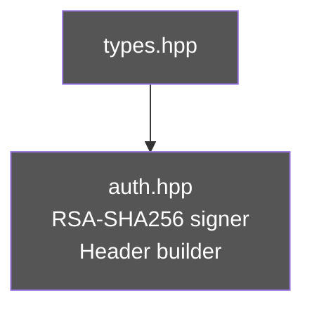
```mermaid
graph TD
    T["types.hpp"]
    AUTH["auth.hpp\nRSA-SHA256 signer\nHeader builder"]

    T --> AUTH

    style T fill:#555,color:#fff
    style AUTH fill:#555,color:#fff
```

**Files:**
- `source/auth.hpp` / `source/auth.cpp`
- `test/source/auth_test.cpp`

**Interface:**

```cpp
class Auth {
public:
    explicit Auth(std::string api_key, std::string pem_private_key);

    // Returns headers to attach to every request
    std::map<std::string, std::string> sign(
        std::string_view method,   // "GET", "POST", etc.
        std::string_view path      // "/trade-api/v2/markets"
    ) const;
};
```

**Headers produced:**
```
Kalshi-Access-Key: <api_key>
Kalshi-Access-Timestamp: <unix_ms>
Kalshi-Access-Signature: <base64(RSA_SHA256(timestamp + method + path))>
```

**Dependency:** OpenSSL (`find_package(OpenSSL REQUIRED)` in CMake).

**Testing:**
- **Unit:** generate an RSA keypair at test time, sign a message, verify the signature with the public key. Test header names, API key passthrough, timestamp bounds, invalid key throws. All done — 7 tests passing.
- **Integration** (`KALSHI_INTEGRATION_TESTS=ON`): sign a real `GET /markets` request against the demo API and assert HTTP 200. This proves the key format, timestamp tolerance, and base64 encoding are all correct end-to-end.
- **ASAN:** run `cmake --preset=asan` — OpenSSL memory handling is a common source of leaks under sanitizers.

---

## Phase 3 — REST Client

Thin HTTP wrapper around libcurl. Responsible only for making signed requests and returning raw JSON strings. JSON parsing happens in callers.

**TDD approach:** Inject an `IHttpTransport` interface. Unit tests use a `FakeTransport` that returns canned responses. A separate integration test (gated by `KALSHI_INTEGRATION_TESTS=ON`) hits the real API.

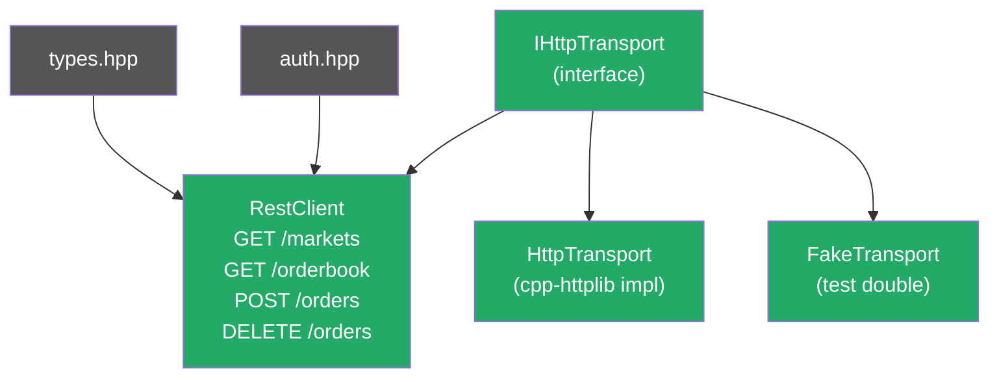
```mermaid
graph TD
    T["types.hpp"]
    AUTH["auth.hpp"]
    IHTTP["IHttpTransport\n(interface)"]
    CURL["HttpTransport\n(cpp-httplib impl)"]
    FAKE["FakeTransport\n(test double)"]
    RC["RestClient\nGET /markets\nGET /orderbook\nPOST /orders\nDELETE /orders"]

    T --> RC
    AUTH --> RC
    IHTTP --> RC
    IHTTP --> CURL
    IHTTP --> FAKE

    style T fill:#555,color:#fff
    style AUTH fill:#555,color:#fff
    style RC fill:#2a6,color:#fff
    style IHTTP fill:#2a6,color:#fff
    style CURL fill:#2a6,color:#fff
    style FAKE fill:#2a6,color:#fff
```

**Files:**
- `source/http_transport.hpp` (interface + CurlTransport)
- `source/rest_client.hpp` / `source/rest_client.cpp`
- `test/source/rest_client_test.cpp`

**Testing:**
- **Unit:** inject `FakeTransport` returning canned JSON strings. Test each method (`get_markets`, `get_orderbook`, `place_order`, `cancel_order`) parses the response into the correct domain struct. Test HTTP error codes (4xx, 5xx) throw or return expected errors.
- **Contract:** record real responses from the demo API into `test/fixtures/` (e.g. `orderbook_KXBTCD.json`). Add a test that parses the fixture — catches API schema drift without needing a live connection.
- **Integration** (`KALSHI_INTEGRATION_TESTS=ON`): call `get_markets()` and `get_orderbook(ticker)` against demo. Assert the returned structs are well-formed (non-empty ticker, valid price levels).
- **ASAN:** libcurl manages its own memory; run under ASAN to confirm no leaks in our wrapper.

**Interface:**

```cpp
class RestClient {
public:
    RestClient(const Auth& auth, std::unique_ptr<IHttpTransport> transport,
               std::string base_url = "https://trading-api.kalshi.com/trade-api/v2");

    std::vector<Market> get_markets(std::string_view event_ticker = "");
    Orderbook get_orderbook(std::string_view ticker);
    Order place_order(std::string_view ticker, Side side,
                      int price_cents, int quantity, OrderType type);
    bool cancel_order(std::string_view order_id);
    std::vector<Order> get_open_orders();
};
```

**Sequence (place order):**

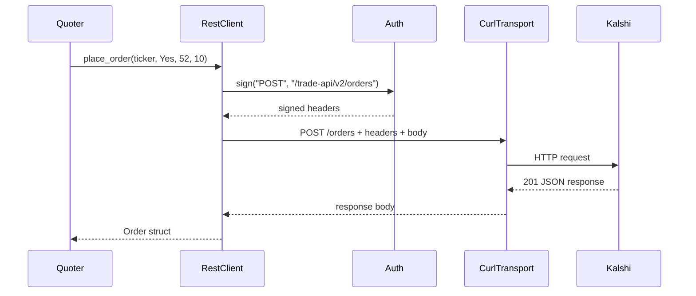
```mermaid
sequenceDiagram
    participant Q as Quoter
    participant RC as RestClient
    participant A as Auth
    participant T as CurlTransport
    participant K as Kalshi

    Q->>RC: place_order(ticker, Yes, 52, 10)
    RC->>A: sign("POST", "/trade-api/v2/orders")
    A-->>RC: signed headers
    RC->>T: POST /orders + headers + body
    T->>K: HTTP request
    K-->>T: 201 JSON response
    T-->>RC: response body
    RC-->>Q: Order struct
```

---

## Phase 4 — Local Orderbook

Maintains an in-memory mirror of the exchange orderbook, updated via WebSocket deltas. Provides fast BBO (best bid/offer) lookups without network round trips.

**TDD approach:** Feed sequences of delta messages into the orderbook and assert the resulting state. Test BBO calculation, mid-price, and edge cases (empty book, locked market).

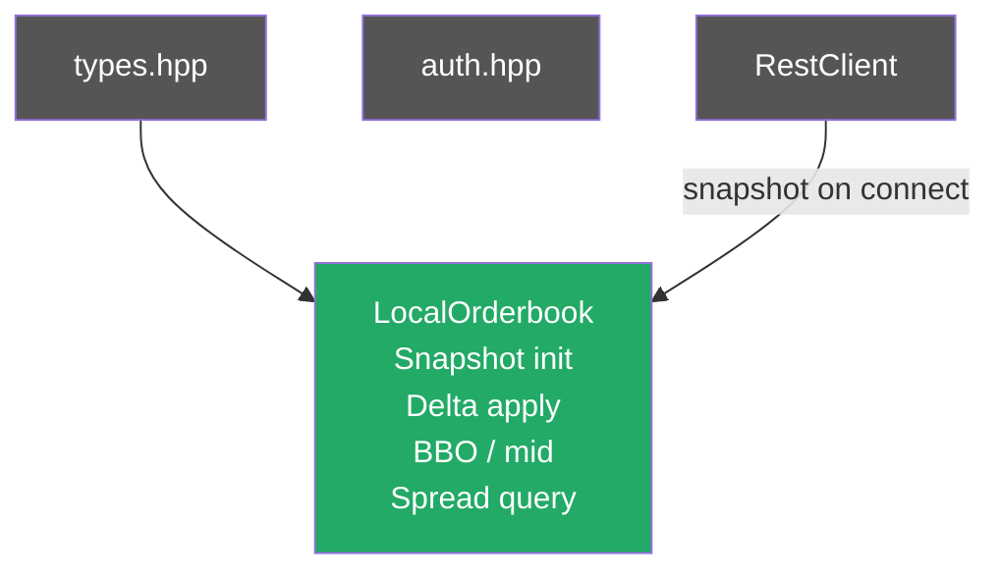
```mermaid
graph TD
    T["types.hpp"]
    AUTH["auth.hpp"]
    RC["RestClient"]
    OB["LocalOrderbook\nSnapshot init\nDelta apply\nBBO / mid\nSpread query"]

    T --> OB
    RC -->|snapshot on connect| OB

    style T fill:#555,color:#fff
    style AUTH fill:#555,color:#fff
    style RC fill:#555,color:#fff
    style OB fill:#2a6,color:#fff
```

**Files:**
- `source/orderbook.hpp` / `source/orderbook.cpp`
- `test/source/orderbook_test.cpp`

**Interface:**

```cpp
class LocalOrderbook {
public:
    void apply_snapshot(const Orderbook& snap);
    void apply_delta(Side side, int price_cents, int new_quantity); // quantity=0 means remove

    std::optional<Level> best_bid() const;  // highest yes price
    std::optional<Level> best_ask() const;  // lowest yes ask (= 100 - best no bid)
    double mid_price_cents() const;
    int spread_cents() const;

    const Orderbook& state() const;
};
```

**Note on Kalshi orderbook mechanics:** YES and NO are two sides of the same contract. The YES ask price = `100 - NO bid price`. Kalshi's feed gives you both YES and NO levels; the implied best ask on YES comes from the best bid on NO.

**Testing:**
- **Unit:** apply a known sequence of snapshot + deltas, assert exact BBO and mid after each step. Test edge cases: empty book returns `std::nullopt` for BBO, single-sided book, delta that removes a level (quantity = 0), delta that adds a new level at a new price.
- **Contract:** capture a real WebSocket `orderbook_snapshot` message from the demo API, save to `test/fixtures/orderbook_snapshot.json`, write a test that applies it and checks BBO is in [1,99].
- **Integration/ASAN:** N/A — pure in-memory logic; covered by unit tests under ASAN.

---

## Phase 5 — WebSocket Client

Streams real-time orderbook snapshots and delta updates, and fill confirmations. Drives the `LocalOrderbook` and `OrderManager` with live data.

**TDD approach:** Mock the WebSocket connection with a `FakeWebSocket` that replays recorded message sequences. Test that the client correctly dispatches snapshot vs. delta messages and calls the registered callbacks.

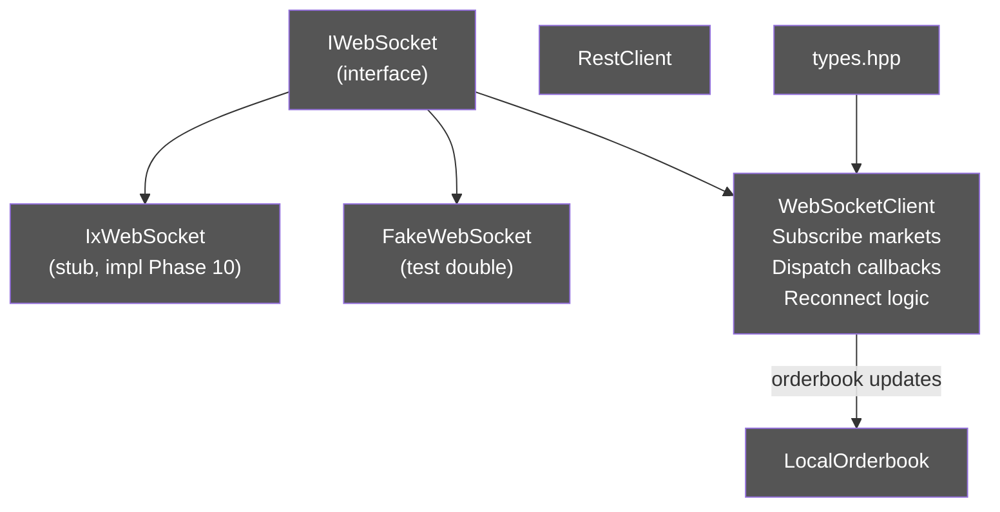
```mermaid
graph TD
    T["types.hpp"]
    RC["RestClient"]
    OB["LocalOrderbook"]
    IWS["IWebSocket\n(interface)"]
    BWSS["IxWebSocket\n(stub, impl Phase 10)"]
    FWS["FakeWebSocket\n(test double)"]
    WSC["WebSocketClient\nSubscribe markets\nDispatch callbacks\nReconnect logic"]

    T --> WSC
    IWS --> WSC
    IWS --> BWSS
    IWS --> FWS
    WSC -->|orderbook updates| OB

    style T fill:#555,color:#fff
    style RC fill:#555,color:#fff
    style OB fill:#555,color:#fff
    style WSC fill:#555,color:#fff
    style IWS fill:#555,color:#fff
    style BWSS fill:#555,color:#fff
    style FWS fill:#555,color:#fff
```

**Files:**
- `source/websocket_client.hpp` / `source/websocket_client.cpp`
- `test/source/websocket_client_test.cpp`

**Testing:**
- **Unit:** inject `FakeWebSocket` that replays a scripted sequence of raw JSON messages. Assert `on_orderbook_snapshot`, `on_orderbook_delta`, and `on_fill` callbacks fire with correctly parsed payloads. Test reconnection: simulate a disconnect, assert the client attempts to reconnect and re-subscribes.
- **Contract:** capture a real `orderbook_delta` and `fill` message from the demo API into `test/fixtures/`. Test parsing in isolation.
- **Integration** (`KALSHI_INTEGRATION_TESTS=ON`): connect to the demo WebSocket, subscribe to one market, receive at least one delta within a timeout. Verifies auth handshake, subscription format, and message parsing end-to-end.
- **TSAN:** the WebSocket client runs a background thread; run under ThreadSanitizer to catch races between the callback thread and the main loop reading `LocalOrderbook`.

**Callbacks registered by the main loop:**

```cpp
ws_client.on_orderbook_snapshot([&](const Orderbook& snap) {
    local_ob.apply_snapshot(snap);
});
ws_client.on_orderbook_delta([&](const std::string& ticker, Side side,
                                  int price, int qty) {
    local_ob.apply_delta(side, price, qty);
});
ws_client.on_fill([&](const Fill& fill) {
    order_manager.record_fill(fill);
});
```

---

## Phase 6 — Order Manager

Tracks the lifecycle of all live orders. Provides a clean interface for placing, cancelling, and amending quotes. Reconciles local state with fill confirmations.

**TDD approach:** Drive the order manager through state transitions with synthetic fills and cancellations. Test that duplicate fills are idempotent, that cancelling a filled order is handled gracefully, and that the position calculation is correct.

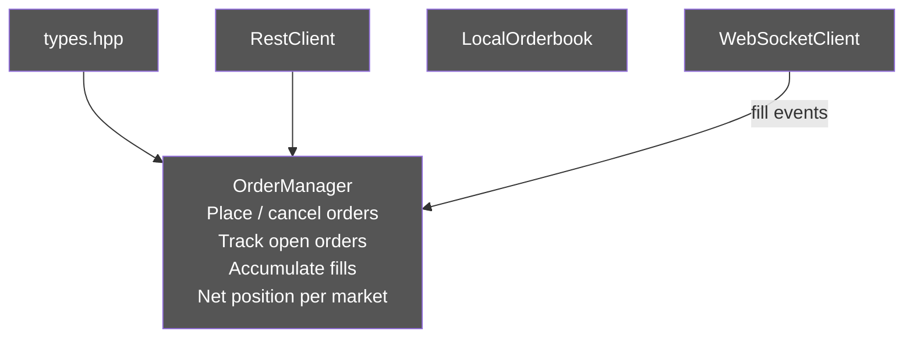
```mermaid
graph TD
    T["types.hpp"]
    RC["RestClient"]
    OB["LocalOrderbook"]
    WSC["WebSocketClient"]
    OM["OrderManager\nPlace / cancel orders\nTrack open orders\nAccumulate fills\nNet position per market"]

    T --> OM
    RC --> OM
    WSC -->|fill events| OM

    style T fill:#555,color:#fff
    style RC fill:#555,color:#fff
    style OB fill:#555,color:#fff
    style WSC fill:#555,color:#fff
    style OM fill:#555,color:#fff
```

**Files:**
- `source/order_manager.hpp` / `source/order_manager.cpp`
- `test/source/order_manager_test.cpp`

**Interface:**

```cpp
class OrderManager {
public:
    Order place(const std::string& ticker, Side side,
                int price_cents, int quantity);
    bool cancel(const std::string& order_id);
    void cancel_all(const std::string& ticker);

    void record_fill(const Fill& fill);

    // Returns net YES position (negative = net NO)
    int net_position(const std::string& ticker) const;
    double realized_pnl(const std::string& ticker) const;

    const std::unordered_map<std::string, Order>& open_orders() const;
};
```

**Testing:**
- **Unit:** drive the state machine with synthetic fills and cancellations. Test that a duplicate fill is idempotent. Test that cancelling a filled order is handled gracefully. Test `net_position()` across a sequence of YES buys and NO buys (which reduce YES position). Test `realized_pnl()` against a known sequence of fills.
- **Contract:** record a real order JSON response from the demo API into `test/fixtures/order_placed.json`. Test that `place_order()` parses it correctly.
- **Integration** (`KALSHI_INTEGRATION_TESTS=ON`): place a 1-contract limit order at an extreme price (1 cent) on the demo API — unlikely to fill. Assert order appears in `get_open_orders()`. Cancel it. Assert it no longer appears.
- **ASAN:** `unordered_map` iteration during cancellation is a common bug site.

---

## Phase 7 — Risk Manager

Guards all outgoing order actions. Acts as a gatekeeper that the Quoter must pass through before any order reaches the exchange. Think of this as your pre-trade risk checks.

**TDD approach:** Write tests that try to breach each limit and confirm the order is rejected. Test PnL accumulation over a sequence of fills. Test that the daily loss limit triggers a full cancel-and-halt.

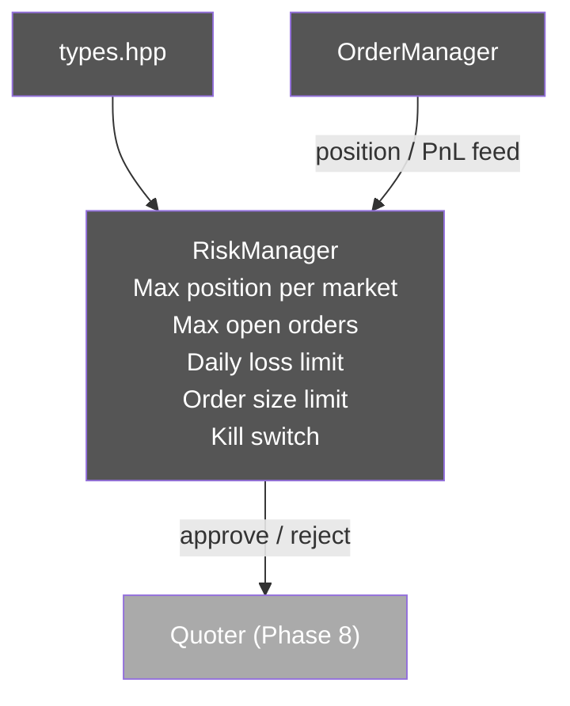
```mermaid
graph TD
    T["types.hpp"]
    OM["OrderManager"]
    RM["RiskManager\nMax position per market\nMax open orders\nDaily loss limit\nOrder size limit\nKill switch"]

    T --> RM
    OM -->|position / PnL feed| RM
    RM -->|approve / reject| QE["Quoter (Phase 8)"]

    style T fill:#555,color:#fff
    style OM fill:#555,color:#fff
    style RM fill:#555,color:#fff
    style QE fill:#aaa,color:#fff
```

**Files:**
- `source/risk_manager.hpp` / `source/risk_manager.cpp`
- `test/source/risk_manager_test.cpp`

**Interface:**

```cpp
struct RiskLimits {
    int max_position_per_market = 100;   // contracts
    int max_open_orders_per_market = 4;
    int max_order_size = 25;             // contracts
    double daily_loss_limit = -500.0;    // dollars
};

class RiskManager {
public:
    explicit RiskManager(RiskLimits limits);

    bool check_order(const std::string& ticker, Side side,
                     int price_cents, int quantity) const;

    void update(const OrderManager& om);

    bool is_halted() const;
    void halt();   // manual kill switch
    void resume();
};
```

**Testing:**
- **Unit:** attempt to breach each limit individually and assert `check_order()` returns false. Test that breaching the daily loss limit triggers `is_halted()`. Test `halt()` blocks all subsequent orders. Test `resume()` restores normal operation. Test that limits are evaluated independently (e.g. position OK but order size too large → reject).
- **Integration/Contract/ASAN:** N/A — pure logic, no I/O. Run unit tests under ASAN.

---

## Phase 8 — Fair Value Engine

Estimates the true probability of the event. This is where alpha lives. Start simple and layer complexity.

**TDD approach:** Each model is a pure function from inputs to a probability in [0,1]. Tests are deterministic — feed known inputs, assert expected outputs. No randomness, no I/O.

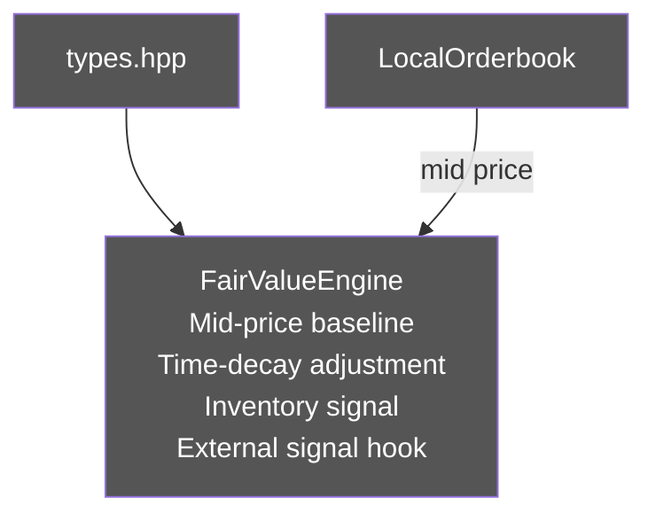
```mermaid
graph TD
    T["types.hpp"]
    OB["LocalOrderbook"]
    FV["FairValueEngine\nMid-price baseline\nTime-decay adjustment\nInventory signal\nExternal signal hook"]

    T --> FV
    OB -->|mid price| FV

    style T fill:#555,color:#fff
    style OB fill:#555,color:#fff
    style FV fill:#555,color:#fff
```

**Files:**
- `source/fair_value.hpp` / `source/fair_value.cpp`
- `test/source/fair_value_test.cpp`

**Model progression:**

1. **Baseline (v1):** Fair value = orderbook mid-price. No edge, but safe to deploy.
2. **Time-weighted (v2):** Fade extreme prices as resolution approaches. If event closes in 1 hour and price is 95, is that really right?
3. **Inventory-adjusted (v3):** If you're long 80 YES contracts, shade fair value down slightly to encourage selling.
4. **External signal (v4):** Hook for injecting external probability estimates (weather APIs, polling data, etc.).

```cpp
struct FairValueInput {
    double mid_cents;
    double time_to_close_hours;
    int net_position;               // your current inventory
    std::optional<double> external_prob;
};

class FairValueEngine {
public:
    double estimate(const FairValueInput& input) const;  // returns cents [1, 99]
};
```

**Testing:**
- **Unit:** for each model layer, feed known inputs and assert the output is within expected bounds. Test that the baseline returns exactly the mid-price. Test that time-decay pulls extreme values toward 50 as `time_to_close_hours` approaches 0. Test that inventory skew shifts the estimate in the correct direction. Test that output is always clamped to [1, 99].
- **Integration/Contract/ASAN:** N/A — pure math. Run under ASAN to catch any floating-point UB.

---

## Phase 9 — Quoter

The brain of the market maker. Combines fair value, inventory, and risk into bid/ask quotes, then instructs the OrderManager to maintain those quotes on the exchange.

**TDD approach:** Test quote generation in isolation with mocked FairValueEngine and RiskManager. Test that inventory skew shifts quotes correctly. Test that stale quotes are cancelled and refreshed.

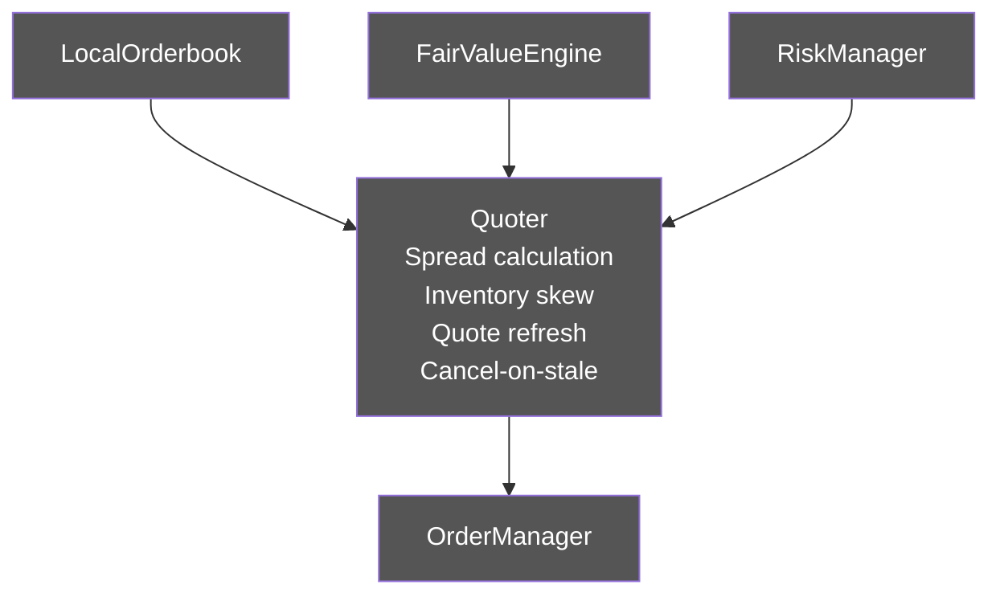
```mermaid
graph TD
    OB["LocalOrderbook"]
    FV["FairValueEngine"]
    RM["RiskManager"]
    OM["OrderManager"]
    QE["Quoter\nSpread calculation\nInventory skew\nQuote refresh\nCancel-on-stale"]

    OB --> QE
    FV --> QE
    RM --> QE
    QE --> OM

    style OB fill:#555,color:#fff
    style FV fill:#555,color:#fff
    style RM fill:#555,color:#fff
    style OM fill:#555,color:#fff
    style QE fill:#555,color:#fff
```

**Files:**
- `source/quoter.hpp` / `source/quoter.cpp`
- `test/source/quoter_test.cpp`

**Quoting logic:**

```
fair_value_cents = fair_value_engine.estimate(input)

base_half_spread = max(1, target_spread_cents / 2)
inventory_skew   = net_position * skew_per_contract_cents
                   // positive position = shade down (sell cheaper)

bid = clamp(round(fair_value - base_half_spread - inventory_skew), 1, 98)
ask = clamp(round(fair_value + base_half_spread - inventory_skew), 2, 99)

assert ask > bid  // minimum 1 cent spread
```

**Quote refresh:** On each tick, compare current live quotes to desired quotes. If they differ by more than `reprice_threshold_cents`, cancel and replace. Avoid churning orders on every tick.

```cpp
struct QuoterConfig {
    int target_spread_cents = 4;
    double skew_per_contract_cents = 0.05;
    int reprice_threshold_cents = 1;
    int quote_size = 10;                   // contracts per side
};

class Quoter {
public:
    Quoter(QuoterConfig cfg, FairValueEngine& fv,
           OrderManager& om, RiskManager& rm);

    void update(const std::string& ticker, const LocalOrderbook& ob);
};
```

**Testing:**
- **Unit:** inject fake `FairValueEngine`, `OrderManager`, and `RiskManager`. Assert that `update()` places a bid and ask at the correct prices given a known fair value and zero inventory. Assert inventory skew shifts both quotes in the correct direction. Assert that a quote within `reprice_threshold_cents` of its target is not cancelled and replaced. Assert that risk rejection (fake RM returns false) results in no order.
- **Integration** (`KALSHI_INTEGRATION_TESTS=ON`): run one `update()` cycle against the demo API with a real `LocalOrderbook` populated from REST. Verify a bid and ask appear in the live orderbook. Cancel them.
- **TSAN:** `update()` will be called from the WebSocket callback thread — run under ThreadSanitizer with a concurrent fake feed.

---

## Phase 10 — Main Loop & Integration

Wire all components together. The main loop drives quote updates on each orderbook event.

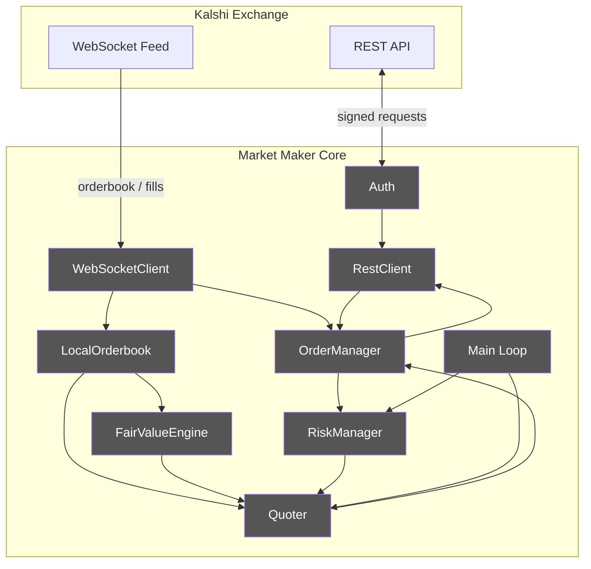
```mermaid
graph TD
    subgraph Exchange ["Kalshi Exchange"]
        REST["REST API"]
        WS["WebSocket Feed"]
    end

    subgraph Core ["Market Maker Core"]
        AUTH["Auth"]
        HTTP["RestClient"]
        WSCONN["WebSocketClient"]
        OB["LocalOrderbook"]
        OM["OrderManager"]
        RM["RiskManager"]
        FV["FairValueEngine"]
        QE["Quoter"]
        LOOP["Main Loop"]
    end

    REST <-->|signed requests| AUTH
    AUTH --> HTTP
    WS -->|orderbook / fills| WSCONN
    WSCONN --> OB
    WSCONN --> OM
    HTTP --> OM
    OB --> FV
    OB --> QE
    FV --> QE
    RM --> QE
    QE --> OM
    OM --> HTTP
    OM --> RM
    LOOP --> QE
    LOOP --> RM

    style AUTH fill:#555,color:#fff
    style HTTP fill:#555,color:#fff
    style WSCONN fill:#555,color:#fff
    style OB fill:#555,color:#fff
    style OM fill:#555,color:#fff
    style RM fill:#555,color:#fff
    style FV fill:#555,color:#fff
    style QE fill:#555,color:#fff
    style LOOP fill:#555,color:#fff
```

**Main loop pseudocode:**

```cpp
int main() {
    auto auth = Auth{api_key, private_key_pem};
    auto rest = RestClient{auth, std::make_unique<CurlTransport>()};
    auto ws   = WebSocketClient{auth};

    auto ob_map = std::unordered_map<std::string, LocalOrderbook>{};
    auto om     = OrderManager{rest};
    auto rm     = RiskManager{RiskLimits{}};
    auto fv     = FairValueEngine{};
    auto quoter = Quoter{QuoterConfig{}, fv, om, rm};

    // Subscribe to target markets
    for (auto& ticker : target_tickers) {
        auto snap = rest.get_orderbook(ticker);
        ob_map[ticker].apply_snapshot(snap);
        ws.subscribe(ticker);
    }

    ws.on_orderbook_delta([&](const std::string& ticker, Side side, int p, int q) {
        ob_map[ticker].apply_delta(side, p, q);
        quoter.update(ticker, ob_map[ticker]);
    });

    ws.on_fill([&](const Fill& fill) {
        om.record_fill(fill);
        rm.update(om);
    });

    ws.run();  // blocks, drives event loop
}
```

**Testing:**
- **Integration** (`KALSHI_INTEGRATION_TESTS=ON`): full end-to-end run on the demo environment for 60 seconds. Assert the process places quotes, receives at least one orderbook delta, reprices at least once, and shuts down cleanly without open orders (cancel-on-exit).
- **Docker:** build and run inside `Dockerfile.test`. Credentials injected via Docker secrets. This is the form used in CI.
- **ASAN + TSAN:** run the full integration test under each sanitizer. The WebSocket thread + main loop interaction is the highest-risk race condition surface.
- **Backtesting:** record a 10-minute live session to a delta log, replay it through the quoter offline. Compare simulated PnL vs. recorded fills to validate the model.

---

## Post-Phase-10 Roadmap

### Phase 11 — Pluggable Pricing Model ✓

**Status: complete.** `source/pricing_model.hpp/cpp`, 12 unit tests + 2 delegation tests in `test/source/pricing_model_test.cpp`.

`FairValueEngine` now owns a `std::unique_ptr<IPricingModel>` and delegates `estimate()` to it. The 3-arg `Quoter` constructor injects a `HeuristicModel` by default; tests inject stubs (`FixedModel`, `EchoMidModel`). `FairValueInput` lives in `pricing_model.hpp`.

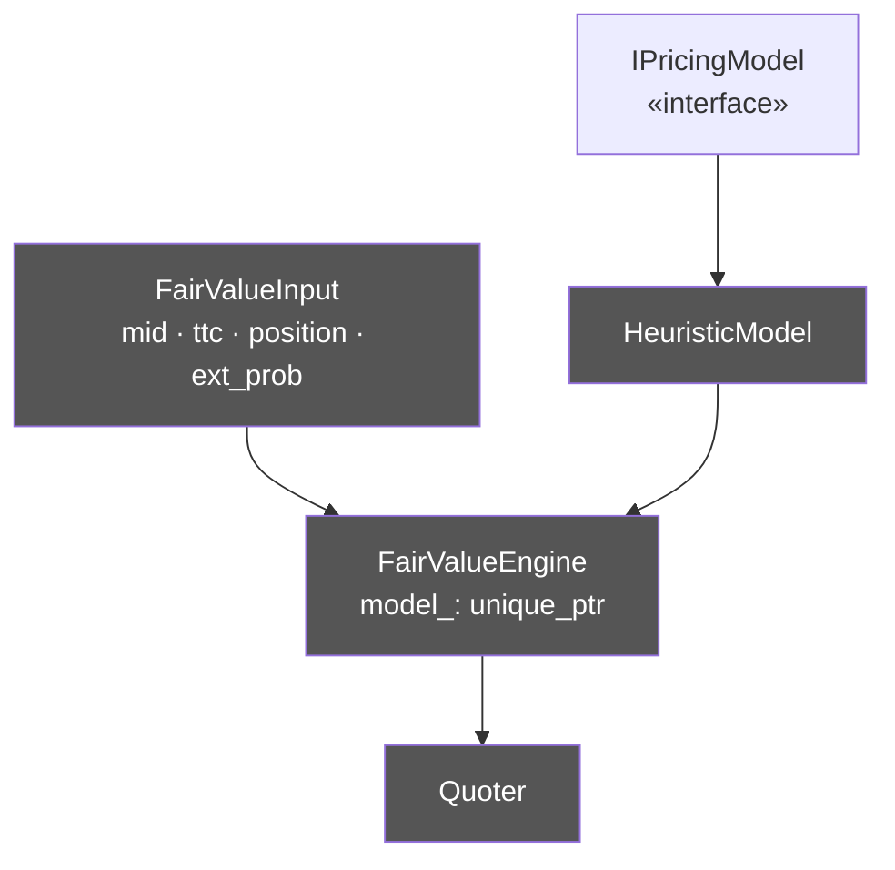
```mermaid
graph TD
    FVI["FairValueInput\nmid · ttc · position · ext_prob"]
    IPM["IPricingModel\n«interface»"]
    HM["HeuristicModel"]
    FVE["FairValueEngine\nmodel_: unique_ptr"]
    QT["Quoter"]

    FVI --> FVE
    IPM --> HM
    HM --> FVE
    FVE --> QT

    style FVI fill:#555,color:#fff
    style HM fill:#555,color:#fff
    style FVE fill:#555,color:#fff
    style QT fill:#555,color:#fff
```

**Concrete implementations to build toward:**

- **Heuristic** (current): mid-price + parametric time-decay. Ship-safe baseline with no edge.
- **Calibrated statistical model**: train on historical resolution outcomes vs. market price at various time horizons. Logistic regression or XGBoost on features: time-to-close, bid/ask imbalance, recent delta velocity, cross-market correlation. Output is a calibrated probability that feeds as `external_prob`.
- **Order flow model**: short-term signal from trade imbalance and quote stuffing — effective in liquid prediction markets where informed traders leave footprints.
- **Reinforcement learning (long-term)**: directly optimize spread/skew parameters rather than computing a fair value. The Quoter's `QuoterConfig` fields become policy outputs from an RL agent trained on historical PnL.

---

### Phase 12 — Theo Grid (Fast Repricing for Underlying-Linked Markets) ✓

**Status: complete.** `source/theo_grid.hpp/cpp`, 10 unit tests in `test/source/theo_grid_test.cpp`.

`TheoGrid` holds a 2-D `vector<vector<double>>` of `(ttc_hours × mid_cents) → fair_value_cents`. `lookup()` does a binary search on each axis then bilinear interpolation; inputs outside the breakpoint range are clamped. `TheoGridConfig::default_config()` ships a 5×5 placeholder grid. All arithmetic uses `.at()` for bounds safety.

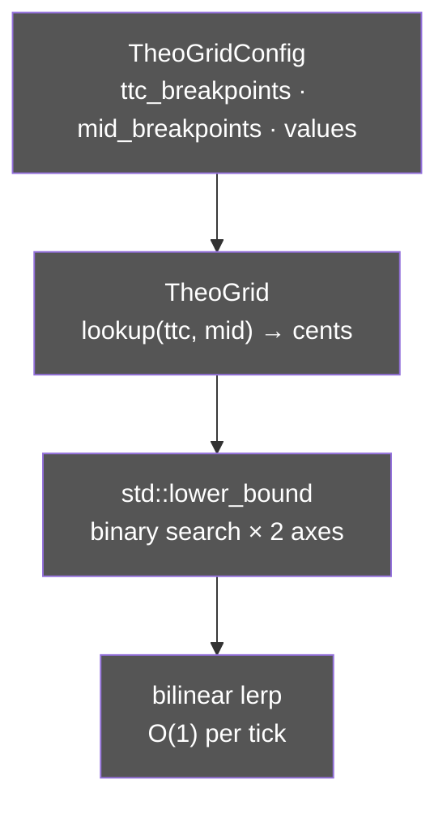
```mermaid
graph TD
    TGC["TheoGridConfig\nttc_breakpoints · mid_breakpoints · values"]
    TG["TheoGrid\nlookup(ttc, mid) → cents"]
    BS["std::lower_bound\nbinary search × 2 axes"]
    BI["bilinear lerp\nO(1) per tick"]

    TGC --> TG
    TG --> BS
    BS --> BI

    style TGC fill:#555,color:#fff
    style TG fill:#555,color:#fff
    style BS fill:#555,color:#fff
    style BI fill:#555,color:#fff
```

**When this matters:**
- Quoting multiple correlated tickers simultaneously (e.g., all BTC price-tier markets: `>$90k`, `>$95k`, `>$99k`). One spot move → reprice all tickers via table lookup with no model calls.
- Underlying moves faster than the model can evaluate (sub-millisecond repricing required).
- Running an ML model whose inference cost is non-trivial.

---

### Phase 13 — Constraint Bitset & Adverse Selection Guard ✓

**Status: complete.** Constraint bitset: `source/risk_manager.hpp/cpp`, 7 new tests in `test/source/risk_manager_test.cpp`. Adverse selection guard: `source/adverse_selection.hpp/cpp`, 6 tests in `test/source/adverse_selection_test.cpp`.

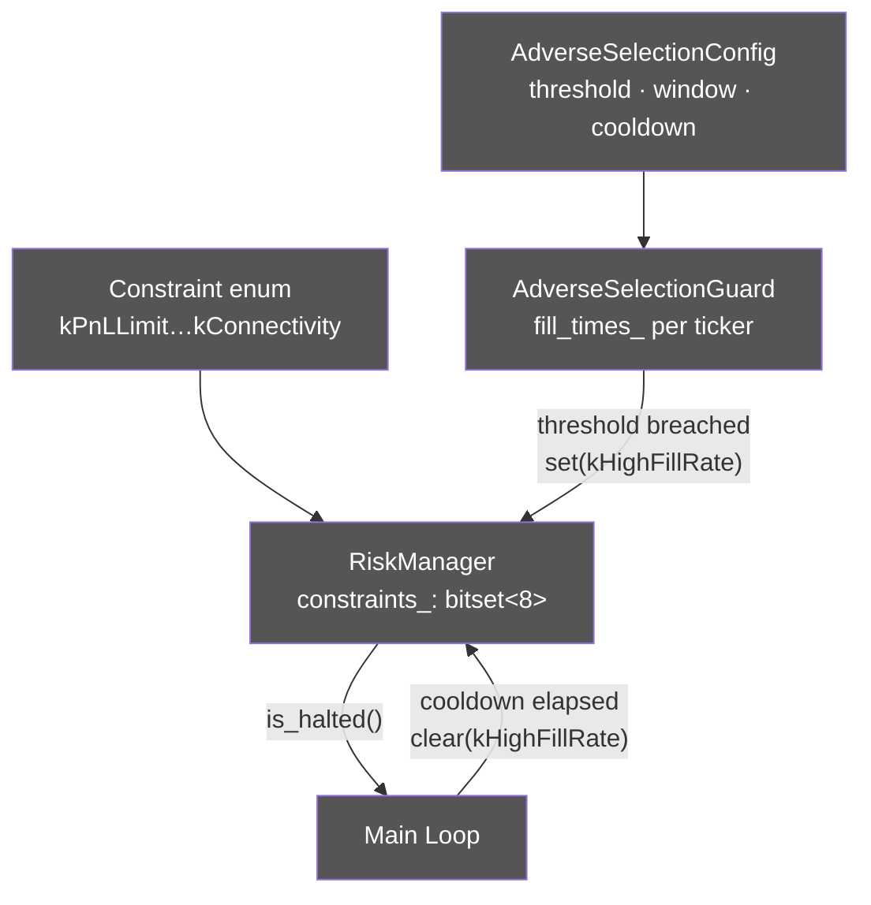
```mermaid
graph TD
    RM["RiskManager\nconstraints_: bitset&lt;8&gt;"]
    CB["Constraint enum\nkPnLLimit…kConnectivity"]
    ASG["AdverseSelectionGuard\nfill_times_ per ticker"]
    ASC["AdverseSelectionConfig\nthreshold · window · cooldown"]
    ML["Main Loop"]

    CB --> RM
    ASC --> ASG
    ASG -->|"threshold breached\nset(kHighFillRate)"| RM
    ML -->|"cooldown elapsed\nclear(kHighFillRate)"| RM
    RM -->|"is_halted()"| ML

    style RM fill:#555,color:#fff
    style CB fill:#555,color:#fff
    style ASG fill:#555,color:#fff
    style ASC fill:#555,color:#fff
    style ML fill:#555,color:#fff
```

`is_halted()` is `constraints_.any()` — Quoter sees no interface change. `active_constraints()` returns a space-separated string of set bit names for logging and diagnostics. `RiskManager::set()` and `clear()` emit `warn`/`info` log lines via `get_logger()`.

---

### Phase 14 — Logging & Observability ✓

**Status: complete.** `source/logger.hpp/cpp`, 4 tests in `test/source/logger_test.cpp`. spdlog fetched via `cmake/spdlog.cmake` (v1.14.1).

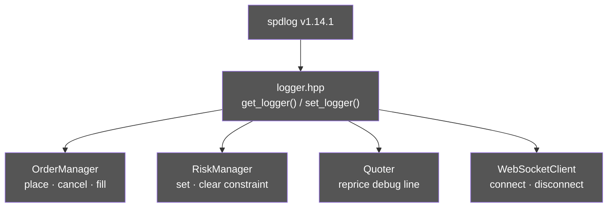
```mermaid
graph TD
    SL["spdlog v1.14.1"]
    LG["logger.hpp\nget_logger() / set_logger()"]
    OM["OrderManager\nplace · cancel · fill"]
    RM["RiskManager\nset · clear constraint"]
    QT["Quoter\nreprice debug line"]
    WS["WebSocketClient\nconnect · disconnect"]

    SL --> LG
    LG --> OM
    LG --> RM
    LG --> QT
    LG --> WS

    style SL fill:#555,color:#fff
    style LG fill:#555,color:#fff
    style OM fill:#555,color:#fff
    style RM fill:#555,color:#fff
    style QT fill:#555,color:#fff
    style WS fill:#555,color:#fff
```

`get_logger()` returns a process-wide `spdlog::logger` (stdout color sink by default). `set_logger()` replaces it — used in tests to inject an `ostream_sink` backed by `ostringstream` for hermetic log-content assertions. Log levels: `info` for orders/fills/constraint clears, `warn` for constraint sets and disconnects, `debug` for reprice ticks.

**Latency metrics (Phase 14b — not yet built)**

The event-log layer is in place. A separate `Metrics` collector (lock-free ring buffer → Prometheus or CSV) is deferred until UAT confirms the hot path is correct. Key metrics to instrument when ready: `ws_delta_to_fv_us`, `fv_to_order_us`, `order_rtt_ms`, `quote_cycle_us`, `reprice_rate`, `fill_rate`.

---

### Phase 15 — Config File & Graceful Shutdown

All runtime parameters (target tickers, spread, position limits, API credentials) are loaded from a TOML or JSON config file at startup. A SIGTERM/SIGINT handler cancels all open orders before the process exits.

**Why these together:** Both are required before going live on real capital. Hardcoded parameters mean recompiling to change a ticker; no graceful shutdown means leaving naked quotes on the book after Ctrl-C.

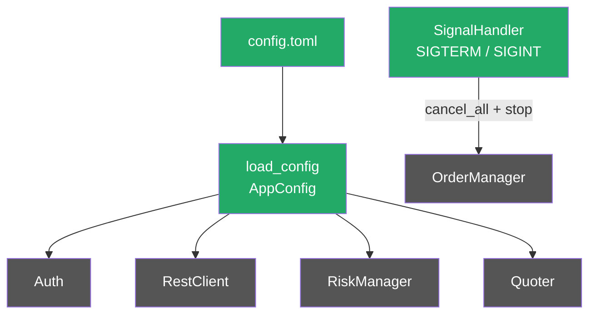
```mermaid
graph TD
    CFG["config.toml"]
    LOADER["load_config\nAppConfig"]
    AUTH["Auth"]
    RC["RestClient"]
    RM["RiskManager"]
    QE["Quoter"]
    OM["OrderManager"]
    SIG["SignalHandler\nSIGTERM / SIGINT"]

    CFG --> LOADER
    LOADER --> AUTH
    LOADER --> RC
    LOADER --> RM
    LOADER --> QE
    SIG -->|cancel_all + stop| OM

    style AUTH fill:#555,color:#fff
    style RC fill:#555,color:#fff
    style RM fill:#555,color:#fff
    style QE fill:#555,color:#fff
    style OM fill:#555,color:#fff
    style CFG fill:#2a6,color:#fff
    style LOADER fill:#2a6,color:#fff
    style SIG fill:#2a6,color:#fff
```

**Files:**
- `source/config.hpp` / `source/config.cpp`
- `test/source/config_test.cpp`
- `config.example.toml`

**Interface:**

```cpp
struct AppConfig {
    std::string api_key;
    std::string private_key_path;
    std::string base_url;
    std::vector<std::string> target_tickers;
    QuoterConfig quoter;
    RiskLimits risk;
};

AppConfig load_config(const std::filesystem::path& path);
```

**Graceful shutdown (in main):**

```cpp
std::signal(SIGTERM, [](int) { g_shutdown.store(true); });
std::signal(SIGINT,  [](int) { g_shutdown.store(true); });

// On shutdown:
om.cancel_all_markets();
ws.stop();
```

**Testing:**
- **Unit:** parse a known fixture, assert every field maps correctly. Test missing required fields throw. Test optional fields get defaults. Test unknown fields are ignored (forward-compat).
- **Unit (shutdown):** send SIGINT to the process under test via `kill(getpid(), SIGINT)`, assert `cancel_all` was called on the fake `OrderManager`.

---

### Phase 16 — CI Pipeline & Coverage

GitHub Actions workflow: build, test, clang-tidy, ASAN, and coverage report on every push and pull request. A coverage threshold fails the build if coverage drops below 80%.

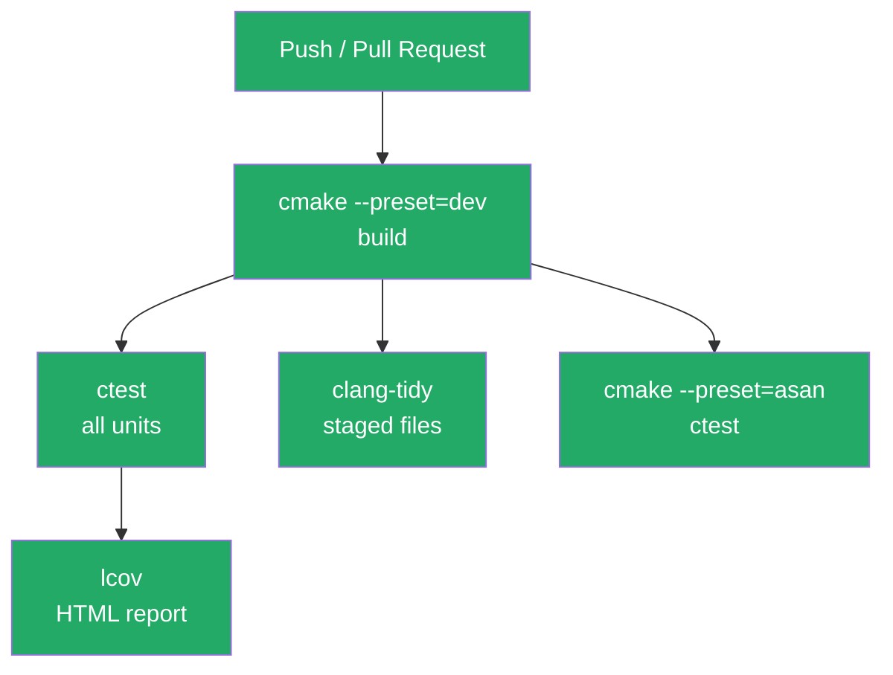
```mermaid
graph TD
    PR["Push / Pull Request"]
    BUILD["cmake --preset=dev\nbuild"]
    TEST["ctest\nall units"]
    TIDY["clang-tidy\nstaged files"]
    ASAN["cmake --preset=asan\nctest"]
    COV["lcov\nHTML report"]

    PR --> BUILD
    BUILD --> TEST
    BUILD --> TIDY
    BUILD --> ASAN
    TEST --> COV

    style PR fill:#2a6,color:#fff
    style BUILD fill:#2a6,color:#fff
    style TEST fill:#2a6,color:#fff
    style TIDY fill:#2a6,color:#fff
    style ASAN fill:#2a6,color:#fff
    style COV fill:#2a6,color:#fff
```

**Files:**
- `.github/workflows/ci.yml`
- `cmake/coverage.cmake`
- `CMakePresets.json` — add `coverage` preset (`-fprofile-arcs -ftest-coverage`)

**CI jobs:**

| Job | Preset | Steps |
|---|---|---|
| `build-and-test` | `dev` | configure → build → ctest |
| `clang-tidy` | `dev` | run tidy on all `.cpp` files |
| `asan` | `asan` | build → ctest under ASAN |
| `coverage` | `coverage` | build → ctest → lcov → upload HTML artifact |

**Testing:**
- The CI itself is the test. Green check on every PR is the deliverable.
- Coverage threshold enforced via `lcov --fail-under-line 80`.

---

### Phase 17 — Benchmarking

Google Benchmark microbenchmarks for the hot path. Gives concrete µs numbers before Phase 12 (Theo Grid) optimization and prevents performance regressions from being silently introduced.

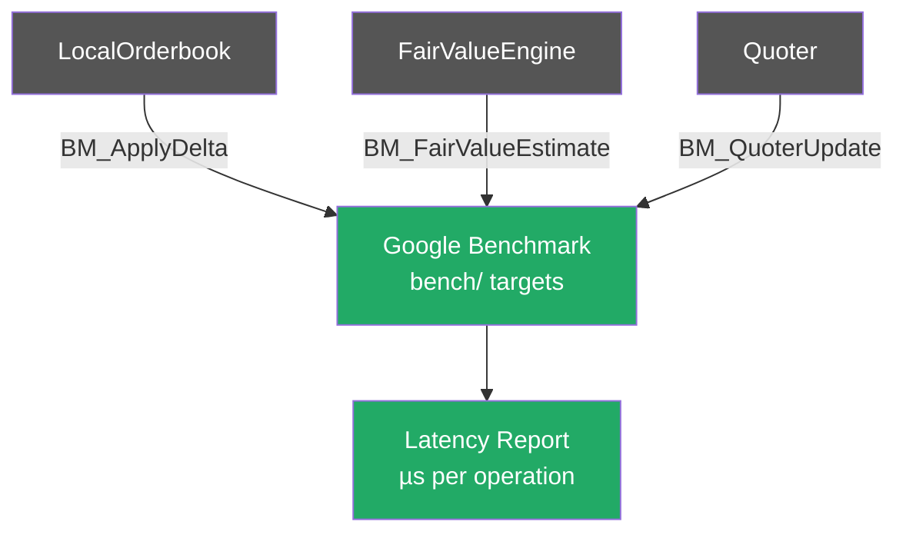
```mermaid
graph TD
    OB["LocalOrderbook"]
    FV["FairValueEngine"]
    QE["Quoter"]
    BM["Google Benchmark\nbench/ targets"]
    OUT["Latency Report\nµs per operation"]

    OB -->|BM_ApplyDelta| BM
    FV -->|BM_FairValueEstimate| BM
    QE -->|BM_QuoterUpdate| BM
    BM --> OUT

    style OB fill:#555,color:#fff
    style FV fill:#555,color:#fff
    style QE fill:#555,color:#fff
    style BM fill:#2a6,color:#fff
    style OUT fill:#2a6,color:#fff
```

**Files:**
- `bench/orderbook_bench.cpp`
- `bench/fair_value_bench.cpp`
- `bench/quoter_bench.cpp`
- `cmake/benchmark.cmake`

**Key benchmarks:**

| Benchmark | What it measures | Target |
|---|---|---|
| `BM_ApplyDelta` | `LocalOrderbook::apply_delta()` on a 100-level book | < 1 µs |
| `BM_ApplySnapshot` | Full snapshot apply | < 10 µs |
| `BM_FairValueEstimate` | `FairValueEngine::estimate()` round trip | < 5 µs |
| `BM_QuoterUpdate` | Full `Quoter::update()` with fake OM/RM | < 50 µs |

**Testing:**
- Benchmarks are not part of `ctest` — run manually with `cmake --build build -t bench`.
- CI job (optional, gated) runs benchmarks and posts results as a PR comment for comparison.

---

### Phase 18 — Replay & Fuzz Testing

Two distinct test capabilities addressing the two highest-risk gaps:

1. **Replay:** Record a live WebSocket session to a newline-delimited JSON file and replay it through the full component stack offline. Validates quoting behavior on real market data without a live connection. Essential for regression-testing pricing changes.
2. **Fuzz:** libFuzzer targets for WebSocket message parsing and JSON deserialization — the most likely crash site from a malformed or unexpected exchange message.

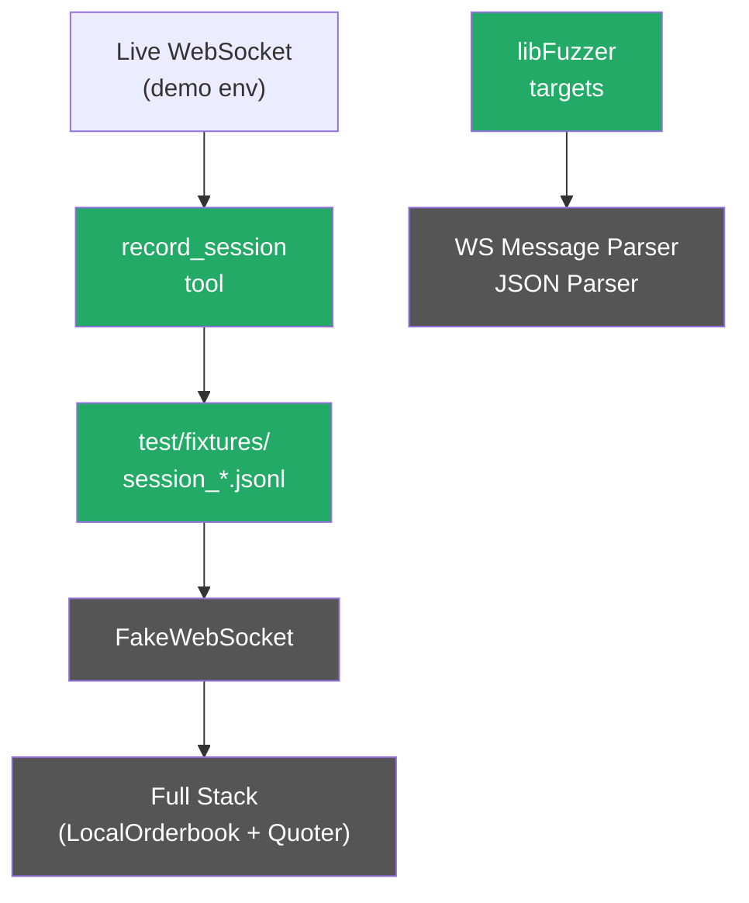
```mermaid
graph TD
    LIVE["Live WebSocket\n(demo env)"]
    REC["record_session\ntool"]
    JSONL["test/fixtures/\nsession_*.jsonl"]
    FAKE["FakeWebSocket"]
    STACK["Full Stack\n(LocalOrderbook + Quoter)"]
    FUZZ["libFuzzer\ntargets"]
    PARSER["WS Message Parser\nJSON Parser"]

    LIVE --> REC
    REC --> JSONL
    JSONL --> FAKE
    FAKE --> STACK
    FUZZ --> PARSER

    style FAKE fill:#555,color:#fff
    style STACK fill:#555,color:#fff
    style PARSER fill:#555,color:#fff
    style REC fill:#2a6,color:#fff
    style JSONL fill:#2a6,color:#fff
    style FUZZ fill:#2a6,color:#fff
```

**Files:**
- `tools/record_session.cpp` — connects to live WS and writes raw messages to `session_<timestamp>.jsonl`
- `test/replay/replay_test.cpp` — drives `FakeWebSocket` from a `.jsonl` file, asserts no crash, no open orders at end
- `test/fuzz/parse_ws_message_fuzz.cpp` — libFuzzer entry point over the WS message parser
- `test/fuzz/parse_json_fuzz.cpp` — libFuzzer entry point over JSON orderbook parsing
- `test/fixtures/session_*.jsonl` — committed recorded sessions (anonymized/demo data)

**Testing:**
- **Replay:** feed a 10-minute demo session; assert no assertions fire, no open orders remain after shutdown, simulated PnL is within plausible bounds.
- **Fuzz (CI):** run with `-max_total_time=30`; any crash or ASAN finding = CI failure. Corpus committed to `test/fuzz/corpus/`.

---

### Phase 19 — Paper Trading Mode

A `--paper` CLI flag wires `PaperTransport` in place of `HttpTransport`. Orders are logged to stdout and a JSON file but not submitted. Fills are simulated when the WebSocket mid-price crosses a resting quote. Lets you run the full system on live market data with zero financial risk.

```mermaid
graph TD
    FLAG["--paper flag"]
    IHT["IHttpTransport"]
    HTTP["HttpTransport\n(production)"]
    PAPER["PaperTransport\n(simulated fills\n+ order log)"]
    OM["OrderManager"]
    LOG["orders.jsonl\nsimulated PnL"]

    FLAG -->|selects| PAPER
    IHT --> HTTP
    IHT --> PAPER
    PAPER --> OM
    PAPER --> LOG

    style IHT fill:#555,color:#fff
    style HTTP fill:#555,color:#fff
    style OM fill:#555,color:#fff
    style FLAG fill:#2a6,color:#fff
    style PAPER fill:#2a6,color:#fff
    style LOG fill:#2a6,color:#fff
```

**Files:**
- `source/paper_transport.hpp` / `source/paper_transport.cpp`
- `test/source/paper_transport_test.cpp`

**Interface:**

```cpp
class PaperTransport : public IHttpTransport {
public:
    // Returns a synthetic 201 with a generated order ID; logs the order
    HttpResponse request(const HttpRequest& req) override;

    // Called by the WS callback when mid crosses a resting quote
    void simulate_fill(const std::string& order_id, int qty);

    const std::vector<Order>& simulated_orders() const;
    double simulated_pnl() const;
};
```

**Testing:**
- **Unit:** verify `place_order` via `PaperTransport` returns a synthetic order ID and logs the order. Verify `cancel_order` removes it from the internal book. Verify `simulated_pnl()` accumulates correctly across a sequence of fills.
- **Manual:** run `--paper` against the demo WS for 10 minutes; verify log output and PnL report are internally consistent.

---

### Phase 20 — Documentation

Doxygen for all public headers. Architecture Decision Records (ADRs) for choices that would otherwise be re-litigated every time someone reads the code.

```mermaid
graph TD
    HDR["source/*.hpp\npublic headers"]
    DOX["Doxygen\ndocs/ target"]
    HTML["docs/html/\nbrowsable API"]
    ADR["docs/adr/\nArchitecture\nDecision Records"]

    HDR --> DOX
    DOX --> HTML

    style HDR fill:#555,color:#fff
    style DOX fill:#2a6,color:#fff
    style HTML fill:#2a6,color:#fff
    style ADR fill:#2a6,color:#fff
```

**Files:**
- `docs/Doxyfile` — targets `source/*.hpp`, outputs to `docs/html/`
- `docs/adr/001-http-client.md` — cpp-httplib over libcurl
- `docs/adr/002-timestamp-parsing.md` — strptime/timegm over `std::chrono::parse`
- `docs/adr/003-websocket-library.md`
- `docs/adr/004-json-library.md`
- `docs/adr/005-tdd-approach.md`
- CMake target `docs` runs Doxygen

**ADR format:**

```markdown
# ADR-NNN: Title
## Status: Accepted
## Context
## Decision
## Consequences
```

**Testing:**
- `cmake --build build -t docs` must succeed with zero warnings in CI.
- New ADR required on any PR that changes a library dependency or core interface.

---

## Scaling & Multi-Ticker Architecture

### Current single-process model

One process handles all tickers in `target_tickers`. The main loop is:

```
WS delta → apply_delta → quoter.update (per ticker) → place/cancel via REST
Fill     → record_fill  → risk.update  (all tickers)
```

This works fine for 2–10 tickers with slow underlyings. The bottlenecks that appear as you scale are documented below alongside the planned fix for each.

---

### Bottleneck map

| Scale | Bottleneck | Root cause | Fix |
|---|---|---|---|
| ~5 tickers | REST latency on reprice | `place_order` blocks ~50–200ms | Phase 21: async HTTP dispatch |
| ~10 tickers | TTCs are constants | Main loop passes `ttc=1000h` hardcoded | Wire `get_markets()` at startup to load real `close_time` per ticker |
| ~20 tickers | Single WS thread serialises all repricing | One goroutine drains the WS message queue | Phase 22: per-series WS connection with a thread-per-series dispatcher |
| ~50 tickers | `RiskManager::update()` scans all tickers on every fill | O(n) scan on the hot fill path | Phase 23: incremental update — only touch the filled ticker |
| ~100 tickers | `HeuristicModel::estimate()` called per delta per ticker | Full model evaluation on every tick | Phase 12 (TheoGrid) is built — wire it into `Quoter::update()` to replace model calls on the hot path |
| ~200+ tickers | Single process, single API key, single rate limit | Exchange caps requests/second per key | Horizontal split by event series (one process per series) |

---

### Natural scaling unit: the event series

Kalshi organises markets into *event series* (e.g. all BTC price-tier markets in one series, all Fed rate markets in another). Within a series:

- All tickers share **one underlying** (BTC spot price, Fed funds rate, etc.)
- One `TheoGrid` per series maps `(underlying_value, time_to_close) → fair_prob` and drives all tickers with a single lookup
- One WS connection subscribes to all tickers in the series
- One `RiskManager` enforces portfolio-level constraints across the series

Across series, separate processes run independently with separate API connections, risk limits, and models.

```mermaid
graph TD
    CFG["config.json\nseries definitions"]

    subgraph ProcA["Process: BTC series"]
        WSA["WebSocketClient\nBTC tickers"]
        TGA["TheoGrid\nBTC spot → prob"]
        QA["Quoter × N\nBTC-B90k, BTC-B95k, ..."]
        RMA["RiskManager\nBTC portfolio limits"]
    end

    subgraph ProcB["Process: Fed series"]
        WSB["WebSocketClient\nFed tickers"]
        TGB["TheoGrid\nFed rate → prob"]
        QB["Quoter × N\nFED-25DEC-B450, ..."]
        RMB["RiskManager\nFed portfolio limits"]
    end

    CFG --> ProcA
    CFG --> ProcB
    WSA --> TGA --> QA --> RMA
    WSB --> TGB --> QB --> RMB
```

---

### Cross-ticker correlation and portfolio hedging

Within a series, the tickers are *mutually exclusive and exhaustive*: exactly one of `BTC > $90k`, `BTC > $95k`, `BTC > $99k` resolves YES. This creates a hard portfolio constraint — the fair probabilities must be monotone and must not sum above 1.

**Consistency enforcement (Phase 24)**

A `PortfolioModel` layer sits above the individual `IPricingModel` instances. After each model estimates an individual fair value, `PortfolioModel` projects the full vector onto the probability simplex:

```
raw probs: [p_90k, p_95k, p_99k]  ← from individual model calls
→ enforce monotonicity: p_90k ≥ p_95k ≥ p_99k
→ enforce no-arbitrage: each consecutive spread ≥ 0
→ output: consistent prob vector used for quoting all three tickers
```

This prevents the system from simultaneously quoting prices that imply a risk-free arbitrage across tiers.

**Delta hedging across tiers (Phase 25)**

Net position across a mutually-exclusive series has a natural hedge: a long position in `BTC > $90k` is partially offset by a short in `BTC > $95k` (because $95k resolving YES implies $90k also resolved YES). The inventory skew in `Quoter` currently treats each ticker independently. A cross-tier `PortfolioRiskManager` computes net exposure in underlying-space and applies a unified skew:

```
underlying_delta = Σ (position[i] × ∂prob[i]/∂underlying)
skew_cents       = underlying_delta × skew_per_unit_underlying
```

All tickers in the series then receive a shared skew adjustment rather than independent ones. This prevents skewing opposing positions in the same direction.

**Position limits in portfolio space (Phase 25)**

The existing `RiskManager` enforces `max_position_per_market` per ticker independently. A portfolio-level limit enforces:
- Max net directional exposure in underlying-space (e.g. max $500 effective BTC exposure)
- Max gross notional across the series
- Correlation-adjusted VaR as a kill switch (`kPortfolioVaR` constraint bit)

---

### Phase 21 — Async HTTP Order Dispatch

**Problem:** `place_order` and `cancel_order` currently block the quoting thread for the full REST round-trip (~50–200ms). With 5+ tickers firing reprices simultaneously, the WS queue backs up and quotes become stale.

**Fix:** A dedicated `OrderDispatcher` thread owns the HTTP connection. The quoting thread posts `PlaceOrder`/`CancelOrder` requests onto a lock-free queue and returns immediately. The dispatcher drains the queue, sends the HTTP request, and posts the result back (fill confirmation, error). The `OrderManager` is updated from the dispatcher thread.

```cpp
struct OrderRequest {
    enum class Kind { Place, Cancel } kind;
    std::string ticker;
    Side side;
    int price_cents;
    int quantity;
    std::string order_id;  // for Cancel
};

class OrderDispatcher {
public:
    void post(OrderRequest req);   // called from quoting thread — non-blocking
    void run();                    // blocks in dispatcher thread
private:
    moodycamel::ConcurrentQueue<OrderRequest> queue_;
    RestClient &rest_;
};
```

The quoting callback drops from `O(REST RTT)` to `O(queue push)` — effectively zero cost on the hot path.

---

### Phase 22 — Per-Series WS + Thread-per-Series Dispatch

**Problem:** All tickers share one WS connection and one message-handler thread. A slow callback on one ticker (e.g. REST reprice blocking) stalls message processing for all others.

**Fix:** One `WebSocketClient` per event series. Each series runs its own `ws_thread` + `OrderDispatcher`. The main thread just monitors `g_shutdown` and coordinates clean shutdown.

```mermaid
graph TD
    MAIN["main()\nshutdown monitor"]
    SDA["SeriesDispatcher A\nBTC: ws_thread + order_thread"]
    SDB["SeriesDispatcher B\nFed: ws_thread + order_thread"]
    API["Kalshi API"]

    MAIN --> SDA
    MAIN --> SDB
    SDA <-->|WS + REST| API
    SDB <-->|WS + REST| API
```

Each `SeriesDispatcher` owns: `WebSocketClient`, `OrderDispatcher`, `Quoter` map (one per ticker), `RiskManager`, `TheoGrid`.

---

### Phase 23 — Incremental RiskManager Update

**Problem:** `RiskManager::update()` currently clears and rebuilds all cached positions and PnL by iterating every ticker and every open order on every fill. At 50+ tickers this becomes an O(n) scan on the latency-critical fill callback.

**Fix:** Make `update()` incremental — accept a `const Fill&` and update only the affected ticker's position and PnL delta:

```cpp
void RiskManager::on_fill(const Fill &fill, const OrderManager &order_mgr);
```

Full rebuild is reserved for startup and periodic reconciliation.

---

### Phase 24 — PortfolioModel (Consistency Across Correlated Tickers)

**Implements:** No-arbitrage projection across mutually-exclusive series tickers.

New class `PortfolioModel` wraps a vector of `IPricingModel` instances (one per ticker). On each reprice cycle it:
1. Calls each model's `estimate()` to get raw fair values
2. Projects the vector onto the monotone-consistent simplex
3. Returns the adjusted fair values to each `Quoter`

**Test surface:**
- Raw probs violating monotonicity → projected correctly
- Raw probs summing > 1 → scaled down proportionally
- Already-consistent probs → unchanged

---

### Phase 25 — Cross-Ticker Portfolio Risk and Delta Hedging

**Implements:** Unified inventory skew and portfolio-space position limits across a series.

A `PortfolioRiskManager` computes:
- `underlying_delta` = Σ positions × `∂prob/∂underlying` (from `TheoGrid` gradient)
- Shared `skew_cents` broadcast to all `Quoter` instances in the series
- Portfolio VaR kill switch: if gross underlying exposure exceeds limit, sets `kPortfolioVaR` constraint on all tickers in the series simultaneously

---

## Dependency Summary

| Library | Purpose | How to add |
|---|---|---|
| OpenSSL | RSA-SHA256 auth signing | `find_package(OpenSSL REQUIRED)` |
| cpp-httplib | HTTP REST client (HTTPS via OpenSSL) | FetchContent `yhirose/cpp-httplib` |
| Boost.Beast | WebSocket client | `find_package(Boost REQUIRED COMPONENTS system)` |
| nlohmann/json | JSON parsing | FetchContent or `find_package` |
| spdlog | Structured logging | FetchContent |
| Google Test | Unit testing (already configured) | Already in `cmake/gtest.cmake` |
| Google Benchmark | Hot-path microbenchmarks | FetchContent `google/benchmark` |
| libFuzzer | Fuzz testing WS/JSON parsers | Clang built-in — `-fsanitize=fuzzer` preset |
| lcov | Test coverage reports | System package `lcov` + `cmake/coverage.cmake` |

---

## Phase Checklist

- [x] Phase 1 — Types & Domain Model
- [x] Phase 2 — Authentication
- [x] Phase 3 — REST Client
- [x] Phase 4 — Local Orderbook
- [x] Phase 5 — WebSocket Client
- [x] Phase 6 — Order Manager
- [x] Phase 7 — Risk Manager
- [x] Phase 8 — Fair Value Engine
- [x] Phase 9 — Quoter
- [x] Phase 10 — Main Loop & Integration
- [x] Phase 11 — Pluggable Pricing Model
- [x] Phase 12 — Theo Grid
- [x] Phase 13 — Constraint Bitset & Adverse Selection Guard
- [x] Phase 14 — Logging & Observability
- [x] Phase 15 — Config File & Graceful Shutdown
- [x] Phase 16 — CI Pipeline & Coverage
- [x] Phase 17 — Benchmarking
- [x] Phase 18 — Replay & Fuzz Testing
- [x] Phase 19 — Paper Trading Mode
- [x] Phase 20 — Documentation
- [ ] Phase 21 — Async HTTP Order Dispatch
- [ ] Phase 22 — Per-Series WS + Thread-per-Series Dispatch
- [ ] Phase 23 — Incremental RiskManager Update
- [ ] Phase 24 — PortfolioModel (No-Arbitrage Consistency)
- [ ] Phase 25 — Cross-Ticker Portfolio Risk & Delta Hedging
