# Kalshi Market Maker — Build Plan

## Overall Architecture

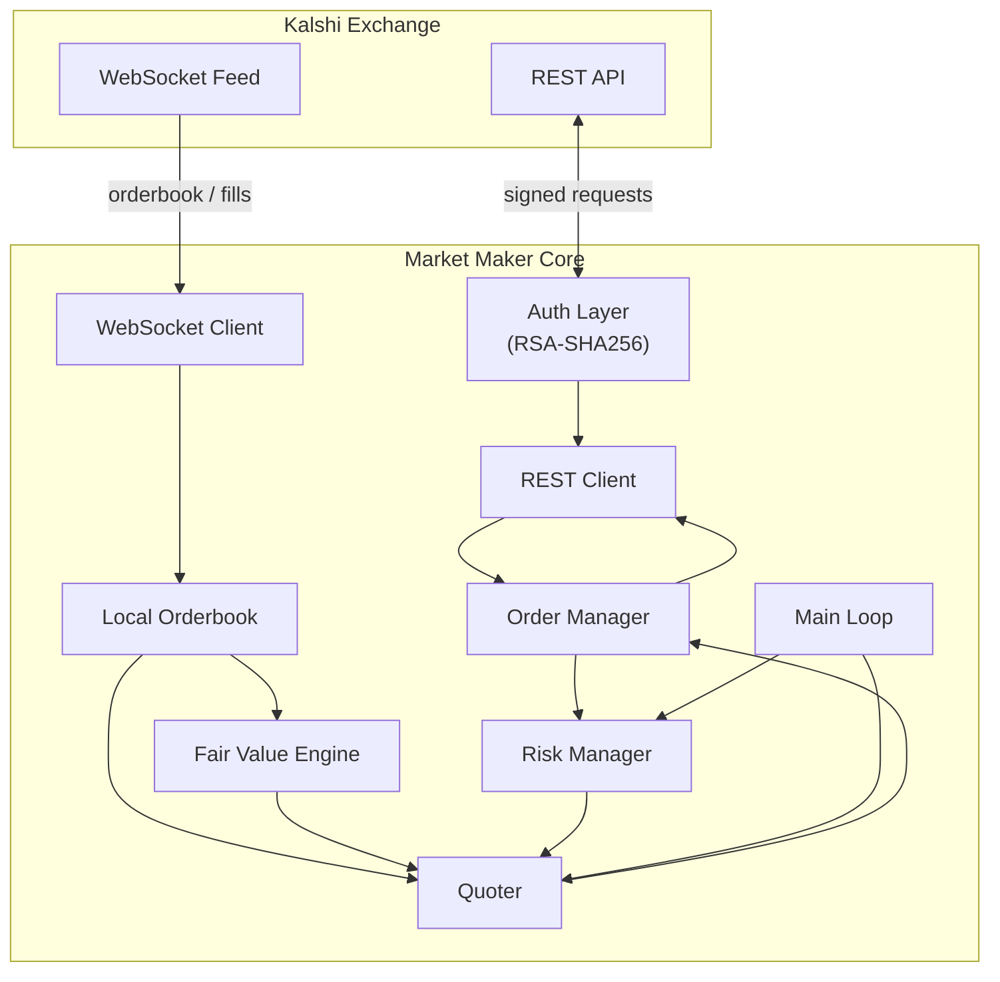

---

## Phase 1 — Types & Domain Model

Define the shared data structures the entire system depends on. No I/O, no logic — just plain structs and enums. This is the foundation everything else builds on.

**TDD approach:** Write tests that construct, copy, compare, and serialize each type. Implementation is trivial; the point is locking the interface.

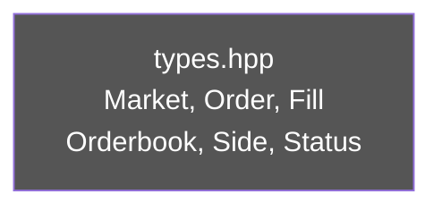

**Files:**
- `source/types.hpp`
- `test/source/types_test.cpp`

**Testing:**
- **Unit:** struct construction, field access, equality, `remaining_quantity()`, `is_active()`, `is_valid_price()`, `complement_price()` symmetry. All done — 19 tests passing.
- **Contract/Integration/ASAN:** N/A — pure value types, no I/O.

**Key types:**

```cpp
enum class Side { Yes, No };
enum class OrderStatus { Open, PartiallyFilled, Filled, Cancelled };
enum class OrderType { Limit, Market };

struct Order {
    std::string id;
    std::string market_ticker;
    Side side;
    int price_cents;      // 1–99
    int quantity;         // number of contracts
    int filled_quantity;
    OrderStatus status;
    std::chrono::system_clock::time_point created_at;
};

struct Level {
    int price_cents;
    int quantity;
};

struct Orderbook {
    std::string market_ticker;
    std::vector<Level> yes;  // sorted descending
    std::vector<Level> no;   // sorted descending
};

struct Fill {
    std::string order_id;
    std::string market_ticker;
    Side side;
    int price_cents;
    int quantity;
    std::chrono::system_clock::time_point timestamp;
};

struct Market {
    std::string ticker;
    std::string title;
    int min_tick;       // always 1
    int fee_rate_bps;
    std::chrono::system_clock::time_point close_time;
};
```

---

## Phase 2 — Authentication

Kalshi v2 requires every REST request to be signed with an RSA-SHA256 private key. This is the critical first integration point.

**TDD approach:** Sign a known message with a known test key, verify the base64 output matches the expected value. All tests are purely computational — no network.

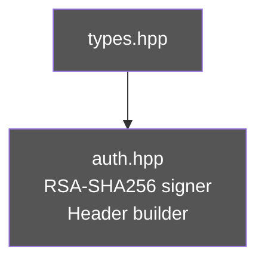

**Files:**
- `source/auth.hpp` / `source/auth.cpp`
- `test/source/auth_test.cpp`

**Interface:**

```cpp
class Auth {
public:
    explicit Auth(std::string api_key, std::string pem_private_key);

    // Returns headers to attach to every request
    std::map<std::string, std::string> sign(
        std::string_view method,   // "GET", "POST", etc.
        std::string_view path      // "/trade-api/v2/markets"
    ) const;
};
```

**Headers produced:**
```
Kalshi-Access-Key: <api_key>
Kalshi-Access-Timestamp: <unix_ms>
Kalshi-Access-Signature: <base64(RSA_SHA256(timestamp + method + path))>
```

**Dependency:** OpenSSL (`find_package(OpenSSL REQUIRED)` in CMake).

**Testing:**
- **Unit:** generate an RSA keypair at test time, sign a message, verify the signature with the public key. Test header names, API key passthrough, timestamp bounds, invalid key throws. All done — 7 tests passing.
- **Integration** (`KALSHI_INTEGRATION_TESTS=ON`): sign a real `GET /markets` request against the demo API and assert HTTP 200. This proves the key format, timestamp tolerance, and base64 encoding are all correct end-to-end.
- **ASAN:** run `cmake --preset=asan` — OpenSSL memory handling is a common source of leaks under sanitizers.

---

## Phase 3 — REST Client

Thin HTTP wrapper around libcurl. Responsible only for making signed requests and returning raw JSON strings. JSON parsing happens in callers.

**TDD approach:** Inject an `IHttpTransport` interface. Unit tests use a `FakeTransport` that returns canned responses. A separate integration test (gated by `KALSHI_INTEGRATION_TESTS=ON`) hits the real API.

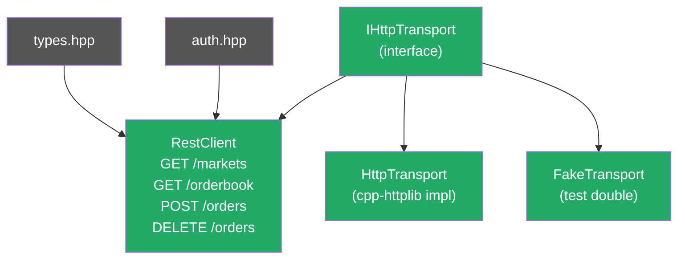

**Files:**
- `source/http_transport.hpp` (interface + CurlTransport)
- `source/rest_client.hpp` / `source/rest_client.cpp`
- `test/source/rest_client_test.cpp`

**Testing:**
- **Unit:** inject `FakeTransport` returning canned JSON strings. Test each method (`get_markets`, `get_orderbook`, `place_order`, `cancel_order`) parses the response into the correct domain struct. Test HTTP error codes (4xx, 5xx) throw or return expected errors.
- **Contract:** record real responses from the demo API into `test/fixtures/` (e.g. `orderbook_KXBTCD.json`). Add a test that parses the fixture — catches API schema drift without needing a live connection.
- **Integration** (`KALSHI_INTEGRATION_TESTS=ON`): call `get_markets()` and `get_orderbook(ticker)` against demo. Assert the returned structs are well-formed (non-empty ticker, valid price levels).
- **ASAN:** libcurl manages its own memory; run under ASAN to confirm no leaks in our wrapper.

**Interface:**

```cpp
class RestClient {
public:
    RestClient(const Auth& auth, std::unique_ptr<IHttpTransport> transport,
               std::string base_url = "https://trading-api.kalshi.com/trade-api/v2");

    std::vector<Market> get_markets(std::string_view event_ticker = "");
    Orderbook get_orderbook(std::string_view ticker);
    Order place_order(std::string_view ticker, Side side,
                      int price_cents, int quantity, OrderType type);
    bool cancel_order(std::string_view order_id);
    std::vector<Order> get_open_orders();
};
```

**Sequence (place order):**

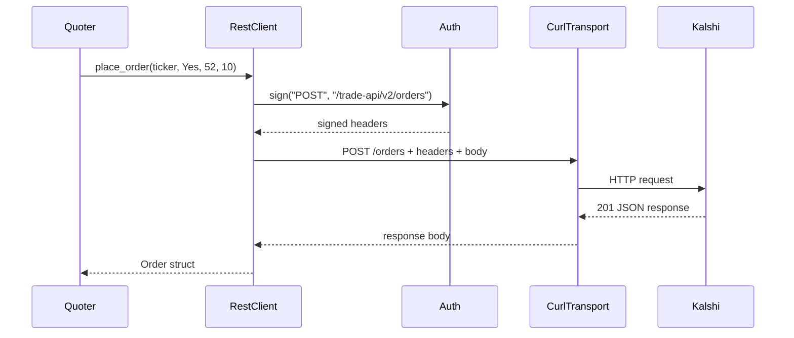

---

## Phase 4 — Local Orderbook

Maintains an in-memory mirror of the exchange orderbook, updated via WebSocket deltas. Provides fast BBO (best bid/offer) lookups without network round trips.

**TDD approach:** Feed sequences of delta messages into the orderbook and assert the resulting state. Test BBO calculation, mid-price, and edge cases (empty book, locked market).

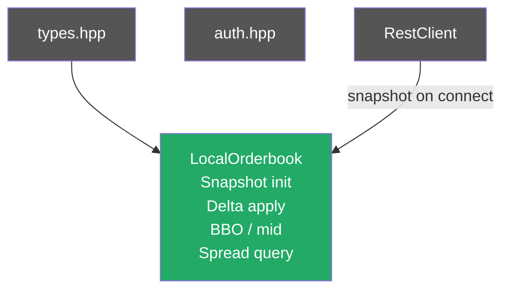

**Files:**
- `source/orderbook.hpp` / `source/orderbook.cpp`
- `test/source/orderbook_test.cpp`

**Interface:**

```cpp
class LocalOrderbook {
public:
    void apply_snapshot(const Orderbook& snap);
    void apply_delta(Side side, int price_cents, int new_quantity); // quantity=0 means remove

    std::optional<Level> best_bid() const;  // highest yes price
    std::optional<Level> best_ask() const;  // lowest yes ask (= 100 - best no bid)
    double mid_price_cents() const;
    int spread_cents() const;

    const Orderbook& state() const;
};
```

**Note on Kalshi orderbook mechanics:** YES and NO are two sides of the same contract. The YES ask price = `100 - NO bid price`. Kalshi's feed gives you both YES and NO levels; the implied best ask on YES comes from the best bid on NO.

**Testing:**
- **Unit:** apply a known sequence of snapshot + deltas, assert exact BBO and mid after each step. Test edge cases: empty book returns `std::nullopt` for BBO, single-sided book, delta that removes a level (quantity = 0), delta that adds a new level at a new price.
- **Contract:** capture a real WebSocket `orderbook_snapshot` message from the demo API, save to `test/fixtures/orderbook_snapshot.json`, write a test that applies it and checks BBO is in [1,99].
- **Integration/ASAN:** N/A — pure in-memory logic; covered by unit tests under ASAN.

---

## Phase 5 — WebSocket Client

Streams real-time orderbook snapshots and delta updates, and fill confirmations. Drives the `LocalOrderbook` and `OrderManager` with live data.

**TDD approach:** Mock the WebSocket connection with a `FakeWebSocket` that replays recorded message sequences. Test that the client correctly dispatches snapshot vs. delta messages and calls the registered callbacks.

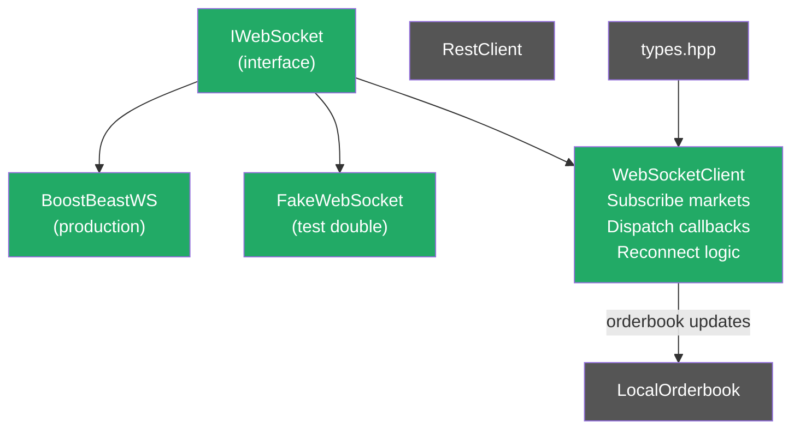

**Files:**
- `source/websocket_client.hpp` / `source/websocket_client.cpp`
- `test/source/websocket_client_test.cpp`

**Testing:**
- **Unit:** inject `FakeWebSocket` that replays a scripted sequence of raw JSON messages. Assert `on_orderbook_snapshot`, `on_orderbook_delta`, and `on_fill` callbacks fire with correctly parsed payloads. Test reconnection: simulate a disconnect, assert the client attempts to reconnect and re-subscribes.
- **Contract:** capture a real `orderbook_delta` and `fill` message from the demo API into `test/fixtures/`. Test parsing in isolation.
- **Integration** (`KALSHI_INTEGRATION_TESTS=ON`): connect to the demo WebSocket, subscribe to one market, receive at least one delta within a timeout. Verifies auth handshake, subscription format, and message parsing end-to-end.
- **TSAN:** the WebSocket client runs a background thread; run under ThreadSanitizer to catch races between the callback thread and the main loop reading `LocalOrderbook`.

**Callbacks registered by the main loop:**

```cpp
ws_client.on_orderbook_snapshot([&](const Orderbook& snap) {
    local_ob.apply_snapshot(snap);
});
ws_client.on_orderbook_delta([&](const std::string& ticker, Side side,
                                  int price, int qty) {
    local_ob.apply_delta(side, price, qty);
});
ws_client.on_fill([&](const Fill& fill) {
    order_manager.record_fill(fill);
});
```

---

## Phase 6 — Order Manager

Tracks the lifecycle of all live orders. Provides a clean interface for placing, cancelling, and amending quotes. Reconciles local state with fill confirmations.

**TDD approach:** Drive the order manager through state transitions with synthetic fills and cancellations. Test that duplicate fills are idempotent, that cancelling a filled order is handled gracefully, and that the position calculation is correct.

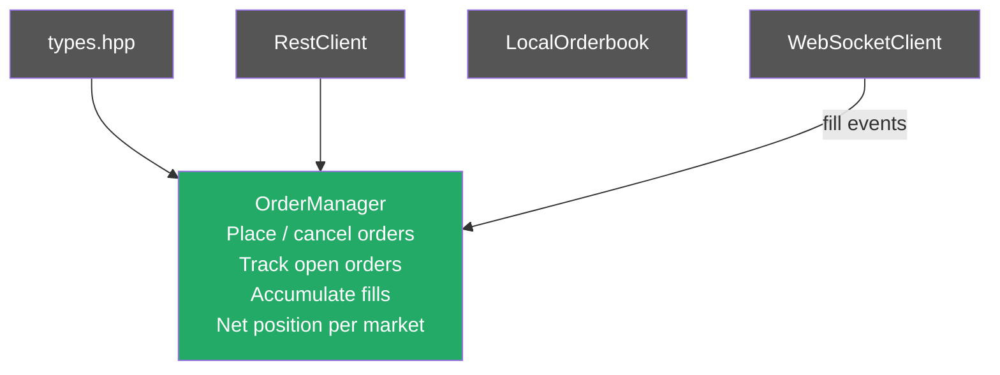

**Files:**
- `source/order_manager.hpp` / `source/order_manager.cpp`
- `test/source/order_manager_test.cpp`

**Interface:**

```cpp
class OrderManager {
public:
    Order place(const std::string& ticker, Side side,
                int price_cents, int quantity);
    bool cancel(const std::string& order_id);
    void cancel_all(const std::string& ticker);

    void record_fill(const Fill& fill);

    // Returns net YES position (negative = net NO)
    int net_position(const std::string& ticker) const;
    double realized_pnl(const std::string& ticker) const;

    const std::unordered_map<std::string, Order>& open_orders() const;
};
```

**Testing:**
- **Unit:** drive the state machine with synthetic fills and cancellations. Test that a duplicate fill is idempotent. Test that cancelling a filled order is handled gracefully. Test `net_position()` across a sequence of YES buys and NO buys (which reduce YES position). Test `realized_pnl()` against a known sequence of fills.
- **Contract:** record a real order JSON response from the demo API into `test/fixtures/order_placed.json`. Test that `place_order()` parses it correctly.
- **Integration** (`KALSHI_INTEGRATION_TESTS=ON`): place a 1-contract limit order at an extreme price (1 cent) on the demo API — unlikely to fill. Assert order appears in `get_open_orders()`. Cancel it. Assert it no longer appears.
- **ASAN:** `unordered_map` iteration during cancellation is a common bug site.

---

## Phase 7 — Risk Manager

Guards all outgoing order actions. Acts as a gatekeeper that the Quoter must pass through before any order reaches the exchange. Think of this as your pre-trade risk checks.

**TDD approach:** Write tests that try to breach each limit and confirm the order is rejected. Test PnL accumulation over a sequence of fills. Test that the daily loss limit triggers a full cancel-and-halt.

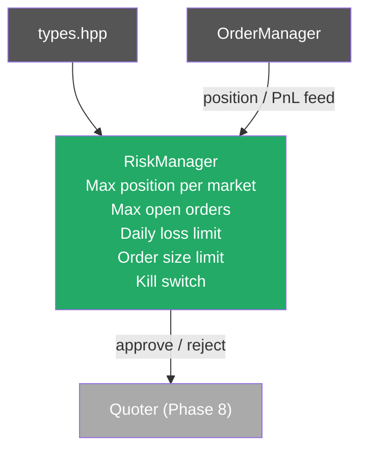

**Files:**
- `source/risk_manager.hpp` / `source/risk_manager.cpp`
- `test/source/risk_manager_test.cpp`

**Interface:**

```cpp
struct RiskLimits {
    int max_position_per_market = 100;   // contracts
    int max_open_orders_per_market = 4;
    int max_order_size = 25;             // contracts
    double daily_loss_limit = -500.0;    // dollars
};

class RiskManager {
public:
    explicit RiskManager(RiskLimits limits);

    bool check_order(const std::string& ticker, Side side,
                     int price_cents, int quantity) const;

    void update(const OrderManager& om);

    bool is_halted() const;
    void halt();   // manual kill switch
    void resume();
};
```

**Testing:**
- **Unit:** attempt to breach each limit individually and assert `check_order()` returns false. Test that breaching the daily loss limit triggers `is_halted()`. Test `halt()` blocks all subsequent orders. Test `resume()` restores normal operation. Test that limits are evaluated independently (e.g. position OK but order size too large → reject).
- **Integration/Contract/ASAN:** N/A — pure logic, no I/O. Run unit tests under ASAN.

---

## Phase 8 — Fair Value Engine

Estimates the true probability of the event. This is where alpha lives. Start simple and layer complexity.

**TDD approach:** Each model is a pure function from inputs to a probability in [0,1]. Tests are deterministic — feed known inputs, assert expected outputs. No randomness, no I/O.

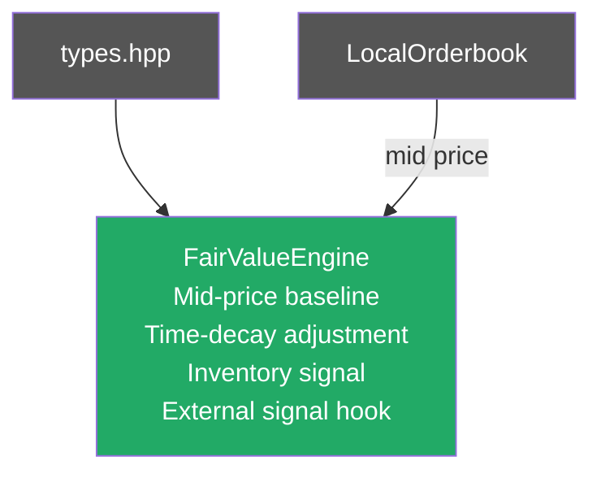

**Files:**
- `source/fair_value.hpp` / `source/fair_value.cpp`
- `test/source/fair_value_test.cpp`

**Model progression:**

1. **Baseline (v1):** Fair value = orderbook mid-price. No edge, but safe to deploy.
2. **Time-weighted (v2):** Fade extreme prices as resolution approaches. If event closes in 1 hour and price is 95, is that really right?
3. **Inventory-adjusted (v3):** If you're long 80 YES contracts, shade fair value down slightly to encourage selling.
4. **External signal (v4):** Hook for injecting external probability estimates (weather APIs, polling data, etc.).

```cpp
struct FairValueInput {
    double mid_cents;
    double time_to_close_hours;
    int net_position;               // your current inventory
    std::optional<double> external_prob;
};

class FairValueEngine {
public:
    double estimate(const FairValueInput& input) const;  // returns cents [1, 99]
};
```

**Testing:**
- **Unit:** for each model layer, feed known inputs and assert the output is within expected bounds. Test that the baseline returns exactly the mid-price. Test that time-decay pulls extreme values toward 50 as `time_to_close_hours` approaches 0. Test that inventory skew shifts the estimate in the correct direction. Test that output is always clamped to [1, 99].
- **Integration/Contract/ASAN:** N/A — pure math. Run under ASAN to catch any floating-point UB.

---

## Phase 9 — Quoter

The brain of the market maker. Combines fair value, inventory, and risk into bid/ask quotes, then instructs the OrderManager to maintain those quotes on the exchange.

**TDD approach:** Test quote generation in isolation with mocked FairValueEngine and RiskManager. Test that inventory skew shifts quotes correctly. Test that stale quotes are cancelled and refreshed.

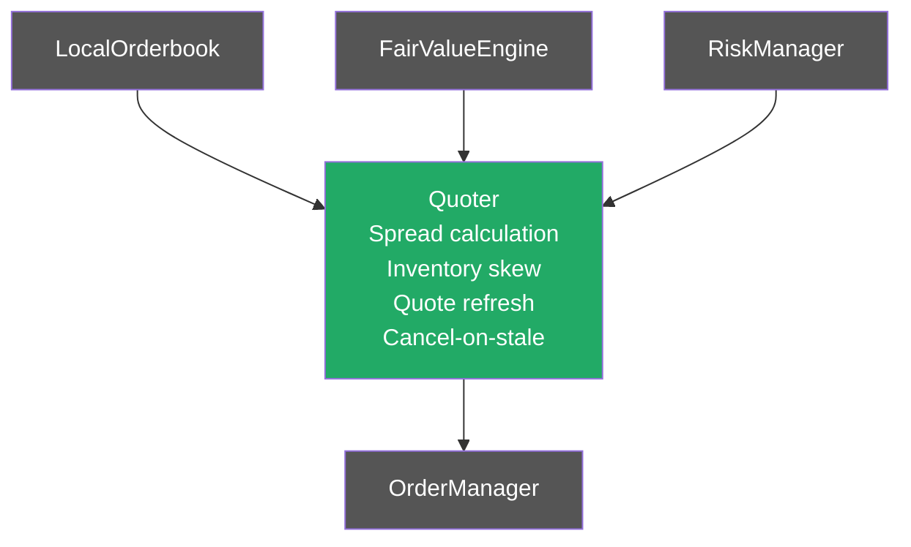

**Files:**
- `source/quoter.hpp` / `source/quoter.cpp`
- `test/source/quoter_test.cpp`

**Quoting logic:**

```
fair_value_cents = fair_value_engine.estimate(input)

base_half_spread = max(1, target_spread_cents / 2)
inventory_skew   = net_position * skew_per_contract_cents
                   // positive position = shade down (sell cheaper)

bid = clamp(round(fair_value - base_half_spread - inventory_skew), 1, 98)
ask = clamp(round(fair_value + base_half_spread - inventory_skew), 2, 99)

assert ask > bid  // minimum 1 cent spread
```

**Quote refresh:** On each tick, compare current live quotes to desired quotes. If they differ by more than `reprice_threshold_cents`, cancel and replace. Avoid churning orders on every tick.

```cpp
struct QuoterConfig {
    int target_spread_cents = 4;
    double skew_per_contract_cents = 0.05;
    int reprice_threshold_cents = 1;
    int quote_size = 10;                   // contracts per side
};

class Quoter {
public:
    Quoter(QuoterConfig cfg, FairValueEngine& fv,
           OrderManager& om, RiskManager& rm);

    void update(const std::string& ticker, const LocalOrderbook& ob);
};
```

**Testing:**
- **Unit:** inject fake `FairValueEngine`, `OrderManager`, and `RiskManager`. Assert that `update()` places a bid and ask at the correct prices given a known fair value and zero inventory. Assert inventory skew shifts both quotes in the correct direction. Assert that a quote within `reprice_threshold_cents` of its target is not cancelled and replaced. Assert that risk rejection (fake RM returns false) results in no order.
- **Integration** (`KALSHI_INTEGRATION_TESTS=ON`): run one `update()` cycle against the demo API with a real `LocalOrderbook` populated from REST. Verify a bid and ask appear in the live orderbook. Cancel them.
- **TSAN:** `update()` will be called from the WebSocket callback thread — run under ThreadSanitizer with a concurrent fake feed.

---

## Phase 10 — Main Loop & Integration

Wire all components together. The main loop drives quote updates on each orderbook event.

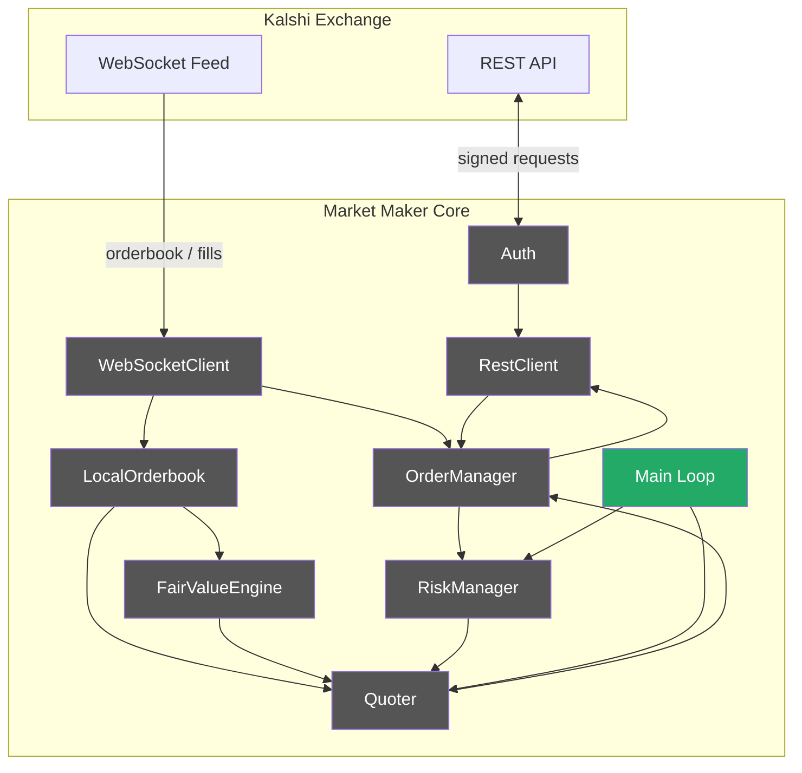

**Main loop pseudocode:**

```cpp
int main() {
    auto auth = Auth{api_key, private_key_pem};
    auto rest = RestClient{auth, std::make_unique<CurlTransport>()};
    auto ws   = WebSocketClient{auth};

    auto ob_map = std::unordered_map<std::string, LocalOrderbook>{};
    auto om     = OrderManager{rest};
    auto rm     = RiskManager{RiskLimits{}};
    auto fv     = FairValueEngine{};
    auto quoter = Quoter{QuoterConfig{}, fv, om, rm};

    // Subscribe to target markets
    for (auto& ticker : target_tickers) {
        auto snap = rest.get_orderbook(ticker);
        ob_map[ticker].apply_snapshot(snap);
        ws.subscribe(ticker);
    }

    ws.on_orderbook_delta([&](const std::string& ticker, Side side, int p, int q) {
        ob_map[ticker].apply_delta(side, p, q);
        quoter.update(ticker, ob_map[ticker]);
    });

    ws.on_fill([&](const Fill& fill) {
        om.record_fill(fill);
        rm.update(om);
    });

    ws.run();  // blocks, drives event loop
}
```

**Testing:**
- **Integration** (`KALSHI_INTEGRATION_TESTS=ON`): full end-to-end run on the demo environment for 60 seconds. Assert the process places quotes, receives at least one orderbook delta, reprices at least once, and shuts down cleanly without open orders (cancel-on-exit).
- **Docker:** build and run inside `Dockerfile.test`. Credentials injected via Docker secrets. This is the form used in CI.
- **ASAN + TSAN:** run the full integration test under each sanitizer. The WebSocket thread + main loop interaction is the highest-risk race condition surface.
- **Backtesting:** record a 10-minute live session to a delta log, replay it through the quoter offline. Compare simulated PnL vs. recorded fills to validate the model.

---

## Dependency Summary

| Library | Purpose | How to add |
|---|---|---|
| OpenSSL | RSA-SHA256 auth signing | `find_package(OpenSSL REQUIRED)` |
| cpp-httplib | HTTP REST client (HTTPS via OpenSSL) | FetchContent `yhirose/cpp-httplib` |
| Boost.Beast | WebSocket client | `find_package(Boost REQUIRED COMPONENTS system)` |
| nlohmann/json | JSON parsing | FetchContent or `find_package` |
| spdlog | Structured logging | FetchContent |
| Google Test | Unit testing (already configured) | Already in cmake/gtest.cmake |

---

## Phase Checklist

- [x] Phase 1 — Types & Domain Model
- [x] Phase 2 — Authentication
- [x] Phase 3 — REST Client
- [ ] Phase 4 — Local Orderbook
- [ ] Phase 5 — WebSocket Client
- [ ] Phase 6 — Order Manager
- [ ] Phase 7 — Risk Manager
- [ ] Phase 8 — Fair Value Engine
- [ ] Phase 9 — Quoter
- [ ] Phase 10 — Main Loop & Integration
