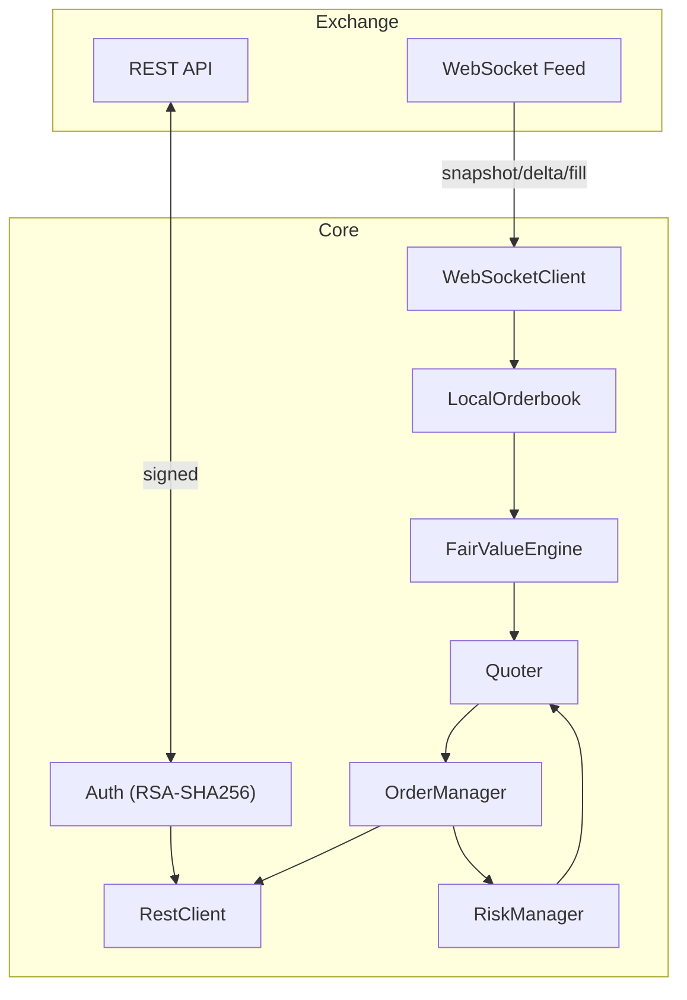

# Kalshi Market Maker — Build Plan

## Architecture



---

## UAT Blockers

**BLOCKER-1 (resolved):** `IxWebSocket` implemented via FetchContent `machinezone/IXWebSocket`. End-to-end connection to live UAT not yet verified.

**BLOCKER-2 (open):** REST fields not verified against live UAT (`https://demo-api.kalshi.co/trade-api/v2`). Fields most likely to drift: price field names, `count` vs `quantity`, status strings, timestamp format.

**Pre-UAT checklist:**
- [x] `IxWebSocket` implemented and library fetched
- [ ] Demo account + RSA key pair generated
- [ ] `config.json` created from `config.example.json` with demo base URL
- [ ] Raw REST request/response bodies verified against UAT
- [ ] Paper mode (`--paper`) runs without errors

---

## Completed Phases (1–20)

| Phase | Component | Key files |
|---|---|---|
| 1 | Types & Domain Model | `source/types.hpp` |
| 2 | Authentication | `source/auth.hpp/cpp` |
| 3 | REST Client | `source/rest_client.hpp/cpp`, `source/http_transport.hpp` |
| 4 | Local Orderbook | `source/orderbook.hpp/cpp` |
| 5 | WebSocket Client | `source/websocket_client.hpp/cpp` |
| 6 | Order Manager | `source/order_manager.hpp/cpp` |
| 7 | Risk Manager | `source/risk_manager.hpp/cpp` |
| 8 | Fair Value Engine | `source/fair_value.hpp/cpp` |
| 9 | Quoter | `source/quoter.hpp/cpp` |
| 10 | Main Loop | `source/main.cpp` |
| 11 | Pluggable Pricing Model | `source/pricing_model.hpp/cpp` |
| 12 | Theo Grid | (in quoter) |
| 13 | Constraint Bitset & AdverseSelectionGuard | `source/quoter.hpp` |
| 14 | Logging & Observability | spdlog structured logging |
| 15 | Config File & Graceful Shutdown | `source/config.hpp`, `config.example.json` |
| 16 | CI Pipeline & Coverage | `.github/workflows/`, `cmake/coverage.cmake` |
| 17 | Benchmarking | `bench/` |
| 18 | Replay & Fuzz Testing | `test/fuzz/`, `test/fixtures/` |
| 19 | Paper Trading Mode | `--paper` flag |
| 20 | Documentation | `docs/`, `docs/adr/` |

216 tests passing. Build clean.

---

## Next Steps

### Phase 31 — Ticker Scanner

Scans `GET /markets` at startup, scores markets, returns ranked list. Operator picks tickers to add to `config.json`.

```cpp
struct ScannerConfig {
  int min_price_cents{15};
  int max_price_cents{85};
  int min_spread_cents{3};
  int max_spread_cents{10};
  double min_volume_usd{5000.0};
  int min_days_to_close{1};
  int max_days_to_close{10};
};

struct MarketScore {
  std::string ticker;
  std::string title;
  std::string category;
  int mid_price_cents;
  int spread_cents;
  double volume_usd;
  double days_to_close;
  double score;
};

class TickerScanner {
public:
  explicit TickerScanner(RestClient &rest, ScannerConfig config = {});
  [[nodiscard]] std::vector<MarketScore> scan(int top_n = 20) const;
private:
  [[nodiscard]] double score(const MarketScore &m) const;
  RestClient &rest_;
  ScannerConfig config_;
};
```

Scoring (additive, terms normalized to [0,1]):
```
score = 0.35 × log(volume) / log(max_volume)
      + 0.25 × (1 − |mid − 50| / 35)     // peaks at 50c
      + 0.20 × (1 − |spread − 5| / 5)     // peaks at 5c
      + 0.10 × (1 − days_to_close / 10)
      + 0.10 × category_bonus              // Financials=1.0, Econ=0.8, Crypto=0.7, other=0.5
```

**Files:** `source/ticker_scanner.hpp`, `source/ticker_scanner.cpp`, `test/source/ticker_scanner_test.cpp`

---

### Phase 29 — Price-Range Gate

Add to `QuoterConfig`:
```cpp
int min_quote_price_cents{15};
int max_quote_price_cents{85};
```

In `Quoter::update()`: if `mid < min_quote_price_cents || mid > max_quote_price_cents`, call `cancel_all(ticker)` and return. Prevents quoting deep-longshot contracts where even Makers lose >35%.

**Files:** `source/quoter.hpp/cpp`, `test/source/quoter_test.cpp` (new `PriceRangeGate` tests)

---

### Phase 27 — Spread Floor & E_win Tracking

Add `min_spread_cents{3}` to `QuoterConfig`. In `Quoter::compute_quotes()`:
```cpp
half_spread = std::max({kHalfSpreadMin, config_.target_spread_cents / 2,
                        config_.min_spread_cents / 2});
```

Add to `OrderManager`:
```cpp
struct ExposureDecomposition {
  double c_a_cents{};   // net cashflow Yes (spread capture)
  double c_b_cents{};   // net cashflow No  (spread capture)
  double e_win_cents{}; // directional exposure on winning outcome
};
[[nodiscard]] ExposureDecomposition exposure(const std::string &ticker) const;
```

**Files:** `source/config.hpp`, `source/order_manager.hpp/cpp`

---

### Phase 26 — Flow Imbalance Signal

```cpp
class FlowImbalanceGuard {
public:
  void record_fill(const std::string &ticker, Side side, int quantity,
                   TimePoint tp = Clock::now());
  [[nodiscard]] double imbalance_ratio(const std::string &ticker) const; // 1.0 = balanced
  [[nodiscard]] bool is_imbalanced(const std::string &ticker) const;
  void reset(const std::string &ticker);
};
```

`Quoter::update()` adds `imbalance_spread_cents` (a `QuoterConfig` field) when `is_imbalanced()` returns true.

**Files:** `source/flow_imbalance.hpp/cpp`, `test/source/flow_imbalance_test.cpp`

---

### Phase 28 — View-Based Pricing (β=0.09 debiasing)

```cpp
class ViewBasedModel : public IPricingModel {
public:
  explicit ViewBasedModel(double view_probability);
  void update_view(double new_probability);
  [[nodiscard]] double estimate(const FairValueInput &input) const override;
private:
  double view_probability_;
};
```

When bootstrapping from market mid, apply debiasing: `π* = (P − 0.045) / 0.91` (derivation: Bürgi et al. β=0.09 calibration). Clamp to [0.01, 0.99].

**Files:** `source/pricing_model.hpp/cpp`, `test/source/view_based_model_test.cpp`

---

### Phase 30 — Maker Fee Integration

After April 2025, Kalshi charges Makers. Confirm γ_maker from current fee schedule. Add `maker_fee_rate` to `Config`. In `Quoter::compute_quotes()`, subtract `γ_maker × P × (1−P)` from effective half-spread so net-of-fee edge stays positive.

---

## Pre-Live Fixes (before first real-money session)

### Code gaps

| Gap | Fix |
|---|---|
| `main.cpp` has no log calls — process runs blind | Add spdlog calls: every fill, every quote update, every risk state change |
| WS thread can silently stall (no data, no disconnect) | Track `last_ws_message_time`; set `kStaleBook` if > 30s; log at `critical` |
| Cancel-all not triggered on WS disconnect | Wire `on_disconnect` callback to `order_mgr.cancel_all()` per ticker |
| Daily loss limit resets on restart (in-memory only) | Write realized PnL to a small JSON file on every fill; read it back on startup |

### Missing tests

| Gap | Fix |
|---|---|
| No contract tests against real API responses | Record one real UAT session; save orderbook + fill JSON to `test/fixtures/`; add parser assertion tests |
| No integration tests written (framework exists) | Add `GET /markets` + `GET /orderbook` integration tests in `test/integration/` |
| Replay fixture is hand-crafted, not from live Kalshi | Replace `session_synthetic.jsonl` with a recorded real session after first UAT run |

### Operational hardening (Phase 32)

Deploy as a `systemd` service with auto-restart, add WS staleness detection, persist PnL across restarts.

**`/etc/systemd/system/kalshi-mm.service`:**
```ini
[Unit]
Description=Kalshi Market Maker
After=network-online.target
Wants=network-online.target

[Service]
ExecStart=/path/to/kalshi-mm /path/to/config.json
Restart=on-failure
RestartSec=10s
StandardOutput=append:/var/log/kalshi-mm/app.log
StandardError=append:/var/log/kalshi-mm/app.log

[Install]
WantedBy=multi-user.target
```

**`/etc/logrotate.d/kalshi-mm`:**
```
/var/log/kalshi-mm/app.log {
    daily
    rotate 14
    compress
    missingok
    notifempty
}
```

**Files:** `main.cpp` (logging + staleness watchdog + disconnect handler), `source/order_manager.cpp` (PnL persistence), `scripts/install-service.sh`

---

## Monitoring (24/7)

### Minimum viable stack

| Layer | Tool | What it catches |
|---|---|---|
| Process watchdog | systemd `Restart=on-failure` | Crash / OOM |
| Log alerting | cron script → Telegram/email | `[critical]` log lines (risk halt, stale WS) |
| Stale WS detection | `kStaleBook` constraint (in-process) | Silent WS hang |
| Position snapshot | Log net position per ticker every 60s | Inventory drift |
| Daily loss persistence | PnL JSON file | Loss limit surviving restarts |

### Alert triggers to implement

1. **Process not running** — external cron, every 5 minutes, checks `systemctl is-active kalshi-mm`
2. **Risk halt** — any `is_halted()` logs at `critical` level; alert on that pattern
3. **WS silent > 30s** — sets `kStaleBook`, logs at `critical`
4. **Position > 80% of limit** — log at `warn` so you can intervene before halt

### Telegram alert script (simplest path to mobile push)

```python
#!/usr/bin/env python3
# scripts/alert.py — called by cron or log monitor
import subprocess, requests, sys
BOT_TOKEN = "..."
CHAT_ID   = "..."
msg = sys.argv[1] if len(sys.argv) > 1 else "kalshi-mm alert"
requests.post(f"https://api.telegram.org/bot{BOT_TOKEN}/sendMessage",
              json={"chat_id": CHAT_ID, "text": msg})
```

Cron entry (checks every 5 minutes):
```cron
*/5 * * * * systemctl is-active --quiet kalshi-mm || python3 /path/scripts/alert.py "kalshi-mm is DOWN"
```

---

## Rate Limiting

Kalshi Basic tier: **200 read tokens/s**, **100 write tokens/s**. Each REST request costs 10 tokens; batch cancels cost **2 tokens** each. Basic tier has no burst (1-second bucket only).

**At ≤5 tickers on slow prediction markets:** safe. A reprice = 1 cancel (2 tokens) + 1 place (10 tokens) × 2 sides = ~24 write tokens. Need >4 reprices/second/ticker to blow the budget — won't happen on event contracts.

**Risk points:**
- Startup: seeding N orderbooks = N GETs simultaneously. Fine at ≤5.
- Fast-moving market (e.g. Fed day): if BBO ticks every second, the `reprice_threshold_cents` config is the main protection — don't reprice unless BBO has moved ≥1c. Already implemented.
- If 429 responses appear: log them, add a per-ticker cooldown timer (skip reprice for 500ms after a 429).

**When scaling beyond Basic:** target the Advanced tier (300/300) or use the `POST /portfolio/orders/batches` endpoint for bulk placement when Phase 21 (async dispatch) is implemented.

---

## Deferred — Scaling (revisit after consistent profit on ≤5 tickers)

Scalability is a goal, but the bottlenecks below only matter once pricing is working and generating edge. Expand to these only after the small-ticker setup is demonstrably profitable. Long-term, the same architecture can extend to **Polymarket and other prediction market exchanges** — the `IHttpTransport` and `IWebSocket` interfaces are designed for exactly this: swap in a Polymarket REST/WS implementation behind the same interfaces, reuse `OrderManager`, `RiskManager`, and `Quoter` unchanged.

| Phase | Component | Bottleneck it solves |
|---|---|---|
| 21 | Async HTTP Order Dispatch | REST blocks reprice at ~5 tickers |
| 22 | Per-Series WS + Thread-per-Series | Single WS thread serializes all repricing |
| 23 | Incremental RiskManager Update | O(n) scan on every fill |
| 24 | PortfolioModel (No-Arbitrage Consistency) | Correlated markets drift apart |
| 25 | Cross-Ticker Delta Hedging | Unhedged directional exposure across series |
| 26+ | Multi-Exchange Support (Polymarket, etc.) | New exchange adapters behind existing interfaces |

### Portfolio aggregation (read-model) — built

`Portfolio` (`source/portfolio.hpp/.cpp`) is a pure read-model over `IOrderManager`:
given a ticker universe and a mark map (ticker → YES mid cents), `snapshot()`
returns total realized PnL, total **unrealized** (mark-to-market) PnL, total
capital at risk, and a per-**event** breakdown (correlated strikes rolled up via
`event_ticker_of`, sorted by capital at risk). `OrderManager` gained
`unrealized_pnl(ticker, yes_mid)` and `position_cost(ticker)` to source the
mark-to-market and capital-at-risk numbers from its open lots. The main loop logs
the aggregate each status interval. This is the fan-in backbone the sharded
quoting (Phases 21–22) will report into.

**Portfolio-level safety (built on top):**
- **Global halt (kill-switch)** — `RiskManager::update_portfolio(const PortfolioSnapshot&)`
  consumes the read-model (the single aggregation authority) rather than re-summing
  positions, and trips two bits that halt **all** quoters at once (`check_order`
  returns false on any set bit):
  - `kOverExposure` when `snapshot.total_notional_cents` exceeds
    `risk.max_total_exposure_dollars` — per-market limits don't bound aggregate
    exposure at scale.
  - `kPortfolioLoss` when `snapshot.total_pnl_cents()` (realized **+** unrealized
    mark-to-market) falls below `risk.max_total_loss_dollars`. The realized-only
    `daily_loss_limit` / `kPnLLimit` would miss a book bleeding while holding
    inventory; this watches the drawdown the read-model exists to surface.

  Both only set bits; clearing requires `resume()` (don't auto-resume into a
  crashing market). The main loop builds the snapshot once and feeds it to both
  the kill-switch (every ~10s, `run_portfolio_tasks`) and the status log (~60s).

  ```mermaid
  graph TD
    OM[OrderManager<br/>single source of truth] -->|net pos, lots, realized| PF[Portfolio<br/>read-model]
    OB[Orderbooks] -->|marks| PF
    PF -->|PortfolioSnapshot| RM[RiskManager.update_portfolio]
    RM -->|notional > cap| OE[kOverExposure]
    RM -->|realized+unrealized < loss cap| PL[kPortfolioLoss]
    OE --> HALT[is_halted = any bit set]
    PL --> HALT
    HALT -->|check_order = false| Q[ALL Quoters stop]
    style OM fill:#555
    style OB fill:#555
    style PF fill:#555
  ```
- **Reconciliation** — `reconcile()` (portfolio.cpp) diffs local net positions
  against the exchange's authoritative `GET /portfolio/positions`
  (`RestClient::get_positions`, paginated). Checks the union of tracked tickers and
  any ticker the exchange reports a non-zero position in (catches positions we
  don't know about). On drift it trips `kModelDiverge` and halts. Runs every ~2min
  live; also a standalone `--reconcile` command (exit non-zero on mismatch) for
  pre-trade / CI checks.

Next: optional auto-resync of local state from the exchange snapshot, and wiring
the shared kill-switch into the sharded quoters once Phases 21–22 land.

---

## Research Findings

### Bürgi, Deng, Whelan 2026 — Key Numbers

| Metric | Value |
|---|---|
| Avg return all contracts | −20% pre-fee |
| Maker avg return | −9.64% |
| Taker avg return | −31.46% |
| Maker return on ≥50c | **+2.6%** (stat. sig.) |
| Maker return on <10c | ~−35% |
| Taker fee formula | γP(1−P), γ=0.07 pre-Apr 2025 |
| Belief bias β | 0.09 (range 0.06–0.12) |
| Maker match rate θ | 0.60 |
| Belief dispersion σ | 0.107 |
| Std dev Maker returns ≥50c | 33% |

**Debiasing formula:** `π* = (P − 0.045) / 0.91`

| Market P | Debiased π* |
|---|---|
| 5c | 0.5% |
| 20c | 17% |
| 50c | 50% |
| 80c | 83% |
| 95c | 99.5% |

**Design rules from paper:**
- Quote ≥15c only — Maker losses below 10c are statistically significant negative
- Prefer Financials, Economics, Crypto categories (larger volume, lower ψ bias coefficients)
- `post_only=true` already correctly positions every order as Maker
- Equilibrium spread at θ=0.60 is 3–5c at mid-range → `min_spread_cents=3` floor

### Palumbo 2026 — Key Finding

LPs accumulate net directional exposure (`E_win`) that dominates terminal P&L. This is underwriting, not spread capture. Flow imbalance (winner-to-loser volume ratio) is the single largest predictor (coeff −3.13 for assets, +2.63 for liabilities). Fill rate alone is insufficient — need side-weighted volume imbalance tracking (Phase 26).

---

## Dependency Summary

| Library | Purpose |
|---|---|
| OpenSSL | RSA-SHA256 signing |
| cpp-httplib | HTTPS REST client |
| IxWebSocket | WebSocket (FetchContent) |
| nlohmann/json | JSON parsing |
| spdlog | Structured logging |
| Google Test | Unit tests |
| Google Benchmark | Microbenchmarks |
| libFuzzer | Fuzz testing |
| lcov | Coverage reports |

---

## Phase Checklist

- [x] Phases 1–20 — complete (197 tests passing)

**Immediate (pricing quality, small ticker set):**
- [ ] UAT Blocker — verify live REST/WS field shapes against demo account
- [ ] Pre-live fixes — logging, WS staleness, cancel-on-disconnect, PnL persistence
- [ ] Phase 32 — Operational hardening (systemd, logrotate, Telegram alert script)
- [x] Phase 31 — Ticker Scanner
- [ ] Phase 29 — Price-Range Gate
- [ ] Phase 27 — Spread Floor & E_win Tracking
- [ ] Phase 26 — Flow Imbalance Signal
- [ ] Phase 28 — View-Based Pricing (β=0.09 debiasing)
- [ ] Phase 30 — Maker Fee Integration

**Deferred (scaling — after consistent profit on ≤5 tickers):**
- [ ] Phase 21 — Async HTTP Order Dispatch
- [ ] Phase 22 — Per-Series WS + Thread-per-Series Dispatch
- [ ] Phase 23 — Incremental RiskManager Update
- [ ] Phase 24 — PortfolioModel
- [ ] Phase 25 — Cross-Ticker Delta Hedging
