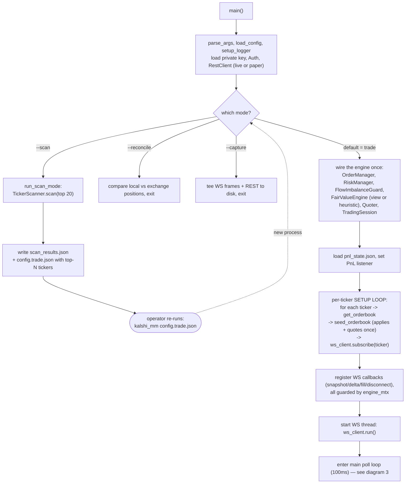
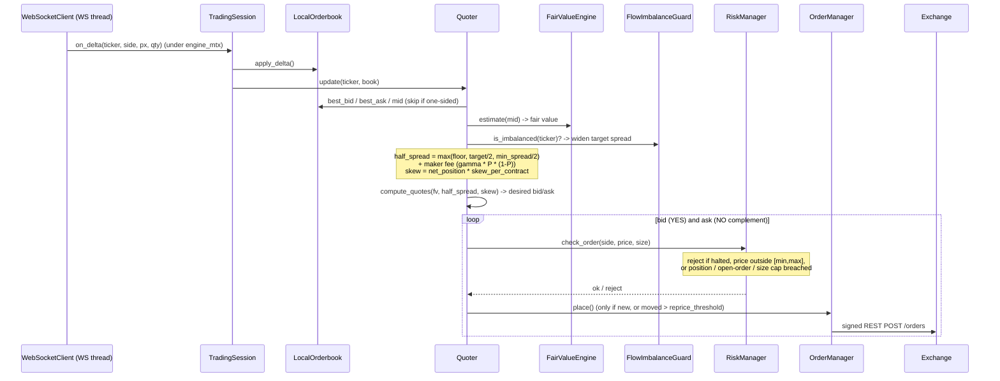
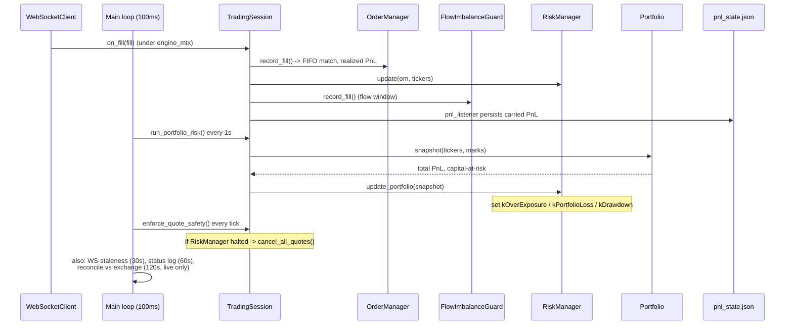

# Kalshi Market Maker — Build Plan

## Things to Fix — Prioritized

> Highest priority at the top. Ordering: bugs that corrupt the book or risk
> money first, then market-making quality, then operational robustness, then
> structural refactors. Detailed write-ups for several items live in the
> sections further down (referenced by name).

### P0 — Correctness & safety (do these first)

- [x] **1. `ensure()` fail-fast invariant primitive.** *Done — merged PR #8:
  `source/ensure.{hpp,cpp}` with `set_panic_handler`; `main` registers
  flatten-before-crash (`cancel_all_quotes`). Design in *Safety* section below.*

### P0 — Correctness & safety (do these first)

- [ ] **38. Self-referential micro-price → quote churn oscillator (D4,
  2026-07-03 demo run).** The quoter prices off a book that includes **our own
  resting orders**; on thin books our size moves `micro_price_cents()` past
  `reprice_threshold_cents=1`, producing a deterministic place/cancel loop
  (measured: 1,146 places + 1,146 cancels vs 22 fills in 10 min; 98% of orders
  lived <1s; placements perfectly bimodal, 2c apart). Fix: subtract our own
  resting orders from the book before computing micro/mid/imbalance, add a
  minimum quote rest time (or two-tick hysteresis). Full evidence in *Demo Run
  Findings (2026-07-03)* below. **Do this before any further live sessions —
  it burns the write budget, queue position, and incentive score.**

### P1 — Market-making quality

- [ ] **39. Flow defenses never engage under one-sided flow (D5, 2026-07-03
  demo run).** 11 maker fills per ticker, all one side, prices never moved:
  `FlowImbalanceGuard` never widened and 0.05c/contract skew is invisible at
  ~12 contracts. Verify the guard sees WS maker fills; raise/replace the skew
  (LMSR log-odds, item 25); consider the directional lean (item 32). Evidence
  in *Demo Run Findings (2026-07-03)*.

- [ ] **40. Shutdown-flatten PnL lost (D7, 2026-07-03 demo run).** The closing
  IOC from `flatten_all_positions` is never recorded as a `Fill`, so the
  session's realized result never reaches `OrderManager` or `pnl_state.json`.
  Build a `Fill` from the flatten response (`fill_count`,
  `average_fill_price`) → `record_fill` → persist the carry before exit; prune
  settled tickers from `pnl_state.json`. Evidence in *Demo Run Findings
  (2026-07-03)*.


- [x] **2. Cancel orphaned orders on startup (and guarantee cancel-on-exit).**
  *Done — merged PR #9: startup fetches resting orders for target tickers and
  cancels them (`cancel_preexisting_orders`) so every session begins flat.*
  The bot only knows about orders it placed in the *current* process and never
  cancels pre-existing resting orders at startup. Across restarts, orders pile
  up on the exchange that the running bot is unaware of — observed live on
  `KXWCADVANCE-…-NED`: a `Sell Yes @ 61c` from a prior buggy-mid run was still
  resting alongside the current quotes (3 resting orders where there should be
  2). That is uncontrolled exposure: a stale order can fill against us while we
  believe we are flat, and it creates self-cross risk. Fix: at startup fetch our
  resting orders for the target tickers and cancel them (or adopt them into
  local state), and make the exit/halt flatten path reliable across SIGINT/kill.
  High priority before any live trading.

- [ ] **3. D1 — non-crossing quote clamp (residual).** Clamp quotes to stay
  strictly passive vs. the observed BBO (≥1c behind) so latency on fast books
  can't turn a quote into a `post only cross`. The *systematic* crossing was the
  orderbook sort bug (fixed); the reject/429 *hot loop* is fixed (per-ticker
  cooldown — see Done). The **residual** is that we still clamp against the
  *lagging local* book, so a fast book still produces occasional crosses
  (post-cooldown: ~45 vs 433 in a 90s demo). Deeper fix: clamp against a fresher
  BBO, or step the price further passive on each reject. Detail in *Demo Run
  Findings*.

- [x] **4. D2 — align scanner price band with the risk price gate.** *Done —
  merged in PR #11 (`30b3524`): `load_config` intersects the scanner band with
  `quotable_price_band(risk, quoter)` so scan picks are always quotable.*

- [x] **5. Demo-environment conformance smoke tests.** *Done — see Done section.*
  Short, unit-test-style
  tests that hit the **real Kalshi demo environment** — one per request/response
  — asserting we can *send* each request and *parse* each response into our
  types without throwing, with key fields populated. **Why this matters:** pure
  unit tests use fakes that can mirror our own bugs — the `fill_count` vs
  `fill_count_fp` bug passed every unit test because `PaperTransport` emitted the
  same wrong field name. A live demo test exercises the real wire shapes and
  catches conformance drift (renamed fields, the `use_yes_price`/NO-side-scale
  question, `fill_count`) the moment it happens. **Design:** gated behind a CMake
  option / env var (needs demo creds + network; off by default, not in normal
  CI); each test is small and fast — one call → assert-parse. Read-only where
  possible; for order endpoints place a tiny `post_only` order far from the
  market so it rests, assert the response parses, then cancel it (demo is fake
  money). **Coverage:** REST `GET /markets`, `/markets/{t}`,
  `/markets/{t}/orderbook`, `/portfolio/balance|positions|orders`, create-order
  (`POST`) + cancel (`DELETE`); WS `orderbook_delta` (subscribe → snapshot
  parses, then a delta) and the `fill` channel. Ties to the conformance audit —
  see the conformance notes in `docs/KALSHI_API_REFERENCE.md`. Highest-leverage
  safety net before live trading: it would have caught the `fill_count` bug on
  the first run.

### P2 — Operational robustness & strategy

- [~] **6. Run the full test suite under sanitizers (and wire it into CI).**
  *Partial: the `asan` preset runs as a required CI job on every PR (green as of
  2026-07-03). Remaining: add UBSan to the preset, add a TSan CI job (the
  2-thread engine is the risk), consider clang-tidy-over-tree in CI.* The
  `asan` and `tsan` CMake presets already exist (`-fsanitize=address` /
  `-fsanitize=thread`, each carrying the full `-Wall -Wextra -Wpedantic
  -Wconversion -Wsign-conversion -Wshadow` set). Add a CI job — and a documented
  local command — that builds and runs the **entire** suite under **ASan+UBSan**
  (memory errors, leaks, undefined behavior) and **TSan** (data races). TSan
  matters most here: the engine is two threads (WS feed + 100ms poll loop)
  sharing all state under one `engine_mtx`, so a race would corrupt order/PnL
  state — catch it before live trading, not after. Add `-fsanitize=undefined` to
  the asan preset if not already covered. Fix or suppress-with-reason every
  finding and keep the suite green under each sanitizer. (Static analysis is
  already wired: cppcheck runs in-build per target; clang-tidy runs in the
  pre-commit hook — consider also running clang-tidy over the whole tree in CI.)

- [ ] **7. Audit and adopt the C++ Best Practices tooling guardrails.** Work
  through *Use the Tools Available* (Jason Turner / lefticus,
  <https://lefticus.gitbooks.io/cpp-best-practices/content/02-Use_the_Tools_Available.html>)
  and turn on **as many non-conflicting static/dynamic guardrails as we can** —
  much of this code is AI-written, so the more the compiler and analyzers catch
  automatically, the safer. Umbrella for item 6 (sanitizers). **Already have:**
  `-Wall -Wextra -Wpedantic -Wconversion -Wsign-conversion -Wshadow` + per-target
  `-Werror`, cppcheck (in-build), clang-tidy (pre-commit), ASan/TSan/coverage
  presets, libFuzzer targets. **Candidates to evaluate/add:** UBSan
  (`-fsanitize=undefined`) and MSan (uninitialized reads; needs instrumented
  libc++); the Clang static analyzer (`scan-build`); include-what-you-use; more
  warnings (`-Wold-style-cast`, `-Wcast-align`, `-Wunused`,
  `-Woverloaded-virtual`, `-Wnull-dereference`, `-Wdouble-promotion`,
  `-Wformat=2`, `-Wimplicit-fallthrough`, `-Wmisleading-indentation`, and
  GCC-only `-Wduplicated-cond`/`-Wduplicated-branches`/`-Wlogical-op`/
  `-Wuseless-cast`); a stricter clang-tidy check set and clang-tidy in CI over
  the whole tree; hardened standard-library asserts (`_LIBCPP_HARDENING_MODE` /
  `_GLIBCXX_ASSERTIONS`); Valgrind for the memcheck cases sanitizers miss.
  **Constraint:** only combine tools that don't contradict (e.g. ASan and TSan
  need separate builds; some flags are GCC-only vs Clang-only) — evaluate each,
  keep the suite green under the chosen set, wire them into CI.

- [x] **8. D3 — staleness flapping on quiet markets.** *Done — WS ping/pong
  liveness (see Done section). `IWebSocket` surfaces ping/pong via `on_heartbeat`,
  `IxWebSocket` enables a 10s auto-ping, and liveness frames refresh
  `last_message_time` — so a quiet-but-alive feed no longer trips the halt.
  Live-validated: 0 false halts over ~2 min on quiet markets.*

- [ ] **9. Queue-position awareness (strategy).** Orders join a price-time FIFO
  queue; at a deep level a small quote sits at the back (observed queue position
  ~115,081 behind a ~115k-contract level) and only fills on adverse selection —
  i.e. when the market runs *through* us. Consider level choice / quote sizing /
  pulling when the queue ahead is too deep. Lower priority; noted so it isn't
  lost.

- [x] **20. WS reconnect backoff (operational).** *Done — merged PR #32:
  delay doubles per consecutive failure (5s → 60s cap, overflow-safe), resets on
  a successful connect; `next_reconnect_delay()` exposed for observability.*
  Original finding: the reconnect loop retried a
  failed handshake every 5s **forever** (`max_reconnects=-1`, fixed delay). A
  persistent `401` (demo connection cap) turned into indefinite 5s reconnect-spam
  that *worsens* the server-side guard it's fighting. Add exponential backoff
  (cap ~60s) and treat repeated **auth** failures distinctly from transient
  disconnects. Surfaced repeatedly during this session's demo runs — highest-value
  remaining operational fix. See *Rate Limiting*.

- [~] **21. VAMP micro-price fair-value anchor — deepen (strategy).** *L1
  (top-of-book) shipped:* `LocalOrderbook::micro_price_cents()` weights each
  side's price by the opposite side's size, and the `Quoter` anchors fair value
  on it instead of the raw mid (leans toward book pressure → less adverse
  selection). Grounded in Bawa 2025 (VAMP) + Bürgi et al. (see
  [docs/papers](docs/papers/README.md)). **Deeper (TODO):** (a) **EMA smoothing**
  — raw VAMP is noisy tick-to-tick, so quotes can chase 1-lot flickers; smooth
  before quoting. (b) **L2/L3 depth weighting** — extend beyond top-of-book;
  deeper imbalance carries informed-trader positioning. (c) **A/B in replay** —
  compare micro vs. mid on realized fills / markout to confirm the adverse-
  selection reduction. (d) consider exposing the OBI/`IR>0.65` signal
  (`FlowImbalanceGuard`) as a directional input, not only a spread-widener.

- [x] **18. Rebate-aware market selection (strategy).** *Done — `get_incentive_programs`
  joined into scanner ranking (see Done section).* Kalshi's **Liquidity
  Incentive Program** pays for top-of-book resting size whether or not it fills
  (score = size × price-proximity, over random 1s snapshots; per-market pools
  ~$10–1,000/day). The scanner is currently blind to this — it ranks on
  spread/volume/days only. Add active-incentive status as a first-class ranking
  input so we prefer markets where our natural quoting shape *also* earns pool
  share (net-positive even at ~0 spread edge), and extend the Phase 30 fee model
  to credit expected reward income into paper/live PnL. Detail in *Kalshi
  incentive / rebate programs* under *Research Findings*. This is plausibly the
  single biggest lever on profitability for a small operator.

- [ ] **19. Falsifiable edge hypothesis + pre-live checklist (strategy/process).**
  Per the practitioner thread, infrastructure ≠ edge. Before more code toward
  live: (a) state the edge in **one falsifiable sentence** (where the profit
  comes from, who pays it, why competitors haven't removed it); (b) pre-declare
  PASS/FAIL/KILL thresholds; (c) ensure markout isn't doubling as both fill
  trigger and eval metric; (d) plan measurement of **live-vs-paper fill
  divergence**. Capture as a trimmed, Kalshi-specific `docs/PRE_LIVE_CHECKLIST.md`
  (from the ~100-question list in *Research Findings*). Gate real capital on it.

- [ ] **37. Deploy in a cloud region near Kalshi's matching engine
  (operational).** The demo runs measured a ~300ms REST round-trip from the
  local machine — the direct cause of the residual `post only cross` window
  (item 3): quotes are clamped against a BBO that is stale by a full RTT.
  Kalshi's infrastructure is AWS-hosted (US East); a small VM in the same
  region cuts the RTT to single-digit milliseconds, shrinking the stale-BBO
  window ~30-100x for a few dollars a month — likely cheaper and more effective
  than any software mitigation, and a prerequisite for judging whether FIX
  (item 11) is worth it. Steps: (a) measure RTT to the API from candidate
  regions (us-east-1/2 first) vs. home; (b) run a demo session from the best
  region and compare cross/reject rates and markout against a local run;
  (c) fold the chosen host into Phase 32 (service supervision, logs, alerts).

### Strategy roadmap — papers re-read (2026-07-03)

> All four papers in [docs/papers](docs/papers/README.md) were re-read against
> the PDFs; the notes there were corrected (several earlier claims were wrong —
> see the ⚠ marks) and these items extracted. Complexity: S/M/L. Suggested
> first wave: 22, 23, 27, 30 — all S, and 22/23 are near-free money.

**Quoting mechanics (cheap, do first):**

- [ ] **22. Round quotes in the maker's favor (S).** `compute_quotes` uses
  `std::round` on both sides, so the bid can round up and the ask down by up to
  0.5c past the intended half-spread — a systematic per-fill giveaway, the CLOB
  analogue of Berg & Proebsting's cash-pump warning (pp.53–54: every rounding
  must favor the maker). Fix: `floor` the bid, `ceil` the ask. Two lines.

- [ ] **23. Maker-fee widening ON by default + ceil-per-order fee model (S).**
  Bürgi p.6: maker fees began April 2025, so the paper's entire +2.6% maker
  edge is a *no-maker-fee* number; fees are rounded **up to the next cent per
  order** (effective 1.77% at 50c×100 lots, worse for small clips — p.6/p.17).
  Flip the Phase 30 γ·P·(1−P) widening default to on; apply ceil-to-cent at
  actual clip size in the fee model (also used for IOC-flatten cost).

- [ ] **24. Layered quoting — ladder size across 2–3 price levels (S/M).**
  Two independent reasons to hold resting orders at multiple levels instead of
  one fat quote:
  - **Queue priming (the big one):** Kalshi matching is price-time FIFO — queue
    position at a level is earned by resting there *before* the market arrives.
    A single-level quoter only joins a new best level *after* the move, at the
    back of the queue (item 9 measured ~115k contracts ahead at one deep
    level). Layers resting 1–3c behind the inside are already at or near the
    front when the market steps to them, converting market moves into
    good-queue fills instead of chasing.
  - **Sweep pricing (LessWrong marginal-pricing insight):** one fat level
    undercharges large takers — the counterparty most likely to be informed.
    Stepped layers make a sweep pay progressively worse prices.
  Also earns Liquidity Incentive score at each layer (depth credit decays with
  distance but is nonzero), and spreads the churn/cancel load: inner layers
  reprice, outer layers mostly rest. **Depends on item 38** (own-quote
  subtraction — layers must actually rest to accrue queue position; they also
  add more of our own size to the book for the pricing view to subtract).
  Naming note: this is genuine intent-to-fill liquidity (laddering); avoid the
  term "layering" externally — regulators use it for the manipulative
  place-and-cancel variant, which the reprice threshold and rest-time rules
  must keep us far away from.

**Inventory & sizing:**

- [ ] **25. LMSR log-odds inventory skew (S).** Replace linear
  `net_position × skew_per_contract_cents` with the log-odds shift
  `fv' = c / (1 + (c/fv − 1)·e^{q_net/b_inv})` (Berg & Proebsting p.49): skew is
  constant per contract in log-odds, self-attenuates in cents near 1c/99c, and
  can never push a quote out of range. Derive `b_inv` from the risk budget —
  "hitting `max_position` moves the reservation price to P_upper" (pp.51,
  55–56) — one interpretable knob replacing the hand-tuned cents constant, with
  an explicit worst-case inventory markdown `b_inv·c·log(c/P)` logged against
  the risk limits.

- [ ] **26. √-time terminal size taper (S).** Binary gamma ∝ 1/√T_remaining
  (Bawa pp.10–11): scale `quote_size` and the exposure cap by
  `√(T_remaining/T_ref)` clamped to [floor, 1] — a continuous ramp ($10k@30d →
  $4.8k@7d → $1.8k@1d), riding TheoGrid's existing time axis. Complements the
  halts with a taper instead of a cliff.

- [ ] **27. Closing-day longshot guard (S).** Distinct from 26 (price-gate, not
  size): Bürgi Fig. 4/Fig. 8 — the closing day is a different regime ("Yogi
  Berra effect": maker losses on ≤10c contracts approach taker losses). When
  time-to-close < ~24h, tighten the price gate (e.g. [10,90] → [25,85]) or
  suppress/heavily shade only the longshot-side bid.

- [ ] **28. Quarter-Kelly quote sizing (M).** Bawa pp.4–5:
  `f* = (P_fair − P_quote)/(1 − P_quote)` per side off the VAMP-anchored fair
  value; `size = clamp(0.25·f*·bankroll/price, min_lot, max_size)` (floor keeps
  queue presence at zero edge). Honest caveat now recorded in the notes: the
  33%/11%/<3% table is a bankroll-halving race under illustrative
  distributions, not ruin probability — and Bürgi's SD-33%-vs-mean-2.6% is the
  Sharpe context. Gate on item 31's measurements.

**Pricing & signals:**

- [ ] **29. Asymmetric quoting — longshot-side edge floor (M).** Bürgi Fig. 6 /
  Table 10: maker returns are negative on everything below ~50c (not just
  <10c), and winning maker flow is long the favorite (56.5% of 90–99c buys vs
  43.5% of 1–10c). Add a price-dependent extra edge requirement (shade or
  down-size) on whichever quote would buy the cheap side; quote normally on the
  favorite side. The [10,90] gate alone leaves us symmetric across 10–49c where
  makers demonstrably bleed.

- [ ] **30. Category-conditional, time-decayed debias β (S/M).** Bürgi Table 8:
  ψ Crypto 0.058*** (largest — our old notes had this inverted), Economics
  0.034, Financials 0.032, Politics/Entertainment ~0.02 and insignificant;
  Table 9: 2025 bias roughly half the sample average. Replace the single
  opt-in β=0.09 with a per-category table (scanner already knows category),
  scaled toward the 2025 estimate; disable outside the paper's sample envelope
  (≥24h duration, spread ≤20c — p.9).

- [ ] **31. Brier calibration logger (S — measurement backbone).** Bawa p.9/11:
  persist `(ticker, t, P_fair, P_market, config flags)` at each quote decision;
  join settlement outcomes; compute Brier per signal variant offline. Turns
  β, the flow lean, and Kelly sizing into measured parameters instead of
  literature constants — and is the harness item 21's VAMP A/B needs anyway.
  Pairs with item 19 (falsifiable edge).

- [ ] **32. Directional flow lean (M).** Bawa p.8: IR > 0.65 predicts an
  up-move within 15–30 min (~58%). Extend `FlowImbalanceGuard` to emit a signed
  signal; Quoter applies a bounded fair-value offset (±1c) or asymmetric size,
  decaying over the 15–30 min horizon. (Caveat from the notes: the headline
  OBI R² is an equities result; validate on our own markout via item 31 before
  trusting the thresholds.)

- [ ] **33. Cancel-on-theo-jump quote fade (M).** Bürgi p.27: the maker edge
  *is* repricing — "willing to cancel those orders if new evidence emerges."
  If VAMP/theo moves > k cents against a resting order, cancel out-of-cycle
  instead of waiting for the next requote tick. Complements
  `FlowImbalanceGuard` (which only shapes *future* quotes) and directly attacks
  adverse-selection fills.

**Portfolio & safety:**

- [ ] **34. Sum-to-one monitor + fair-value renormalization (M).** Bawa
  pp.5–7: group mutually-exclusive outcomes by event; renormalize fair values
  by `P_i/ΣP` before quoting; log/alert when `Σ best_ask < 100c − fees − 0.5c`
  (executable buy-all arb, 0.54% net in the worked example). Defer multi-leg
  execution — partial fills destroy the arb.

- [ ] **35. Position-accountability guard (S).** Kalshi limit: 25,000 contracts
  per strike per member (Bawa p.7, CFTC filing Nov 2024). Add a hard per-market
  cap to the risk module well below it. Trivial regulatory insurance.

- [ ] **36. Scanner: volume-weight cap + eligibility envelope (S).** Bürgi
  Tables 6–7: pricing bias survives every volume quintile — volume buys fill
  probability, not price quality (and Bawa p.12: wash trading can be 20–60% of
  volume in some periods). Cap the scanner's 0.7 log-volume rank contribution
  beyond a threshold, and gate the β debias on the paper's sample envelope
  (market open ≥24h etc., per item 30).

### P3 — Structural refactors (PR #1 review — detail in *Code Review Follow-ups*)

- [ ] **10. R3 — `Cents` strong type for prices.** The `Quantity` half is done
  (see Done); prices are still bare `int` cents everywhere. Wrap them in a strong
  `Cents` type so price/count/dollar values can't be silently mixed.
- [ ] **11. FIX transport.** Replace REST order entry with FIX (Kalshi supports
  FIX for order entry; tag `21006` = CancelOrderOnPause, drop-copy for missed
  exec reports). Lower latency than REST, better for high-frequency requoting.
  Market data still comes via WebSocket. See §12 of the API reference and
  `https://docs.kalshi.com/fix/*`.
- [ ] **12. R2 — break up `main.cpp`** (also flagged by clang-tidy:
  cognitive complexity 27 > 25).
- [ ] **13. R1 — split `source/`** into `Calculations/ Quoter/
  PortfolioManagement/ Networking/ Common/`.
- [ ] **14. R4 — Constraints-vs-Guards framework.**
- [ ] **15. R5 — `KalshiSession` + a `Session` concept** (multi-exchange).
- [ ] **16. Process-per-exchange isolation.** Today the whole system is a
  **single process, two threads** (WS feed + 100ms poll loop) with **one global
  `engine_mtx`** serializing all state; all markets share one WebSocket
  connection and are distinguished only by a ticker key into per-ticker maps.
  There is no cross-market parallelism and no failure isolation — a stall on one
  market (or one exchange) blocks everything. **Target: each exchange (Kalshi,
  Polymarket, …) runs as its own OS process** — independent connection, event
  loop, order state, rate-limit budget, and crash/restart domain, able to use a
  separate core. Pairs with R5 (the `Session` abstraction is the in-process
  seam; this is the runtime/deployment boundary). Open design questions:
  shared vs. per-process risk/PnL ledger, cross-exchange netting, and how a
  supervisor starts/monitors/flattens each process.
- [ ] **17. R7 — `docs/kalshi-messages.md` + rate-limiting review.**

### Bug audit — 2026-07-03 (complete — all fixes merged same day)

> Findings from a systematic correctness audit of the codebase. All seven
> findings below are resolved: A1 (PR #35), A2 (PR #28; duplicate #33 closed),
> A3 (PR #39), A4 (PR #38), A5+A6 (PR #27; duplicates #34/#37 closed),
> A7 narrowed & fixed (PR #36). Full suite green (400 tests) post-merge.

- [x] **A1. Quoter spread floor truncates odd `min_spread_cents`
  (`source/quoter.cpp:165`).** The floor is applied as `min_spread_cents / 2`
  (integer division), so with the default `min_spread_cents = 3` and
  `target_spread_cents = 2`: `base_half_spread = max({1, 2/2, 3/2}) = 1` →
  total quoted spread **2c < the 3c floor**. The default floor of 3 adds zero
  protection beyond the absolute half-spread min of 1. The only floor test uses
  an even value (8), so the odd case is untested. Fix: round the half-spread
  up (`(min_spread + 1) / 2`). Confidence: high.

- [x] **A2. Carried PnL double-counts on every fill
  (`source/trading_session.cpp:75-91`) — corrupts `pnl_state.json`.**
  `on_fill` computes `total = prior_pnl_[ticker] + session_pnl` where
  `session_pnl = order_mgr_.realized_pnl(ticker)` is *cumulative* for the
  session — then writes `total` back into `prior_pnl_[ticker]`, which is the
  baseline for the next fill. Every fill re-adds the entire running total:
  fill 1 realizes 50c → persisted 50; fill 2 realizes 30c more (cumulative 80)
  → persisted `50 + 80 = 130` instead of 80. Persisted financial state grows
  without bound. The single-fill test never exercises accumulation. Fix:
  capture the prior baseline once at session start and never mutate it
  (`total = immutable_prior + session_pnl`). Confidence: high.

- [x] **A3. `TheoGrid::lookup` crashes on a single-breakpoint axis
  (`source/theo_grid.cpp:63-110`).** The ctor accepts a size-1 axis but the
  clamp logic then either indexes `.at(1)` past the end or underflows
  `size_t ttc_lo = ttc_hi - 1` → `std::out_of_range` on any lookup instead of
  returning the axis's only value. Not reachable from `default_config` (5×5);
  `TheoGrid` is currently test-only. Confidence: medium (deterministic crash,
  low exposure).

- [x] **A4. Scanner spread score hardcoded to the default window
  (`source/ticker_scanner.cpp:20-33`).** `compute_score` centers the spread
  term at 6.5c with half-range 3.5c — the midpoint/half-width of the *default*
  `[3,10]` filter — ignoring configured `min/max_spread_cents`. With, e.g.,
  `[1,20]`, a market with spread 15 scores 0 on spread and ranking is
  miscalibrated; the code comment claims the curve peaks at the configured
  window's midpoint, which is false. Fix: derive the midpoint/half-range from
  the configured bounds. Confidence: medium (only bites non-default configs).

- [x] **A5. NO-side fills recorded at the YES price
  (`source/websocket_client.cpp:319` `dispatch_fill`) — corrupts NO cost basis
  and PnL.** `fill.price_cents` is always parsed from `yes_price_dollars`,
  but `OrderManager::record_fill` treats it as side-native (realized spread
  `= 100 - fill_price - lot_price`; NO lots marked at `100 - yes_mid`).
  `rest_client.cpp` parse_order correctly reads `no_price_dollars` for NO;
  the WS fill path does not. Example: buy 5 YES @52 + 5 NO @44 (complete set)
  → NO fill carries yes_price 56 → realized spread `(100-56-52)*5 = -40c`
  instead of `+20c`. Every NO fill mis-accounts. Fix: parse `no_price_dollars`
  (or `100 - yes`) when `outcome_side == "no"`. Confidence: high.

- [x] **A6. Fill dedup key collides within the same millisecond
  (`source/order_manager.cpp:64-67`).** `fill_key = order_id + "@" + ts_ms`;
  an order sweeping two levels can emit two fills with the same order id and
  same `ts_ms` but different price/count — the second is silently dropped as a
  "duplicate": position and realized PnL under-count, and a fully-filled order
  can linger in `open_orders_`. Fix: include the exchange trade/fill id in
  `Fill` and key on that. Confidence: medium.

- [x] **A7. `place_order` ignores the response `status` field
  (`source/rest_client.cpp:419-428`) — a killed order is reported as resting.**
  *Narrowed on investigation (PR #36):* the documented Create Order V2 response
  has **no `status` field**, and a `post_only` order that would cross is
  rejected with an HTTP error that `check_response` already throws on — so the
  phantom-resting-quote half of this finding is **refuted**. The real bug: an
  IOC (`OrderType::Market`, used by flatten) never rests, yet its dead
  remainder was reported `Open`/`PartiallyFilled`. Fixed: any IOC that didn't
  fully fill now reports `Cancelled`.

*Audit complete — 4 subsystem sweeps (orderbook/quoter/risk, portfolio/PnL,
rest/order-manager/auth/rate-limit, session/paper/main). A2 was independently
found by two agents. Areas traced and cleared: complement math, micro-price
weighting, FIFO realized-spread and lot accounting, Quantity fixed-point
round-trips, token-bucket math, RSA-PSS signing, engine_mtx locking,
shutdown/flatten paths, steady-vs-system clock usage.*

### In review (PR open)

*(nothing in review)*

### Merged 2026-07-03

- [x] **WS protocol hardening (PR #30, merged).** Four wire
  protocol bugs: (a) no `seq` gap detection — missed deltas silently corrupted
  the local book; now tracked per `sid`, a gap discards the message and recycles
  the connection via new `IWebSocket::request_close()` (async-safe from the
  callback thread, unlike `stop()`) to force a fresh snapshot; (b) `parse_side`
  silently defaulted unknown side strings to `No`, corrupting the book on
  malformed deltas — now throws and the delta is dropped; (c) subscribe sent an
  undocumented `use_yes_price` param — removed (if the server ever honored it,
  the NO-side complement math would double-flip the scale); (d) `error` and
  `subscribed` server messages were silently ignored — now logged/handled.

### Done (recent sessions, committed)

- [x] **Zero-inventory invariant — flatten positions (item, this session).** The
  bot cancelled resting *orders* on exit but left *positions* (fills accumulate
  real inventory) — a live demo run ended with ~$11 of residual positions. Added
  `RestClient::flatten(ticker, net_position)` (aggressive IOC taker on the
  opposite side, fractional `Quantity` count so it closes to the exact 0.01), a
  `--flatten` CLI mode to clean up leftover inventory, and **flatten-on-shutdown**
  (live mode) so a normal exit ends flat. Verified live: closed 3 residual demo
  positions exactly, re-run reported flat. Complements *inventory skew* (which
  keeps us near-flat while running) with a hard flat at exit.
- [x] **Reject/rate-limit hot loop → per-ticker cooldown (D1-adjacent, this
  session).** On a fast book a quote clamped against the *lagging* local BBO can
  cross the exchange's current BBO → `post only cross` reject; the place threw
  before the quote state updated, so the next delta re-fired the same crossing
  price ~5×/s. Live: **433 rejects + 13 × 429 in ~90s** on one ticker. Fix:
  `TradingSession` records a per-ticker cooldown (500ms) on any place error and
  skips re-quoting that ticker until it elapses. Verified live: rejects **−90%**
  (433→45), 429s **−92%** (13→1). Residual crossing remains — see item 3.
- [x] **Client-side write rate limiter (this session).** New `RateLimiter` token
  bucket sized to the Basic tier (100 write-tokens/s, capacity 100); `RestClient`
  throttles `place_order` (10) / `cancel_order` (2) by sleeping the returned wait.
  Starts full, so normal quoting never waits — a defense-in-depth backstop for the
  429s. Fills the *Rate Limiting* gap below.
- [x] **WS ping/pong liveness → staleness fix (D3, item 8, this session).** The
  30s stale-book guard false-halted on quiet markets because only app messages
  refreshed `last_message_time`. `IWebSocket` now surfaces ping/pong via
  `on_heartbeat`; `IxWebSocket` enables a 10s auto-ping and counts ping/pong as
  liveness. Distinguishes "market idle" (keep quoting) from "feed dead" (halt).
  Verified live: **0 false halts** over ~2 min on quiet markets.
- [x] **Rebate-aware scanner (item 18, this session).** `RestClient::get_incentive_programs()`
  (public `GET /incentive_programs`) joined into the scanner ranking; an active
  Liquidity Incentive pool adds a log-normalized bonus (`incentive_weight`, 0.50)
  on top of volume+spread. Verified live against demo pools. See *Kalshi incentive
  programs* under *Research Findings*.
- [x] **`--verbose` flag (this session).** Extracted `CliArgs`/`parse_args` into a
  testable `cli.{hpp,cpp}` unit; `--verbose` sets the logger to `debug` so quote/
  skew/reprice detail (debug-level) is visible.
- [x] **Demo-environment conformance smoke tests (item 5).** Live-demo, gated
  tests for REST (`get_markets`/orderbook/positions/open-orders/create+cancel
  lifecycle/`get_incentive_programs`) and WS (snapshot, delta-applies-and-stays-
  valid, NO-side). Caught the microsecond-timestamp bug on the first real run.
- [x] **Orderbook delta apply (P0).** `delta_fp` is a signed *increment*, not the
  absolute size; `apply_delta` treated it as absolute, so a `-1.47` shrink set
  the level negative and a `-0.16` shrink erased it. Now `quantity += delta` with
  removal only at ≤ 0. Regression-tested.
- [x] **Fractional count precision (R3 quantity half).** Contract counts
  (orderbook levels, fills, positions, FIFO lots, flow volumes) are a strong
  `Quantity` type backed by exact int64 centi-contracts — no more `int` rounding
  that dropped sub-unit deltas/fills. Outbound order *sizing* stays whole-contract
  `int` by design.
- [x] **R6 — comment convention.** Documented in `CLAUDE.md`: no comments except a
  single doc block at the top of each `.hpp`. Existing-code cleanup is incremental
  (conform files as they're edited).
- [x] **API conformance.** RSA-PSS salt length = digest size; fill dispatch reads
  `outcome_side` (not removed `side`); `place_order` reads `fill_count_fp`. Added
  `docs/KALSHI_API_REFERENCE.md`.
- [x] **Orderbook ascending-sort → correct BBO/mid** (was the reason we weren't
  making markets); **quoter resync on flatten** (re-quotes after halt/disconnect);
  **seed order-error containment** (one bad market can't crash startup); **paper
  mode against the V2 API**. See *Demo Run Findings*.

### North-star architecture (long-horizon — not yet prioritized)

Where this is headed once there is more than one strategy and more than one
exchange. Deliberately *way* out; captured so the near-term refactors (R1, R5,
item 13) don't paint us into a corner.

- **Process-per-strategy/exchange for crash protection.** Generalize item 13:
  each strategy instance (and each exchange it trades) runs as its own OS
  process with its own connection, event loop, and order state. A **supervisor**
  starts, health-checks, and restarts them, and **flattens a process's book if
  it dies** so a crash is contained instead of taking down the whole system or
  leaking live orders. Independent failure/restart domains; free use of multiple
  cores.
- **Central risk / portfolio aggregation layer.** A process above the strategy
  fleet that each strategy reports positions, fills, and PnL to. It maintains the
  **aggregate** position / exposure / PnL across all strategies and exchanges,
  enforces **global** risk limits (not just per-strategy), does cross-strategy
  and cross-exchange **netting**, and can issue a **global kill / flatten-all**.
  Individual strategies keep their own local guards; this layer is the
  firm-level backstop and the single source of truth for "what do we actually
  hold and what are we risking right now."
- **Aggregated pricing inputs (fed back to each exchange/strategy).** The same
  layer that sees every venue is also the natural place to *produce* consolidated
  market-data signals and push them back down to each strategy's pricing. The
  motivating example: the same (or economically equivalent) contract trades on
  Kalshi, Polymarket, and others, so compute a **consolidated BBO across all
  prediction markets** — the true best bid/offer and a blended fair value over
  every venue — and feed it in as a pricing input (external view / fair-value
  anchor) so each exchange quotes against the whole market, not just its own
  local book. Extends the existing `external_prob` / view-based-model hook from a
  single-market signal to a cross-venue one. Requires a contract-equivalence map
  (which tickers across venues are the same underlying) and careful handling of
  fees, settlement rules, and staleness per venue before treating two books as
  comparable.
- Open questions: transport between processes (shared memory / IPC / a message
  bus), whether the risk layer is advisory or has hard veto over order
  submission, and how netting interacts with per-exchange margin/settlement.

---

## Architecture

The binary is one executable with four modes selected by CLI flag. **Scanning
and trading are separate runs**: `--scan` writes a config file, and you re-run
the bot pointed at it to actually make markets. There is no loop that "sets up
and trades each market in turn" — after a one-time per-ticker setup loop the bot
is entirely **event-driven** (WebSocket callbacks) with a periodic safety timer.

### 1. Startup, mode dispatch, and the per-ticker setup loop



So the answer to "I have a list of markets, then what?": each ticker is **seeded
and subscribed once** (`main.cpp` setup loop). Seeding already places the first
pair of quotes. From then on the book moves and fills arrive asynchronously —
the code path below runs once **per inbound message**, not once per market.

### 2. The hot path — one book update becomes a quote



### 3. The two steady-state drivers (fills + periodic safety)



`main.cpp` does process/IO only (config, logger, signals, transports, the WS
thread, and the 100ms poll loop). `TradingSession`
(`source/trading_session.hpp/.cpp`) owns the domain reactions (snapshot/delta/
fill, portfolio kill-switch, status logging) so the same wiring runs in
production, unit tests, and session replay. The WS callback thread and the main
loop both touch the engine, serialized by a single `engine_mtx`. Capture (raw WS
frames + REST responses) is teed by the `CapturingWebSocket` /
`CapturingHttpTransport` decorators (`source/capture.hpp/.cpp`) via `--capture`.

---

## Demo Run Findings (2026-07-03)

Second sustained live demo run (10 min, 5 scanned tickers, post-audit build).
Clean lifecycle: startup orphan-cancel, quoting, WS fills, SIGINT →
cancel-all (10 resting) → flatten both positions → exit 0. **Validated live:**
NO-side WS fills priced side-native (A5/C1 fix — fills at 70c/84c matched our
NO quotes), same-millisecond same-order fills both counted via `trade_id`
dedup (A6/H6), fully-filled sides kept re-quoting (H1), no false stale halts
on quiet books (item 8), zero 429s/rejects (write limiter + clamp). New
findings, prioritized:

- [ ] **D4 — Self-referential micro-price → place/cancel oscillator (P0,
  item 38).** 1,146 places and 1,146 cancels in ~10 min vs 22 fills; 98% of
  orders lived <1s (p50 0.5s). Placement prices are perfectly bimodal on both
  active tickers — the quote flips between exactly two states 2c apart
  (yes@14/no@82 ↔ yes@12/no@84: 213/212 each; yes@26-28/no@68-70: 73/72) —
  a deterministic two-state oscillation, not market noise. Root cause:
  `LocalOrderbook` includes **our own resting quotes** (the exchange book
  does), and on a thin demo book our 10-lot dominates top-of-book size, so
  `micro_price_cents()` (VAMP) moves ~2c when our quotes land — over
  `reprice_threshold_cents = 1` — so the quoter cancels/replaces, the book
  reverts, fair value flips back, repeat every tick. Fixes, in order of
  principle: (a) **subtract our own resting orders from the book** before
  computing micro/mid/imbalance (every serious MM does this); (b) minimum
  quote rest time or two-consecutive-ticks hysteresis before repricing;
  (c) reprice threshold ≥ our own worst-case book impact. Churn burns the
  write-limit budget (~1.8 places/s avg), destroys queue position (item 9),
  and forfeits Liquidity Incentive score (time-at-top-of-book).

- [ ] **D5 — One-sided flow absorbed with static quotes (P1, item 39).**
  11 maker fills per active ticker, **all NO side**, at unchanged prices
  (70c, 84c), accumulating net −10.93 and −12.02 with zero realized PnL —
  textbook adverse-selection underwriting (Palumbo's E_win). Neither defense
  engaged: `FlowImbalanceGuard` never widened (verify it sees WS maker fills;
  the churn also destroys any per-quote state), and inventory skew at
  0.05c/contract × 12 ≈ 0.6c rounds to invisible. Fix: verify guard wiring
  live, raise skew (or adopt the LMSR log-odds skew, item 25), and consider
  the directional lean (item 32) so sustained one-sided fills move the
  reservation price.

- [ ] **D7 — Shutdown flatten PnL never recorded or persisted (P1,
  item 40).** `flatten_all_positions` places the closing IOC via
  `rest.flatten()` but never records the execution as a `Fill` in
  `OrderManager`, and the PnL listener only fires on WS fills — so the
  realized PnL of closing −10.93/−12.02 (the session's actual economic
  result) is lost: `pnl_state.json` still contains only the stale 2026-07-02
  tickers at 0.0. Fix: build a `Fill` from the flatten order response
  (`fill_count`, `average_fill_price`) → `record_fill` → persist the carry
  before exit. Also: prune settled tickers from `pnl_state.json`.

- [ ] **D8 — Quiet-market idling is invisible (P2, observability).** From
  15:42:52 to shutdown (~7 min) the bot placed nothing — the live-game
  markets (Australia vs Egypt props) paused, deltas stopped, and with
  ping/pong keeping the feed "fresh" that is *correct* behavior — but nothing
  distinguishes "idle because quiet" from "wedged": add an info log / status
  field for seconds-since-last-book-update per ticker. Related scanner
  question: it picked **in-play sports props** (pause-prone, event-driven
  jumps) — consider a scanner filter for markets whose event is in progress.

## Demo Run Findings (2026-06-29)

First sustained market-making run on the Kalshi **demo** environment
(`config.json` → `demo-api.kalshi.co`, real access key + demo key). The engine
works end-to-end (auth, seed, quote, WS, risk, portfolio, reconcile). Two bugs
were found and fixed, plus several environment/strategy learnings.

**Fixed (committed):**
- **Quoter not resynced on flatten** — a flatten (staleness/disconnect/halt)
  cancelled the resting orders but left the `Quoter`'s `live_quotes_` ids stale,
  so on feed recovery it tried to cancel dead ids and **never re-quoted**.
  `Quoter::reset_quotes()` now called from `TradingSession::cancel_all_quotes`.
- **Order rejection crashed startup** — a single `place` returning HTTP 400
  (e.g. `"post only cross"`) threw out of the unguarded seed loop and killed the
  whole process. `seed_orderbook` now contains quote errors and the `main.cpp`
  seed loop skips a failing ticker. (`on_delta` was already guarded.)
- **Orderbook stored in the wrong order → garbage mid (THE reason we weren't
  making markets).** The exchange sends levels in *ascending* price order (a 1c
  dust level first), but `best_bid`/`best_ask`/`find_level` all assume
  *descending* (best at `front()`). `apply_snapshot` copied the wire order
  verbatim, so `best_bid` was the 1c dust level, `best_ask` its complement
  (99c), and `mid` was pinned near 50 regardless of the real market. Quotes were
  priced *through* the true book → rejected as `post only cross`. Proven on the
  liquid `KXWCADVANCE-…-NED` market: **21 cross-rejections → 0** after sorting
  levels descending on ingest. This was a correctness bug masked because every
  unit test used single-level (already-sorted) books.

**Open follow-ups (tracked):**
- [x] **D1 — Belt-and-braces non-crossing clamp.** *Clamp shipped — PR #10
  (`passive_bid`/`passive_ask`, ≥1c behind BBO). Residual (lagging local book on
  fast markets) tracked as item 3 above.* The orderbook fix removed the
  systematic crossing. Residual risk remains on very fast books: a quote priced
  near the touch can cross by the time the ~300ms REST round-trip lands. Clamp
  quotes to stay strictly passive vs. the observed BBO (≥1c behind) so latency
  jitter can't produce a `post only cross`. Lower priority now that mid is
  correct, but still worth doing.
- [x] **D2 — Scanner price band vs. risk price gate are misaligned.** *Done —
  PR #11: `load_config` intersects the scanner band with the quotable band.* Scanner
  admits `[min_price, max_price]` (was `[2,98]`) but the risk gate only quotes
  `[10,90]`, so the scanner's top picks (2–5c longshots) are un-quotable and
  also the longshots Bürgi/Deng/Whelan say to avoid. Align the scanner's
  `min/max_price_cents` to the risk gate (or derive one from the other).
- [x] **D3 — Staleness flapping on quiet markets.** *Done — see item 8: WS
  ping/pong liveness counts toward freshness; 0 false halts on quiet markets.* Thin demo markets (e.g. the
  CPI tickers) send no WS traffic for >30s, tripping `kStaleBook` repeatedly →
  flatten/re-quote churn. Consider counting heartbeats/pings toward freshness,
  or a longer threshold for low-activity markets. Don't loosen blindly — it
  weakens staleness protection on active markets.
- Ops note: background launches need `setsid` (a bare `&` under the tooling gets
  killed when the parent shell exits).

---

## Safety: `ensure()` Fail-Fast Invariant Checks

- [x] **Add a project-wide `ensure()` primitive.** *(shipped — PR #8)* Used liberally to assert
  invariants that must hold for safe trading. On violation: **flatten (cancel
  all resting orders) then crash** with a non-zero exit. An inconsistent process
  must never keep quoting — fail loud and flat, don't limp on.

**Design (the parts that are easy to get wrong):**

- New `source/ensure.{hpp,cpp}` (Common). Signature roughly:
  `void ensure(bool condition, std::string_view what,
  std::source_location loc = std::source_location::current())`. On failure: log
  `critical` with `file:line` + message, invoke the registered panic handler
  (flatten), then terminate.
- **Flatten-before-crash needs a registered hook.** `ensure` can be called from
  anywhere and has no access to the `OrderManager`. At startup `main` registers
  a panic handler — e.g. `set_panic_handler([&] { session.cancel_all_quotes(); })`
  — that `ensure` calls on failure. `cancel_all_quotes` is already
  best-effort / never-throws, so it is safe on this path.
- **RAII will NOT save us here.** `std::abort()` / `std::terminate` do not run
  stack-unwind destructors, so the existing exit-time `ScopeGuard` cancel-all
  will *not* fire on an `ensure` failure. That is exactly why `ensure` must
  flatten explicitly via the hook *before* aborting.
- **Thread-safety / reentrancy.** `ensure` may fire on the WS thread or the main
  loop; the panic handler must take the same `engine_mtx` (or be lock-free
  best-effort) and be idempotent. Guard against an `ensure` failing *inside* the
  handler: set a "panicking" flag on first entry; a second entry skips the
  re-flatten and aborts immediately, so we can never deadlock or recurse.
- **Testability (TDD first).** Make the terminating action injectable — default
  to `std::abort`, overridable in tests to a recording/throwing stub — so tests
  can assert "(a) the panic handler ran (flatten was called) and (b) abort was
  requested" without killing the test process. Same injection pattern as the
  configurable logger.
- **Distinct from a risk halt.** A risk halt is recoverable (`resume()`); an
  `ensure` violation is an unrecoverable invariant break → flatten + exit
  non-zero. Use `ensure` only for "this should be impossible" conditions, never
  for normal control flow or expected error handling (those stay
  exceptions / `check_order` rejections).

**Candidate invariants to seed the rollout:**

- order price ∈ [1,99], quantity > 0, `complement_price` ∈ [1,99]
- `best_bid < best_ask` when both sides present; no negative level sizes
- fair value is finite (not NaN/inf) and ∈ [1,99] before quoting
- net position and open-order counts within the configured hard caps
- config values sane at load (spreads ≥ 0, price band `min < max`)
- realized/unrealized PnL and marks are finite

**Rollout:** land the primitive + its tests first, then introduce `ensure`
calls incrementally — one subsystem per commit — so every new invariant ships
with a test that exercises both the pass and the flatten-then-crash path.

---

## UAT Blockers

**BLOCKER-1 (resolved):** `IxWebSocket` implemented via FetchContent `machinezone/IXWebSocket`. End-to-end connection to live UAT not yet verified.

**BLOCKER-2 (RESOLVED 2026-07-03 — see resolution below):** A live `--capture` run against demo
showed network + clock are fine and **public** REST (`GET /orderbook`) returns
200, but every **authenticated** call (`GET /portfolio/positions`, the WS
handshake) returns `401 INVALID_PARAMETER`. Root cause: the `api_key` (access key
ID) in `config-demo.json` is still an unfilled placeholder (`<…>`, not a UUID) —
the private key `.pem` is real, the access key ID is missing. **Action: paste the
real demo access key ID into config, then re-run `--capture`.** Secondary suspect
if 401 persists after that: RSA-PSS salt length in `auth.cpp` uses
`RSA_PSS_SALTLEN_MAX`; Kalshi's SDK uses digest length (32) — verify live once a
real key exists. Field-shape drift (price names, `count` vs `quantity`, status
strings, timestamps) can only be confirmed once authenticated traffic flows.

**Resolution (2026-07-03):** real demo access key + private key configured on the
Mac (`/Users/jacobfreund/kalshi-demo-key/`, copied to gitignored
`config-demo.json`). All 10 demo conformance tests pass against the live demo
environment — authenticated REST (`positions`, `open orders`), order
place/rest/cancel on both sides, and the authenticated WS handshake with
snapshot + delta parsing. The RSA-PSS secondary suspect was real and is fixed:
`auth.cpp` now signs with `RSA_PSS_SALTLEN_DIGEST` (commit `292f274` — salt
length must equal digest size, matching Kalshi's SDK), and authenticated calls
succeed.

**Pre-UAT checklist:**
- [x] `IxWebSocket` implemented and library fetched
- [x] Demo RSA private key present (`/Users/jacobfreund/kalshi-demo-key/`, referenced by `config-demo.json`)
- [x] Real demo **access key ID** filled into `config-demo.json` (`api_key`) — done 2026-07-03
- [x] `config-demo.json` points at demo base/ws URLs
- [~] Raw REST/WS bodies captured via `--capture` (authenticated REST + WS verified 2026-07-03 via conformance suite, 10/10 pass; full `--capture` session for the replay fixture still pending)
- [x] Paper mode (`--paper`) runs without errors (fixed 2026-06-29 — was silently placing zero orders against the V2 API)

---

## Completed Phases (1–20)

| Phase | Component | Key files |
|---|---|---|
| 1 | Types & Domain Model | `source/types.hpp` |
| 2 | Authentication | `source/auth.hpp/cpp` |
| 3 | REST Client | `source/rest_client.hpp/cpp`, `source/http_transport.hpp` |
| 4 | Local Orderbook | `source/orderbook.hpp/cpp` |
| 5 | WebSocket Client | `source/websocket_client.hpp/cpp` |
| 6 | Order Manager | `source/order_manager.hpp/cpp` |
| 7 | Risk Manager | `source/risk_manager.hpp/cpp` |
| 8 | Fair Value Engine | `source/fair_value.hpp/cpp` |
| 9 | Quoter | `source/quoter.hpp/cpp` |
| 10 | Main Loop | `source/main.cpp` |
| 11 | Pluggable Pricing Model | `source/pricing_model.hpp/cpp` |
| 12 | Theo Grid | (in quoter) |
| 13 | Constraint Bitset & AdverseSelectionGuard | `source/quoter.hpp` |
| 14 | Logging & Observability | spdlog structured logging |
| 15 | Config File & Graceful Shutdown | `source/config.hpp`, `config.example.json` |
| 16 | CI Pipeline & Coverage | `.github/workflows/`, `cmake/coverage.cmake` |
| 17 | Benchmarking | `bench/` |
| 18 | Replay & Fuzz Testing | `test/fuzz/`, `test/fixtures/` |
| 19 | Paper Trading Mode | `--paper` flag |
| 20 | Documentation | `docs/`, `docs/adr/` |

303 tests passing. Build clean.

### Also shipped (post-phase-20, on top of the table above)

| Area | What | Key files |
|---|---|---|
| Ticker Scanner (Phase 31) | ranks markets, writes ready-to-run trade config | `ticker_scanner.*`, `scan_output.*` |
| Portfolio read-model | total realized + unrealized PnL, per-event risk | `portfolio.*` |
| Global kill-switch | `kOverExposure` (capital cap) + `kPortfolioLoss` (realized+unrealized loss floor) + `kDrawdown` (give-back from PnL high-water mark) halt **all** quoting; sampled ~1s | `risk_manager.*`, `RiskManager::update_portfolio` |
| Reconciliation | local vs exchange positions; `kModelDiverge` halt; `--reconcile` | `portfolio.cpp::reconcile` |
| TradingSession engine | domain reactions extracted from `main.cpp` (testable, replayable) | `trading_session.*` |
| Replay integration test | full-stack replay of a session through the real wiring (gated `KALSHI_INTEGRATION_TESTS`, default ON) | `test/integration/replay_session_test.cpp` |
| Session capture | `--capture <dir>` tees raw WS frames + REST responses for replay/UAT | `capture.*` |
| Paper-mode V2 fix | `PaperTransport` now speaks the V2 order schema (was silently broken) | `paper_transport.cpp` |

---

## Code Review Follow-ups (PR #1)

Review of the MOBILE branch (PR #1) surfaced design feedback. Small items were
fixed in the branch; the larger structural items below are tracked here. Most
are cross-cutting refactors that should each land as their own TDD phase.

**Addressed in-branch (PR #1):**
- `flow_imbalance.cpp` — replaced bare `INT64_C(1)` with a named
  `kMinRatioDenominator` constant that documents the divide-by-zero floor.
- `OrderManager::exposure(...)` renamed to `exposure_decomposition(...)` (the
  old name read as a scalar; it returns an `ExposureDecomposition`). Interface,
  impl, fake, and tests updated.

**Tracked refactors (not yet done):**

- [ ] **R1 — Split `source/` into domain subdirectories.** Cluster files into
  `Calculations/` (pricing_model, flow_imbalance, future signals), `Quoter/`
  (quoter, trading_session), `PortfolioManagement/` (portfolio, risk_manager,
  order_manager), `Networking/` (rest_client, websocket_client, transports),
  and `Common/` (types, config, auth). Update CMake target sources + include
  paths; keep `kalshi::` namespace flat. Big mechanical move — do as one commit
  with no behavior change so the diff is reviewable.

- [ ] **R2 — Break up `main.cpp`.** It has grown too large. Extract
  `run_capture_mode` into its own translation unit (`capture_mode.{hpp,cpp}`),
  and pull the live-trading wiring into a small composition-root file so
  `main()` is just argument parsing + dispatch. Avoid unexplained abbreviations
  while moving code (`ws_*` → `websocket_*`, `rest_*` stays — REST is a proper
  noun). Each extraction is independently testable.

- [ ] **R3 — Introduce a `Cents` type.** The *count* half of this item is
  already done: contract counts are a strong `Quantity` type (exact int64
  centi-contracts) — see the Done list. Still open is the *money* half: replace
  the `double *_cents` fields (e.g. `ExposureDecomposition::e_win_cents`, spread
  capture, PnL) and the bare `int` price cents with a dedicated strong type
  wrapping an integer representation, plus arithmetic helpers and explicit dollar
  conversion. This (a) removes float rounding from money math and (b) localizes
  the representation so a future move to sub-cent precision (e.g. micro-cents) is
  a one-type change. Migrate call sites incrementally behind the type's API.

- [ ] **R4 — Constraints vs. Guards abstraction.** `FlowImbalanceGuard` is
  really one of a family of *constraints* the quoter consults (inventory caps,
  flow imbalance, price-range band, spread floor). Define a clear seam — a
  `Constraint` concept/interface that, given market + position context, returns
  a spread/size adjustment or a reject — so new constraints and guards can be
  registered without editing the `Quoter` constructor signature each time.
  Clarify the naming distinction between a "guard" (hard veto) and a
  "constraint" (soft adjustment).

- [ ] **R5 — `TradingSession` → `KalshiSession` + `Session` concept.** The
  engine is Kalshi-specific (WS schema, fill accounting). Rename to
  `KalshiSession` and extract a `Session` concept/interface capturing the
  contract (subscribe, on-fill, quote, halt) so a future `PolymarketSession`
  is a drop-in. Pairs with the ADR-007 multi-exchange direction. More broadly:
  lean on C++20 concepts and strong types across the codebase rather than bare
  interfaces + primitives.

- [x] **R6 — Comment convention: verbose code, header-top docs only.** Codified
  in `CLAUDE.md` (Comments section): no comments except a single doc block at the
  top of each `.hpp`. The convention is now enforced on new/edited code; stripping
  pre-existing inline comments from untouched files (offenders flagged:
  `pricing_model.{hpp,cpp}`, `quoter.hpp`, `order_manager.hpp`) is incremental —
  conform files as they're touched by R1–R5.

- [ ] **R7 — Document Kalshi message types + revisit self-rate-limiting.**
  Add `docs/kalshi-messages.md` enumerating the WS/REST message shapes we
  consume (orderbook snapshot/delta, fills, positions, the `PortfolioSnapshot`
  we synthesize) so terms like "snapshot" are defined in one place. While there,
  re-document our outbound rate-limiting story (see the existing **Rate
  Limiting** section) and confirm the live path honors it.

### Phase 31 — Ticker Scanner

Scans `GET /markets` at startup, scores markets, returns ranked list. Operator picks tickers to add to `config.json`.

```cpp
struct ScannerConfig {
  int min_price_cents{15};
  int max_price_cents{85};
  int min_spread_cents{3};
  int max_spread_cents{10};
  double min_volume_usd{5000.0};
  int min_days_to_close{1};
  int max_days_to_close{10};
};

struct MarketScore {
  std::string ticker;
  std::string title;
  std::string category;
  int mid_price_cents;
  int spread_cents;
  double volume_usd;
  double days_to_close;
  double score;
};

class TickerScanner {
public:
  explicit TickerScanner(RestClient &rest, ScannerConfig config = {});
  [[nodiscard]] std::vector<MarketScore> scan(int top_n = 20) const;
private:
  [[nodiscard]] double score(const MarketScore &m) const;
  RestClient &rest_;
  ScannerConfig config_;
};
```

Scoring (additive, terms normalized to [0,1]):
```
score = 0.35 × log(volume) / log(max_volume)
      + 0.25 × (1 − |mid − 50| / 35)     // peaks at 50c
      + 0.20 × (1 − |spread − 5| / 5)     // peaks at 5c
      + 0.10 × (1 − days_to_close / 10)
      + 0.10 × category_bonus              // Financials=1.0, Econ=0.8, Crypto=0.7, other=0.5
```

**Files:** `source/ticker_scanner.hpp`, `source/ticker_scanner.cpp`, `test/source/ticker_scanner_test.cpp`

---

### Phase 29 — Price-Range Gate — built

Enforced at the single risk chokepoint rather than in the Quoter: `RiskLimits`
gained `min_quote_price_cents` / `max_quote_price_cents` (default `[10, 90]`,
configurable under `risk`), and `RiskManager::check_order` now uses its
previously-unused `price_cents` arg to reject any order whose **own-side**
contract price falls outside the band. Because `check_order` runs before every
`place`, both YES and NO quotes are gated by their own contract price — a YES bid
at 5c and a NO order at 5c (= YES 95c) are both refused. The low bound avoids
cheap longshots (Bürgi: maker returns on <10c are significantly negative); the
high bound caps near-settled extremes. Cancels are unaffected (they don't pass
through `check_order`), so out-of-band resting orders can always be flattened.

**Files:** `source/risk_manager.hpp/cpp`, `source/config.cpp`, `config.example.json`,
tests in `risk_manager_test` + `config_test` (the extreme-inventory `quoter_test`
uses a `[1, 99]` band so it still verifies clamping math).

---

### Phase 27 — Spread Floor & E_win Tracking — built

**Spread floor:** `QuoterConfig.min_spread_cents` (default 3, configurable). In
`Quoter::update`, `half_spread = max({kHalfSpreadMin, target_spread / 2,
min_spread_cents / 2})` so the bot never quotes tighter than the floor (it applies
on top of the imbalance widening from Phase 26). Don't give away the underwriting
premium.

**E_win tracking:** `OrderManager::exposure(ticker)` (added to `IOrderManager`)
returns an `ExposureDecomposition`:
```cpp
struct ExposureDecomposition {
  double spread_capture_cents; // realized profit from matched YES/NO pairs (outcome-independent)
  int    net_inventory;        // signed open contracts (+YES / -NO)
  double e_win_cents;          // payoff if the held side WINS  (qty*100 - cost)
  double e_loss_cents;         // payoff if it LOSES (≤ 0; = -capital at risk)
};
```
Open inventory sits on one side at a time (offsetting fills realize first), so the
split is exact: locked spread capture vs. the directional E_win bet that, per
Palumbo, dominates terminal P&L. `TradingSession::log_status` logs it per ticker.

**Files:** `source/quoter.*`, `source/order_manager.*`, `source/config.cpp`,
`source/trading_session.cpp`, `config.example.json`, tests in `order_manager_test`
/ `quoter_test` / `config_test`.

---

### Phase 26 — Flow Imbalance Signal — built

`FlowImbalanceGuard` (`source/flow_imbalance.hpp/.cpp`) tracks the bot's fill
volume per side, per ticker, over a rolling time window (`FlowImbalanceConfig`:
`window_seconds`, `imbalance_ratio_threshold`, `min_flow_volume`; default
300s/2.0/20). `imbalance_ratio()` = larger-side / smaller-side (1.0 = balanced);
`is_imbalanced()` is true when the window holds ≥ `min_flow_volume` contracts and
the ratio exceeds the threshold. Per Palumbo, side-weighted volume imbalance — the
bot accumulating mostly YES or mostly NO — is the largest predictor of adverse
terminal directional exposure (`E_win`), so a sustained one-sided fill stream is
the signal to back off.

Wired via an **optional guard pointer** (nullptr disables it, so existing call
sites are untouched): `TradingSession::on_fill` feeds the guard; `Quoter::update`
queries `is_imbalanced(ticker)` and adds `quoter.imbalance_spread_cents` (default
2) to the target spread while imbalanced, demanding more compensation for the
adverse flow. Read queries take an injectable `now` for deterministic tests.

**Files:** `source/flow_imbalance.*`, `flow_imbalance_test.cpp`, plus optional-ptr
integration in `quoter.*` / `trading_session.*` / `main.cpp`, `config.*` (`flow`
section + `imbalance_spread_cents`).

---

### Phase 28 — View-Based Pricing (β=0.09 debiasing) — built

`ViewBasedModel : IPricingModel` (`source/pricing_model.*`) prices toward the
bot's probability *view* rather than the raw (biased) market mid. Stateless: the
view is `FairValueInput::external_prob` when supplied, otherwise the **debiased
market mid** via the free function `debias_probability(P, β) = (P − β/2)/(1 − β)`,
clamped to [0.01, 0.99] (β default 0.09 per Bürgi/Deng/Whelan, clamped ≤ 0.95 to
keep 1−β positive). This pulls longshots down (20c → 17c) and favorites up
(80c → 83c) — quoting toward true probability is where systematic maker edge
comes from. Inventory skew / spread stay the Quoter's job (it passes
`net_position=0` to the model), so the model is pure debiasing.

Selected via `QuoterConfig.use_view_based_pricing` (default **false** — Heuristic
remains the safe baseline) + `view_debias_beta`; `main` builds the chosen
`FairValueEngine` and logs which model is active.

**Files:** `source/pricing_model.*`, `view_based_model_test.cpp`, `quoter.hpp`
(config) + `config.cpp` + `main.cpp` (selection), `config.example.json`.

---

### Phase 30 — Maker Fee Integration — built

`QuoterConfig.maker_fee_rate` (γ, default **0.0** — set to your market's actual
rate, e.g. 0.07). In `Quoter::update`, the per-contract fee `γ·P·(1−P)` (P
estimated from fair value, maximal ~1.75c at 50c for γ=0.07) is **added** to the
half-spread so the net-of-fee edge stays positive. (The original PLAN sketch said
"subtract from the half-spread" — that's backwards: covering a fee requires
quoting *wider*, not tighter, so the fee widens the spread.) It stacks on top of
the spread floor and imbalance widening, and is a no-op at the 0.0 default.

**Files:** `source/quoter.hpp/cpp`, `source/config.cpp`, `config.example.json`,
tests in `quoter_test` + `config_test`.

---

## Pre-Live Fixes (before first real-money session)

### Code gaps

| Gap | Status |
|---|---|
| Structured logging (every fill / quote / risk state change) | ✅ done — spdlog throughout `TradingSession` + `main.cpp` |
| WS thread can silently stall (no data, no disconnect) | ✅ done — `check_ws_staleness` sets `kStaleBook` after 30s |
| Cancel-all on WS disconnect | ✅ done — `on_disconnect` → `TradingSession::on_disconnect` → `cancel_all` |
| PnL persists across restarts | ✅ done — `persist_pnl`/`load_pnl` (`pnl_state.json`), wired as the session's fill listener |
| Paper mode placed zero orders against V2 API | ✅ fixed 2026-06-29 — `PaperTransport` parses the V2 request + returns the V2 response |

### Missing tests

| Gap | Status |
|---|---|
| Full-stack integration test | ✅ done — `replay_session_test` drives the real wiring (gated `KALSHI_INTEGRATION_TESTS`, default ON) |
| Capture real sessions for replay / field-shape checks | ✅ tooling done — `--capture`; **blocked on the placeholder `api_key`** (see BLOCKER-2) for a real demo capture |
| Replay fixture is hand-crafted, not from live Kalshi | ⏳ pending a real capture — then drop `session.jsonl` into `test/fixtures/` and give `replay_session_test` capture-specific assertions (current ones are tied to the synthetic fixture) |

### Operational hardening (Phase 32)

Deploy as a `systemd` service with auto-restart, add WS staleness detection, persist PnL across restarts.

**`/etc/systemd/system/kalshi-mm.service`:**
```ini
[Unit]
Description=Kalshi Market Maker
After=network-online.target
Wants=network-online.target

[Service]
ExecStart=/path/to/kalshi-mm /path/to/config.json
Restart=on-failure
RestartSec=10s
StandardOutput=append:/var/log/kalshi-mm/app.log
StandardError=append:/var/log/kalshi-mm/app.log

[Install]
WantedBy=multi-user.target
```

**`/etc/logrotate.d/kalshi-mm`:**
```
/var/log/kalshi-mm/app.log {
    daily
    rotate 14
    compress
    missingok
    notifempty
}
```

**Files:** `main.cpp` (logging + staleness watchdog + disconnect handler), `source/order_manager.cpp` (PnL persistence), `scripts/install-service.sh`

---

## Monitoring (24/7)

### Minimum viable stack

| Layer | Tool | What it catches |
|---|---|---|
| Process watchdog | systemd `Restart=on-failure` | Crash / OOM |
| Log alerting | cron script → Telegram/email | `[critical]` log lines (risk halt, stale WS) |
| Stale WS detection | `kStaleBook` constraint (in-process) | Silent WS hang |
| Position snapshot | Log net position per ticker every 60s | Inventory drift |
| Daily loss persistence | PnL JSON file | Loss limit surviving restarts |

### Alert triggers to implement

1. **Process not running** — external cron, every 5 minutes, checks `systemctl is-active kalshi-mm`
2. **Risk halt** — any `is_halted()` logs at `critical` level; alert on that pattern
3. **WS silent > 30s** — sets `kStaleBook`, logs at `critical`
4. **Position > 80% of limit** — log at `warn` so you can intervene before halt

### Telegram alert script (simplest path to mobile push)

```python
#!/usr/bin/env python3
# scripts/alert.py — called by cron or log monitor
import subprocess, requests, sys
BOT_TOKEN = "..."
CHAT_ID   = "..."
msg = sys.argv[1] if len(sys.argv) > 1 else "kalshi-mm alert"
requests.post(f"https://api.telegram.org/bot{BOT_TOKEN}/sendMessage",
              json={"chat_id": CHAT_ID, "text": msg})
```

Cron entry (checks every 5 minutes):
```cron
*/5 * * * * systemctl is-active --quiet kalshi-mm || python3 /path/scripts/alert.py "kalshi-mm is DOWN"
```

---

## Rate Limiting

Kalshi Basic tier: **200 read tokens/s**, **100 write tokens/s**. Each REST request costs 10 tokens; batch cancels cost **2 tokens** each. Basic tier has no burst (1-second bucket only).

**At ≤5 tickers on slow prediction markets:** safe. A reprice = 1 cancel (2 tokens) + 1 place (10 tokens) × 2 sides = ~24 write tokens. Need >4 reprices/second/ticker to blow the budget — won't happen on event contracts.

**Risk points:**
- Startup: seeding N orderbooks = N GETs simultaneously. Fine at ≤5.
- Fast-moving market (e.g. Fed day): if BBO ticks every second, the `reprice_threshold_cents` config is the main protection — don't reprice unless BBO has moved ≥1c. Already implemented.
- If 429 responses appear: log them, add a per-ticker cooldown timer (skip reprice for 500ms after a 429).

**When scaling beyond Basic:** target the Advanced tier (300/300) or use the `POST /portfolio/orders/batches` endpoint for bulk placement when Phase 21 (async dispatch) is implemented.

**Live findings (2026-07-02 demo runs):**
- **✅ Client-side write limiter — now built** (`RateLimiter`, see Done). `RestClient` throttles `place_order`/`cancel_order` against a Basic-tier token bucket (100/s, capacity 100). Starts full, so normal quoting never waits; backstops burst 429s. The scanner's ~70 paginated `GET /markets` at ~1.75 req/s stays far under the 200/s read budget and is left unthrottled.
- **✅ Reject/429 cooldown — now built** (per-ticker 500ms on a place error, see Done). This is the reprice-cooldown-on-429 noted above, generalized to any place error (post-only-cross included). Root-cause fix for the burst that produced the 429s.
- **❗ WS reconnect still has no backoff.** On a failed handshake the client retries every 5s **forever** (`max_reconnects=-1`). Observed a *persistent* WS `401 Unauthorized` (likely a demo concurrent-connection cap, **not** rate limiting) turn into indefinite 5s reconnect-spam that can only worsen a server-side connection guard. **TODO:** add exponential backoff (cap ~60s) and treat repeated auth failures distinctly from transient disconnects. Highest-value remaining operational fix.
- **`429` ≠ `401`.** Throttling returns `429` (token bucket, no cooldown — retry ~immediately once the bucket covers the cost). `401` is auth/connection rejection. Do not conflate them when handling errors.

---

## Deferred — Scaling (revisit after consistent profit on ≤5 tickers)

Scalability is a goal, but the bottlenecks below only matter once pricing is working and generating edge. Expand to these only after the small-ticker setup is demonstrably profitable. Long-term, the same architecture can extend to **Polymarket and other prediction market exchanges** — the `IHttpTransport` and `IWebSocket` interfaces are designed for exactly this: swap in a Polymarket REST/WS implementation behind the same interfaces, reuse `OrderManager`, `RiskManager`, and `Quoter` unchanged.

### Target architecture: process-per-strategy + an aggregator process (see [ADR-007](docs/adr/007-process-per-strategy-and-aggregator.md))

The end-state for scaling is a **portfolio of strategies** with the quoting layer
separated from the risk-aggregation layer, as distinct OS processes:

- **Each market maker / Quoter is its own process** — one strategy over a market
  set, its own exchange connections, enforcing *local* risk. This is exactly a
  `TradingSession` + its transports.
- **A "portfolio of portfolios" aggregator is its own process** — consumes every
  quoter's `RiskReport`, enforces *global* risk + capital allocation, and emits
  `ControlCommand`s (halt/resume/limit). This is today's in-process global
  kill-switch (`Portfolio` + `RiskManager::update_portfolio`) promoted to a
  process with many inputs.

A second driver is **multiple exchanges**: a quoter process targets one venue via
its own `IHttpTransport`/`IWebSocket` adapter (Kalshi today, **Polymarket** next),
and the aggregator becomes a cross-exchange risk/arbitrage authority — netting
exposure and hedging across venues, and acting on the same event priced
differently on each. Polymarket is on-chain (EVM) with very different auth,
latency, and settlement, so its own process keeps those quirks off the Kalshi hot
path while it reports into the same aggregator via the same `RiskReport`.

Boundary: `IRiskPublisher` (quoter → aggregator, payload ≈ `PortfolioSnapshot` +
`strategy_id` + heartbeat) and `IControlChannel` (aggregator → quoter), in-process
today, IPC at split time — same interface+fake discipline as `IHttpTransport`.
**Already positioned:** `TradingSession` is the quoter core, aggregation already
consumes a `PortfolioSnapshot` DTO (not live objects), and `IPricingModel` is the
strategy seam. **Don't regress:** keep the aggregator snapshot-only (never reach
into a quoter's internals); route remote halts through `RiskManager` +
`enforce_quote_safety` so the cancel-on-halt invariant holds across the wire.
Phase 24 below *is* the aggregator extraction; Phase 25 lives in it.

| Phase | Component | Bottleneck it solves |
|---|---|---|
| 21 | Async HTTP Order Dispatch | REST blocks reprice at ~5 tickers |
| 22 | Per-Series WS + Thread-per-Series | Single WS thread serializes all repricing |
| 23 | Incremental RiskManager Update | O(n) scan on every fill |
| 24 | Aggregator process (PortfolioModel + global risk) | Portfolio of strategies needs one risk/PnL authority across processes |
| 25 | Cross-Ticker Delta Hedging (in the aggregator) | Unhedged directional exposure across series/strategies |
| 26+ | Multi-Exchange Support (Polymarket, etc.) | New exchange adapters behind existing interfaces |

### Portfolio aggregation (read-model) — built

`Portfolio` (`source/portfolio.hpp/.cpp`) is a pure read-model over `IOrderManager`:
given a ticker universe and a mark map (ticker → YES mid cents), `snapshot()`
returns total realized PnL, total **unrealized** (mark-to-market) PnL, total
capital at risk, and a per-**event** breakdown (correlated strikes rolled up via
`event_ticker_of`, sorted by capital at risk). `OrderManager` gained
`unrealized_pnl(ticker, yes_mid)` and `position_cost(ticker)` to source the
mark-to-market and capital-at-risk numbers from its open lots. The main loop logs
the aggregate each status interval. This is the fan-in backbone the per-strategy
quoter processes will report into once aggregation moves to its own process (see
the Target architecture above + [ADR-007](docs/adr/007-process-per-strategy-and-aggregator.md)).

**Portfolio-level safety (built on top):**
- **Global halt (kill-switch)** — `RiskManager::update_portfolio(const PortfolioSnapshot&)`
  consumes the read-model (the single aggregation authority) rather than re-summing
  positions, and trips bits that halt **all** quoters at once (`check_order`
  returns false on any set bit):
  - `kOverExposure` when `snapshot.total_notional_cents` exceeds
    `risk.max_total_exposure_dollars` — per-market limits don't bound aggregate
    exposure at scale.
  - `kPortfolioLoss` when `snapshot.total_pnl_cents()` (realized **+** unrealized
    mark-to-market) falls below `risk.max_total_loss_dollars`. The realized-only
    `daily_loss_limit` / `kPnLLimit` would miss a book bleeding while holding
    inventory; this watches the absolute-loss floor the read-model exists to surface.
  - `kDrawdown` when total PnL has given back more than `risk.max_drawdown_dollars`
    from its **session high-water mark**. Unlike the loss floor (anchored at
    break-even), this protects gains — it can fire while still net profitable. The
    peak starts at 0 and `resume()` re-anchors it so a manual resume doesn't
    instantly re-trip.

  All only set bits; clearing requires `resume()` (don't auto-resume into a
  crashing market). The main loop builds the snapshot once and feeds it to both
  the kill-switch (every ~1s, `run_portfolio_tasks`) and the status log (~60s).
  Truly event-driven (recompute on every WS delta) is deferred to Phase 23
  (Incremental Risk) — full recompute per delta doesn't scale; 1s sampling does.

  ```mermaid
  graph TD
    OM[OrderManager<br/>single source of truth] -->|net pos, lots, realized| PF[Portfolio<br/>read-model]
    OB[Orderbooks] -->|marks| PF
    PF -->|PortfolioSnapshot| RM[RiskManager.update_portfolio]
    RM -->|notional > cap| OE[kOverExposure]
    RM -->|realized+unrealized < loss cap| PL[kPortfolioLoss]
    OE --> HALT[is_halted = any bit set]
    PL --> HALT
    HALT -->|check_order = false| Q[ALL Quoters stop]
    style OM fill:#555
    style OB fill:#555
    style PF fill:#555
  ```
- **Reconciliation** — `reconcile()` (portfolio.cpp) diffs local net positions
  against the exchange's authoritative `GET /portfolio/positions`
  (`RestClient::get_positions`, paginated). Checks the union of tracked tickers and
  any ticker the exchange reports a non-zero position in (catches positions we
  don't know about). On drift it trips `kModelDiverge` and halts. Runs every ~2min
  live; also a standalone `--reconcile` command (exit non-zero on mismatch) for
  pre-trade / CI checks.

**Drawdown kill-switch — deferred refinements (documented, NOT built):**

1. **Persist the high-water mark across restarts.** Today `peak_total_pnl_cents_`
   is in-memory and resets to 0 on restart (session-scoped). A crash/redeploy
   mid-session resets the protection — after a restart you could give back a large
   prior peak without tripping. Fix: persist the peak (alongside `pnl_state.json`)
   and reload it like realized PnL. Needs a decision on scope (daily vs. session
   vs. lifetime) and how it composes with carried inventory.
2. **Reconsider the anchor.** The peak tracks total PnL (realized + unrealized)
   starting at break-even (0), so early-session losses register as drawdown-from-0
   — at the $500 default this is *tighter* than the −$1000 loss floor before any
   profit is banked. Options to weigh: (a) anchor on **realized-only** gains
   (protect locked profit, ignore volatile marks — fewer false trips from thin/
   one-sided books where the unrealized mark is noisy, but slower to react to a
   real bleed); (b) start the peak at the **first observed PnL** instead of 0 so
   it's a pure give-back-from-high (the loss floor already covers absolute early
   losses); (c) make the starting anchor configurable.

Next: optional auto-resync of local state from the exchange snapshot, and wiring
the shared kill-switch into the sharded quoters once Phases 21–22 land.

---

## Research Findings

> **Paper library:** the reference papers (Bürgi et al., Bawa, Berg & Proebsting,
> LessWrong) and full study notes now live in
> **[docs/papers/README.md](docs/papers/README.md)**. This section keeps only the
> build-actionable summaries.

### Bürgi, Deng, Whelan 2026 — Makers & Takers (Kalshi)

Full data + notes: [docs/papers/README.md](docs/papers/README.md) §1
(re-verified vs the PDF 2026-07-03 — several earlier claims corrected). Rules driving the build:
- Quote **≥15c** only, and require *extra* edge to buy anything below ~50c —
  maker returns are negative across the whole sub-50c range (Fig. 6), with
  significance for positive returns only **above 70c**.
- `post_only=true` keeps every order a Maker — Makers out-return Takers (avg
  −9.6% vs −31.5%), but makers still lose on average; the +2.6% on ≥50c is
  "some evidence" of significance, **pre-maker-fee era** → fee widening on by
  default (item 23).
- Category bias (Table 8): **Crypto has the LARGEST bias (ψ=0.058)**;
  Politics/Entertainment smallest and insignificant — earlier note had this
  inverted. Response: category-conditional β (item 30), not category avoidance.
- β=0.09 belief debias (`ViewBasedModel`, Phase 28) — 2021–25 average; 2025-only
  ψ ≈ 0.021, so decay it (item 30). (The old "θ=0.60 ⇒ 3–5c equilibrium spread"
  line had no basis in the paper — spreads are never quantified there.)
- Closing day is a separate regime (steep MAE drop + maker losses on longshots
  approach taker losses) → item 27.

### Bawa 2025 — Prediction Market Alpha (execution)

Full notes: [docs/papers/README.md](docs/papers/README.md) §2. Actionable for our flow/pricing:
- **Micro-price (VAMP)** `= (P_bid·Q_ask + P_ask·Q_bid)/(Q_bid+Q_ask)` — better fair-value anchor than the raw mid. **L1 shipped** (`micro_price_cents`, quoter anchor); deepen per item 21.
- **Order-book imbalance** `IR = Bid_vol/(Bid_vol+Ask_vol)`; **IR>0.65** predicts a near-term up-move (~58%) — empirical backing for `FlowImbalanceGuard`; consider using it as a directional signal, not just a spread-widener.
- **Fractional Kelly** `f* = (P_true−P_market)/(1−P_market)`, sized at 25–50% — the sizing rule for when `quote_size` becomes edge-scaled.
- Terminal-risk taper `∝ √(T_remaining)`; cross-outcome arb when `Σ P_i < 1` (future strategy).

### Palumbo 2026 — Key Finding

LPs accumulate net directional exposure (`E_win`) that dominates terminal P&L. This is underwriting, not spread capture. Flow imbalance (winner-to-loser volume ratio) is the single largest predictor (coeff −3.13 for assets, +2.63 for liabilities). Fill rate alone is insufficient — need side-weighted volume imbalance tracking (Phase 26).

### Practitioner insights — r/PredictionsMarkets MM thread (2026)

Community Q&A from working prediction-market makers (Kalshi/Polymarket), cross-checked against our architecture. Consistent with Bürgi et al. above.

- **Adverse selection is the core risk, not spread width.** Naive two-sided passive quoting "picks up coins in front of a steamroller" — you get filled on the side you *didn't* want, by sharps/insiders/fast-news traders. Passive MM without a view loses. `adverse_selection.cpp` + `flow_imbalance.cpp` (Phase 26) exist for exactly this; the open question is whether our fair value is *sharper than the median counterparty*, not whether the plumbing works.
- **Rebates/liquidity rewards are often the real profit source**, not spread capture — "bots make much more from farming maker rebates than from market making." Reframes strategy — see *Kalshi incentive programs* below.
- **Passive vs. originating fork.** Passive liquidity = lots of capital, up on everything, thin margins, heavy automation. *Originating* (quoting early from your own view) = high margin, selective, not more capital — the sane solo starting point. Matches "quote ≥15c with an edge," not "quote everything."
- **You cannot simulate maker fills accurately** — the thread's strongest technical consensus. Queue priority, quote hysteresis, true latency, and how *other* MMs react to your quotes don't exist in a backtest. This is exactly the limitation of our paper mode (simulated fills). Prescription: run a live prototype with tight risk limits making $10–50/day and iterate up — "you will not build a $500/day bot in a simulation."
- **Capital:** ~$50 for the final live-plumbing test; no institutional capital needed to *research*. Solo can run ~$50k; ~$1m wants partners + specialized roles (tech/trading/quant).
- **Edge magnitude:** MMs profit at <1% edge amid unavoidable adverse selection — rebates make the thin margin work. A sharp early view lets you quote wider and still get filled.
- **Diversify beyond the efficient markets** (crypto up/down) — sports/esports carry more pricing inefficiency because fewer sharp models are present.

**Validation-rigor checklist (itsyourdecide, ~100 questions).** A serious pre-live gate spanning economics, market mechanics, data hygiene, falsifiable hypothesis, execution model, statistics, inventory/risk, live-system robustness, and staged capital deployment. Items we **already satisfy**: disconnect/stale-book handling, remove-quotes-on-uncertainty, SIGTERM/kill flatten, verified kill-switch (cancel-orphans-on-startup), reconciliation, dry-run/paper mode. Items we **don't yet satisfy**: edge as one falsifiable sentence; pre-declared PASS/FAIL/KILL; markout not doubling as both fill-trigger and eval metric; measured live-vs-paper fill divergence. → item 19 below.

**Takeaway:** our infrastructure matches what experienced operators consider table stakes; the unsolved, higher-leverage gap is *strategy* (a falsifiable edge that survives adverse selection + fees) and *paper-to-live fill fidelity* — neither provable in simulation.

### Kalshi incentive / rebate programs (2026)

Kalshi *does* pay makers — several stacking programs, and the flagship one is open to small/independent traders (not only designated MMs). This materially changes market selection and the edge math.

**Liquidity Incentive Program** — the key one for us:
- Pays for **resting orders that improve depth, whether or not they fill.**
- `reward = (your score ÷ all participants' score) × reward pool` — proportional and competitive.
- `score = order_size × price-proximity multiplier`, summed over **random 1-second snapshots** during the active period. Best bid/ask = full 1.0× credit; credit decays with distance (a "discount factor").
- Per-market pools ~**$10–$1,000/day**, periods up to 31 days, **$1 min payout**, target size 100–20,000 contracts before orders score.
- Eligibility: most regular US members (excludes employees, contracted MMs, IBs, international). **Independent traders qualify.**

**Other programs:** Market Maker Program (designated — up to **1% rebate, capped $7,000/week**, reduced fees + adjusted position limits, requires committed two-sided quoting); Volume Incentive Program (volume cashback); Combo / Liquidity Provider programs; Sportsbook Hedging Rebate (effective ~Feb 2026). On most markets makers also get a small maker rebate that roughly zeroes passive-post fees (confirm exact schedule against our Phase 30 fee model).

**Implications for us:**
- The scanner should treat **active Liquidity Incentive periods as a first-class ranking input** — a market with a live pool plus our top-of-book resting size can be net-positive even at ~0 spread edge. Today's scanner ranks on spread/volume/days only and is blind to incentives. → item 18 below.
- Our quoting shape (tight, top-of-book, sized, resting) *already* scores — but the objective shifts: on incentivized markets, **time-at-top-of-book with size** matters as much as spread capture, and pulling quotes (the stale-book halt) directly forfeits score. Reinforces item 8.
- Extend the fee-aware PnL model (Phase 30 / `feat/fee-aware-pnl`) to **credit expected rebate/reward income** so paper/live PnL reflects the real economics.

Sources: [Liquidity Incentive Program](https://help.kalshi.com/en/articles/13823851-liquidity-incentive-program), [Kalshi Incentives](https://kalshi.com/incentives), [Become a Market Maker](https://help.kalshi.com/en/articles/13823819-how-to-become-a-market-maker-on-kalshi), [Rate Limits & Tiers](https://docs.kalshi.com/getting_started/rate_limits).

---

## Dependency Summary

| Library | Purpose |
|---|---|
| OpenSSL | RSA-SHA256 signing |
| cpp-httplib | HTTPS REST client |
| IxWebSocket | WebSocket (FetchContent) |
| nlohmann/json | JSON parsing |
| spdlog | Structured logging |
| Google Test | Unit tests |
| Google Benchmark | Microbenchmarks |
| libFuzzer | Fuzz testing |
| lcov | Coverage reports |

---

## Phase Checklist

- [x] Phases 1–20 — complete (272 tests passing)
- [x] Phase 31 — Ticker Scanner
- [x] Portfolio read-model + global kill-switch (`kOverExposure` + `kPortfolioLoss` + `kDrawdown`) + reconciliation
- [x] TradingSession engine extracted from `main.cpp`
- [x] Full-stack replay integration test + `--capture` mode (paper-mode V2 bug fixed en route)
- [x] Pre-live fixes — logging, WS staleness, cancel-on-disconnect, PnL persistence

**Immediate (pricing quality, small ticker set):**
- [x] UAT Blocker — resolved 2026-07-03: demo creds configured, 10/10 conformance tests pass against the live demo (auth REST + WS + order place/cancel). Field shapes verified by the conformance assertions.
- [ ] Real-capture replay — record a demo session, drop into `test/fixtures/`, add capture-specific assertions to `replay_session_test`
- [ ] Phase 32 — Operational hardening (systemd, logrotate, Telegram alert script)
- [x] Phase 29 — Price-Range Gate (band gate in `check_order`, default [10,90]c)
- [x] Phase 27 — Spread Floor & E_win Tracking (min_spread floor + OrderManager::exposure)
- [x] Phase 26 — Flow Imbalance Signal (FlowImbalanceGuard → widen spread under one-sided flow)
- [x] Phase 28 — View-Based Pricing (β=0.09 favorite-longshot debiasing, opt-in)
- [x] Phase 30 — Maker Fee Integration (γ·P·(1−P) widens spread; default off)

**Deferred (scaling — after consistent profit on ≤5 tickers):**
- [ ] Phase 21 — Async HTTP Order Dispatch
- [ ] Phase 22 — Per-Series WS + Thread-per-Series Dispatch
- [ ] Phase 23 — Incremental RiskManager Update
- [ ] Phase 24 — PortfolioModel
- [ ] Phase 25 — Cross-Ticker Delta Hedging
