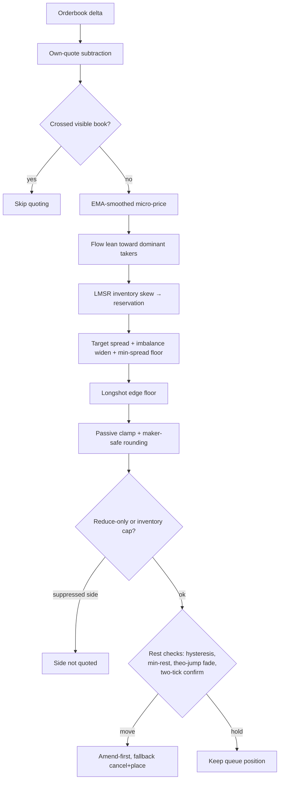

# Guards Inventory

Every defensive mechanism in the bot, grouped by the question it answers.
Each strategy guard traces to a named demo finding or a literature result —
provenance is listed so a guard can be re-examined when its motivating
incident no longer applies.

**Status key:** `structural` = permanent anatomy of a maker, keep.
`placeholder` = hand-set constant standing in for a fitted model; slated for
consolidation under item 60 (regression calibration) or item 42b
(queue-value rule).

## Where guards sit in the quote pipeline

## Belief — what is this contract worth?

| Guard | What it does | Provenance | Status |
|---|---|---|---|
| EMA-smoothed micro-price (`fv_ema_alpha=0.2`) | Smooths sub-second micro flapping before it becomes belief | D13 fade oscillator | structural (alpha: placeholder) |
| Flow lean (`flow_lean_cents=1` toward dominant takers) | Persistent one-sided flow moves the quote center with the trend | Run 13 drift loss (−$0.416) | placeholder → 60a/60b |
| LMSR inventory skew (`b = max(risk-derived, 25×quote_size)`) | Each fill shifts the reservation price away from repeating it | D5 invisible skew; floor from the buy-50-offer-49 bug | structural |

## Quote construction — where do I quote?

| Guard | What it does | Provenance | Status |
|---|---|---|---|
| Asymmetric unwind (`unwind_edge_cents=0`) | The inventory-reducing side quotes at reservation (passive-clamped); only opening risk charges the full half-spread — loops close at first counter-flow | Run 18 (−$0.10 = unwind priced like an open) | structural |
| Imbalance widen (`imbalance_spread_cents=2`) | Extra spread while flow is one-sided | Flow guard | placeholder → 60b |
| Min spread floor (`min_spread_cents=3`) | Never give away the underwriting premium | Palumbo (LPs are underwriters) | structural |
| Longshot edge floor (`+1c` below `40c`) | Cheap-side buys demand extra edge | Bürgi Fig. 6 / Table 10 | placeholder → 60b |
| Floor bid / ceil ask rounding | Rounding never goes against the maker | Penny-loss fix | structural |
| Passive clamp | Never cross the visible book | Post-only discipline | structural |
| Crossed-book skip | Do not price off a garbage book | Crossed-book incident | structural |
| Own-quote subtraction | Our own resting orders are not market signal | Self-reference bug family | structural |

## Repricing — when do I move?

All four timers answer one question — "is repricing worth losing my queue
position?" — and are slated to collapse into a single expected-value rule
once the fill-probability model exists (item 42b).

| Guard | What it does | Provenance | Status |
|---|---|---|---|
| Reprice hysteresis (`reprice_threshold_cents=1`) | Ignore sub-tick belief wiggles | Churn | placeholder → 42b |
| Min rest (`min_rest_ms=3000`) | Quotes rest before cancel; kills echo-race oscillators | D9 | placeholder → 42b |
| Theo-jump fade (`theo_jump_cents=3` → `fade_rest_ms=500`) | Adverse belief move lets the toxic side exit fast | −2.4c adverse selection | placeholder → 42b |
| Two-tick fade confirmation | One flap is noise; two consecutive are a fade | D13 | placeholder → 42b |
| Self-cross cancel | Our bid and ask never cross each other | Safety invariant | structural |

## Position risk — how much can I hold?

| Guard | What it does | Status |
|---|---|---|
| Inventory brake (`inventory_cap_lots=2` × quote_size) | Accumulating side stops quoting entirely | structural (cap size: placeholder) |
| Reduce-only wind-down (`winddown_seconds=45`) | Maker-first exit before taker flatten at shutdown | structural |
| RiskManager halt bits | kPnLLimit, kPositionLimit, kOpenOrders, kHighFillRate, kStaleBook, kModelDiverge, kManualHalt, kConnectivity, kOverExposure, kPortfolioLoss, kDrawdown | structural |
| Rate-limit budget | Place=10 / cancel=2 cost accounting against the exchange budget | structural |

## State integrity — is my model of the world true?

| Guard | What it does | Status |
|---|---|---|
| Startup cancel-all (item 53) | No zombie orders survive from prior runs | structural |
| Verified shutdown sweep + flatten | Cancel until exchange confirms empty (3 attempts), then flatten | structural |
| Periodic reconcile (120s) | Position drift trips kModelDiverge; auto-clears on resync | structural |
| Fill dedup by trade_id | WS stream + REST backfill cannot double-count | structural |
| Fill backfill on WS reconnect | No fills lost in the disconnect gap | structural |
| Exchange order flags | post_only, taker_at_cross STP, cancel_order_on_pause | structural |
| Liveness filter + rotation | Do not sit on dead markets; swap idle ones out | structural |
| Flow-rate admission (`min_trades_per_hour=6`) | Finalists need recent public trades — vol_24h credits yesterday's burst (run 15: $0 in a no-trade window) | structural (threshold: placeholder → 60a) |
| Live-spread admission | Finalists' live book must be wider than `min_spread_cents` — a penny-wide book never fills us at our edge (run 15) | structural |
| Pinned-tape admission (`min_trade_price_range_cents=2` over `tape_range_lookback_minutes=180`) | Recent prints must span ≥2c — a tape pinned at one price is a determined/expired event where only informed takers remain (run 16); the 3h lookback keeps sparse-but-moving pre-game tapes in (item 63) | structural |

## The consolidation plan

The structure above is standard maker anatomy (Avellaneda-Stoikov: belief →
inventory adjustment → spread → damped repricing) plus kill-switches, and is
permanent. The hand-set constants are not: roughly eight free parameters
were each eyeballed from one incident or one paper, and several answer the
same underlying question independently.

- **Toxicity** (longshot floor, imbalance widen, flow lean) → one fitted
  required-edge curve, item 60b.
- **Queue value** (hysteresis, min-rest, theo-jump fade, two-tick confirm)
  → one expected-value-of-repricing rule, item 42b, unblocked by the
  fill-probability model in 60b.
- **Drift** (flow lean's trend-following half) → significance-gated rolling
  slope, item 60a — needs no fill history, so it lands first.

The placeholders are priors that keep the bot solvent while the training set
accumulates. They are deleted by replacement, not by accretion: item 60 is
the consolidation pass, not a ninth knob.
