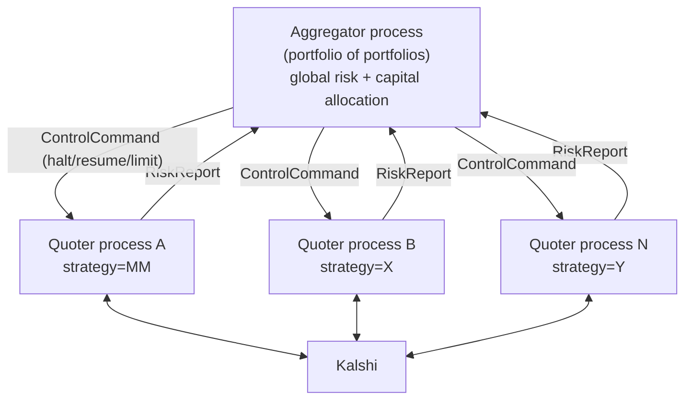

# ADR-007: Process-per-Strategy Quoters + an Aggregator Process

## Status: Proposed (2026-06-29) — target architecture, not yet implemented

Recorded now so the seams stay clean. No IPC is built yet; see "Cost control".

## Context

The goal is to scale to a **portfolio of different strategies** with a hard
separation between the market-making / quoting layer and the risk-aggregation
layer. The target end-state:

- **Each market maker / Quoter is its own OS process** — one strategy over a set
  of markets, with its own exchange connections and *local* risk.
- **A "portfolio of portfolios" aggregator is its own process** — it sees every
  quoter's risk, enforces *global* limits, and can halt any or all of them.

Process separation buys the things a single process can't: fault isolation (one
quoter crashing doesn't take down the others), horizontal scaling (add a
process), independent deploy/restart, and heterogeneous strategies side by side.

## Decision (target, phased)

- **Quoter process** = a self-contained `TradingSession` (WS + REST +
  `OrderManager` + `RiskManager` + a strategy/`Quoter`) running ONE strategy,
  enforcing local risk (per-market caps + its own portfolio caps).
- **Aggregator process** = the `Portfolio` read-model + the global `RiskManager`
  kill-switch, consuming each quoter's `RiskReport` and emitting
  `ControlCommand`s. This is today's in-process global halt, promoted to a
  process with many inputs.
- **Transport boundary** between them, behind interfaces with an in-process
  implementation today and an IPC one later (Unix socket / nanomsg / gRPC /
  Redis stream — chosen at split time):
  - `IRiskPublisher` — quoter → aggregator. Payload `RiskReport` ≈
    `PortfolioSnapshot` + `strategy_id` + heartbeat.
  - `IControlChannel` — aggregator → quoter. Payload `ControlCommand`
    (halt-all / halt-strategy / resume / set-limit / allocate-capital), mapping
    onto the existing `RiskManager` constraint bits.

## What already positions us for this

- **`TradingSession`** (ADR-006) is exactly the quoter-process core — each
  process is one session + its transports.
- **`Portfolio`** is the aggregation logic that moves into the aggregator. It
  already consumes a `PortfolioSnapshot` **DTO** via
  `RiskManager::update_portfolio(...)` — not live objects — so the aggregation
  boundary is already snapshot-shaped (≈ the wire `RiskReport`).
- **Interface + fake pattern** (`IHttpTransport`, `IWebSocket`) proves transports
  are swappable; `IRiskPublisher`/`IControlChannel` follow the same discipline.
- **Capturing decorators** prove we can tee/serialize a live stream — the same
  mechanism publishes reports.
- **Global kill-switch** already separates the *aggregate decision*
  (`update_portfolio`) from *local enforcement* (`check_order`).
- **`IPricingModel` / `FairValueEngine`** abstracts the pricing decision — the
  natural seam for "different strategies".

## Seams to keep clean (regressions that would block the split)

- The aggregator consumes `RiskReport` / `PortfolioSnapshot` **only** — it must
  never reach into a quoter's `OrderManager` or other internals. (True today.)
- Reports carry a `strategy_id` / source identity and a heartbeat; the aggregator
  must flatten a **silent/dead quoter** — process-level staleness mirroring the
  `kStaleBook` pattern.
- Commands are addressable (one strategy vs. all) and idempotent.
- A quoter must always honor a remote halt the way it honors a local one — route
  `ControlCommand` halts through the same `RiskManager` + `enforce_quote_safety`
  path so the "always cancel quotes when halted" invariant still holds.

## Cost control (do-now vs. defer)

- **Now (free):** keep the boundaries clean (above) and treat this ADR as the
  north star. No new abstraction is added to the single process.
- **Defer until splitting** (likely when adding the 2nd strategy/process):
  introduce `RiskReport`, `IRiskPublisher`, `IControlChannel` with the real IPC
  choice. Defining single-implementation interfaces for one process today is
  premature — the wire contract should be designed against the actual transport.
- Within-process scaling (Phases 21–23: async dispatch, per-series WS,
  incremental risk) still applies to a single quoter process and is independent
  of this split. Phase 24 (PortfolioModel) becomes the aggregator; Phase 25
  (cross-ticker hedging) lives in the aggregator.
