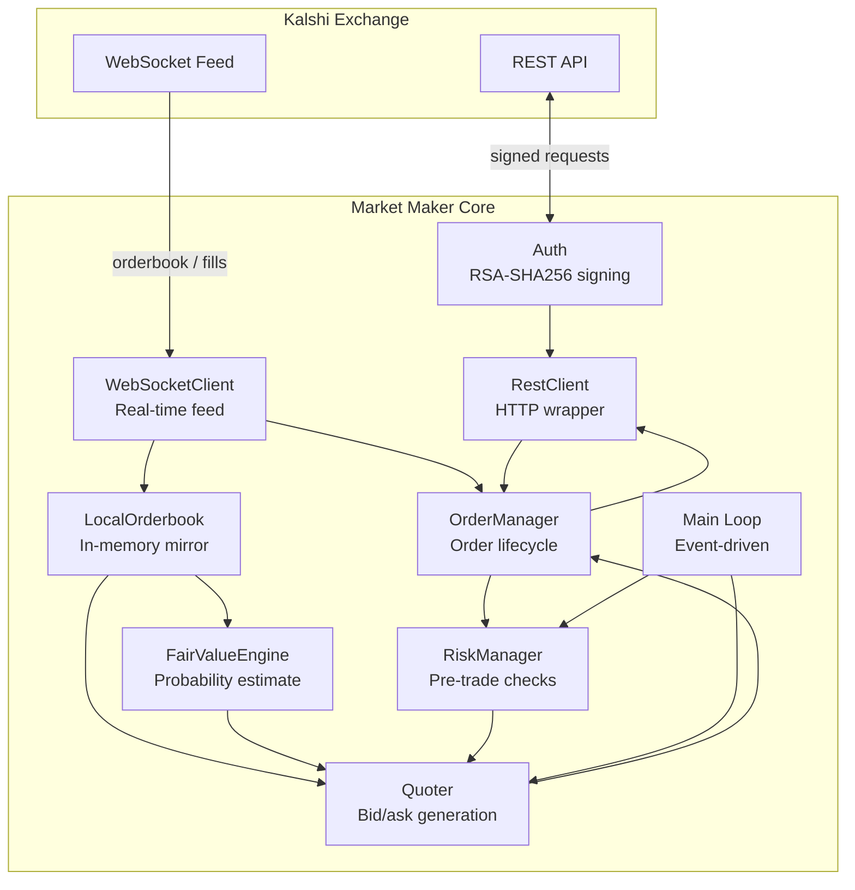
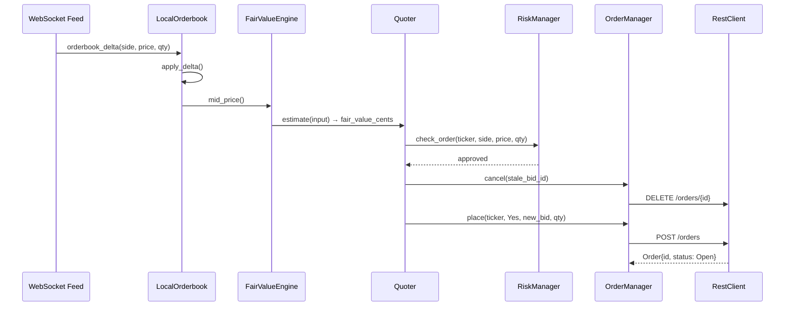

# Architecture

## System Overview

## Component Responsibilities

### Auth (`source/auth.hpp`)
Signs every outbound REST request with RSA-SHA256. Produces three HTTP headers: `Kalshi-Access-Key`, `Kalshi-Access-Timestamp`, `Kalshi-Access-Signature`. Stateless — takes a private key PEM and API key at construction, exposes a single `sign(method, path)` call. Has no knowledge of HTTP or business logic.

### RestClient (`source/rest_client.hpp`)
Thin wrapper over `IHttpTransport`. Translates domain calls (`place_order`, `cancel_order`, `get_orderbook`) into signed HTTP requests and parses JSON responses into domain types. The `IHttpTransport` interface allows a `FakeTransport` to be injected in tests so no network is required.

### WebSocketClient (`source/websocket_client.hpp`)
Maintains a persistent WebSocket connection to Kalshi's feed. Dispatches orderbook snapshots, orderbook deltas, and fill events to registered callbacks. Handles reconnection with exponential backoff. Uses the same `IWebSocket` interface pattern for testability.

### LocalOrderbook (`source/orderbook.hpp`)
In-memory mirror of the exchange orderbook for one market. Initialized from a REST snapshot, kept live by WebSocket deltas. Provides O(1) BBO (best bid/offer) lookups and mid-price calculation without network round trips. The authoritative source of market state for the Quoter.

### OrderManager (`source/order_manager.hpp`)
Owns the lifecycle of every order this process has placed. Tracks open orders, accumulates fills, and computes net position per market. The Quoter interacts with it to place and cancel quotes; the RiskManager reads positions from it.

### RiskManager (`source/risk_manager.hpp`)
Pre-trade gatekeeper. Every order the Quoter wants to place passes through `check_order()` first. Enforces position limits, order size limits, and a daily loss limit. Exposes a kill switch (`halt()`) for emergency use. Designed to be fast and side-effect-free in the hot path.

### FairValueEngine (`source/fair_value.hpp`)
Estimates the true probability of a market's event. This is where alpha lives. The baseline is the orderbook mid-price; layers above it add time-decay adjustments, inventory skew, and hooks for external signals. Returns a price in cents [1, 99].

### Quoter (`source/quoter.hpp`)
Combines fair value, inventory, and risk into concrete bid and ask prices, then instructs the OrderManager to maintain those quotes on the exchange. Applies a configurable spread and an inventory skew (long YES → lower quotes to attract sellers). Cancels and replaces quotes when they drift beyond a reprice threshold.

### Main Loop (`source/main.cpp`)
Wires all components together and runs the event loop. Quotes are refreshed on each WebSocket orderbook event, not on a timer, so latency tracks market movement rather than a polling interval.

## Data Flow: Quote Lifecycle

## Key Design Decisions

**Interface + fake pattern for all I/O.** `IHttpTransport`, `IWebSocket` — every external dependency is hidden behind an interface. Unit tests inject fake implementations. Integration tests (gated by `KALSHI_INTEGRATION_TESTS=ON`) use real implementations against the demo environment.

**Inventory skew over position flattening.** Rather than placing aggressive orders to flatten inventory, the Quoter shifts bid and ask symmetrically around fair value based on net position. This keeps us quoting on both sides and earns the spread while naturally rebalancing. Aggressive flattening would cross our own spread and destroy P&L.

**No timer-driven quoting.** Quotes are refreshed on market events (orderbook deltas). This means we only act when there is new information, avoiding unnecessary order churn and reducing cancel/replace fees.

**RiskManager is a pure function in the hot path.** `check_order()` reads state but has no side effects. The kill switch path (`halt()`) is the only mutation. This keeps the critical pre-trade check fast and easy to reason about.
