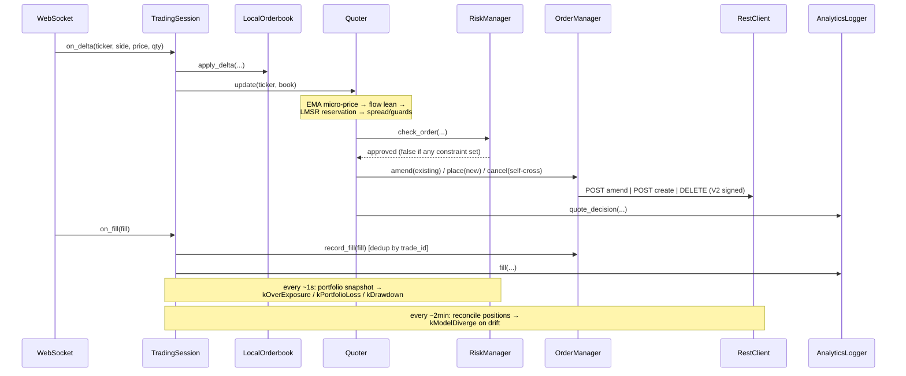

# Architecture

## Data Flow

`main.cpp` wires the WebSocket callbacks to a `TradingSession`, which owns the
domain reactions. The session is the single seam shared by production, unit
tests, and session replay — `main.cpp` itself does only process/IO setup
(mode runners live in `app_modes.cpp`).

## Key Design Decisions

- **Interface + fake pattern** — `IHttpTransport`, `IWebSocket` hide all I/O.
  Unit tests inject fakes; the `Capturing*` decorators tee live traffic for
  replay.
- **TradingSession engine** — domain reactions live in `TradingSession`, not
  `main.cpp`, so the exact production wiring is exercised by tests and replay.
- **Self-selecting markets** — with `target_tickers` empty (the default) the
  session scans and picks its own markets at startup, then rotates dead-idle
  ones out every `rotation_minutes`; markets holding a position or resting
  orders are never rotated out. `--scan` is research-only.
- **Event-driven quoting** — quotes refresh on orderbook deltas, not a timer;
  idle orderless markets get a 30s re-quote sweep.
- **Amend-first repricing** — a reprice issues one atomic amend (falls back to
  cancel+place on rejection); no quote-less window, half the round trips.
- **Guards over cleverness** — the quoter's defensive layers (rest timers,
  fade, lean, inventory brake, wind-down) are cataloged with provenance in
  [GUARDS.md](GUARDS.md).
- **Portfolio is a read-model** — `Portfolio` owns no state; it aggregates PnL
  and capital-at-risk from `OrderManager` (the single source of truth) and
  feeds the risk kill-switch.
- **RiskManager hot path vs. control plane** — `check_order()` is pure and
  returns false if *any* constraint bit is set; state changes happen out of
  the hot path (`update()`, `update_portfolio()`, `halt()`). Auto-set
  kill-switch bits require an explicit `resume()`.
- **Connection liveness vs. market activity** — the WS stale-book guard uses
  ping/pong heartbeats (10s auto-ping) as a liveness signal separate from
  app-data messages, so a quiet-but-alive feed keeps quoting while a dead feed
  halts.
- **End flat, verifiably** — startup cancels all resting orders account-wide;
  shutdown winds down inventory as a maker (reduce-only), then sweeps cancels
  until the exchange confirms clean and taker-flattens the remainder.
- **Error cooldown over instant retry** — a rejected place (e.g. `post only
  cross`) puts that ticker in a 500ms cooldown instead of re-firing every
  delta.
- **Self-throttling writes** — `RestClient` runs order writes through a token
  bucket sized to the Kalshi tier, so bursts back-pressure locally rather than
  taking 429s.
- **Measure everything** — `AnalyticsLogger` streams quote decisions, fills,
  and per-request HTTP RTT to `logs/analytics.jsonl`; the analysis scripts
  (markout, PnL attribution, latency report) read it offline.
- **Incentive-aware selection** — the scanner joins active Liquidity Incentive
  pools into ranking, biasing toward markets that pay for resting size.
