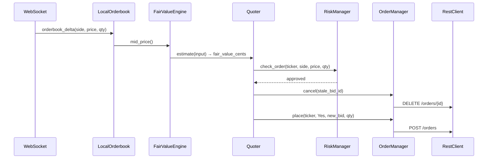

# Architecture

## Data Flow

## Key Design Decisions

- **Interface + fake pattern** — `IHttpTransport`, `IWebSocket` hide all I/O. Unit tests inject fakes; integration tests use real implementations.
- **Event-driven quoting** — quotes refresh on orderbook deltas, not a timer. Acts only on new information.
- **Inventory skew over flattening** — Quoter shifts bid/ask symmetrically around fair value based on net position rather than placing aggressive orders to flatten.
- **RiskManager is pure in the hot path** — `check_order()` is side-effect-free. Only `halt()` mutates state.
