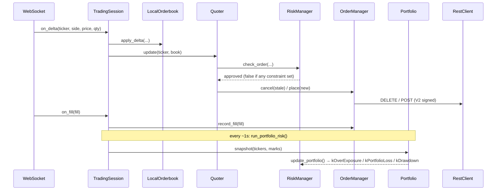

# Architecture

## Data Flow

`main.cpp` wires the WebSocket callbacks to a `TradingSession`, which owns the
domain reactions. The session is the single seam shared by production, unit
tests, and session replay — `main.cpp` itself does only process/IO setup.

## Key Design Decisions

- **Interface + fake pattern** — `IHttpTransport`, `IWebSocket` hide all I/O. Unit tests inject fakes; the `Capturing*` decorators tee live traffic for replay.
- **TradingSession engine** — domain reactions (snapshot/delta/fill, portfolio kill-switch, status logging) live in `TradingSession`, not `main.cpp`, so the exact production wiring is exercised by tests and replay.
- **Event-driven quoting** — quotes refresh on orderbook deltas, not a timer. Acts only on new information.
- **Inventory skew over flattening** — Quoter shifts bid/ask symmetrically around fair value based on net position rather than placing aggressive orders to flatten.
- **Portfolio is a read-model** — `Portfolio` owns no state; it aggregates realized + unrealized PnL and capital-at-risk from `OrderManager` (the single source of truth) and feeds the risk kill-switch.
- **RiskManager hot path vs. control plane** — `check_order()` is pure (side-effect-free) and returns false if *any* constraint bit is set. State changes happen out of the hot path: `update()` (per-market caches + realized daily-loss → `kPnLLimit`), `update_portfolio()` (aggregate exposure → `kOverExposure`, realized+unrealized loss → `kPortfolioLoss`, give-back from the session high-water mark → `kDrawdown`), and `halt()`. Auto-set kill-switch bits require an explicit `resume()` to clear.
- **Connection liveness vs. market activity** — the WS stale-book guard uses ping/pong heartbeats (`on_heartbeat`, 10s auto-ping) as a *liveness* signal separate from app-data messages, so a quiet-but-alive feed keeps quoting while a genuinely dead feed still halts. See PLAN item 8.
- **Zero-inventory invariant** — inventory skew keeps us near-flat *while running*; `RestClient::flatten` (aggressive IOC taker, fractional count) closes any residual on shutdown and via `--flatten`, so the bot ends flat. A market maker collects the spread/rebate and should not carry directional inventory.
- **Error cooldown over instant retry** — a rejected place (e.g. `post only cross`) puts that ticker in a 500ms cooldown in `TradingSession` instead of re-firing the same crossing price every delta, breaking the reject/429 hot loop.
- **Self-throttling writes** — `RestClient` runs order writes through a `RateLimiter` (token bucket sized to the Kalshi tier) so bursts back-pressure locally rather than taking 429s.
- **Incentive-aware selection** — the scanner joins active Liquidity Incentive pools (`GET /incentive_programs`) into ranking, biasing toward markets that pay for resting size.
